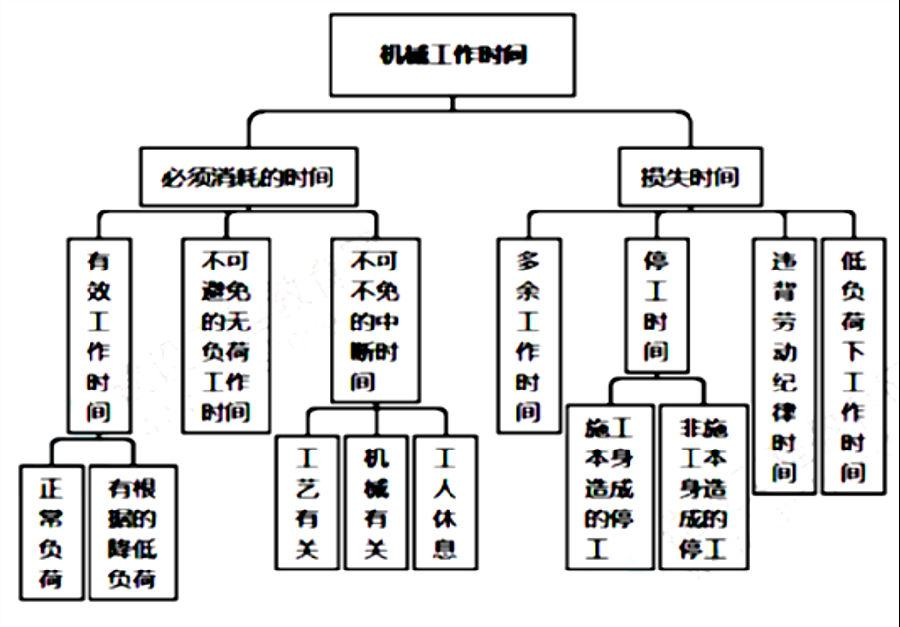
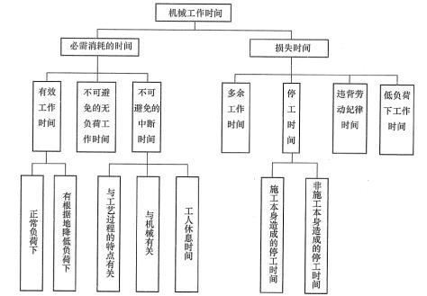
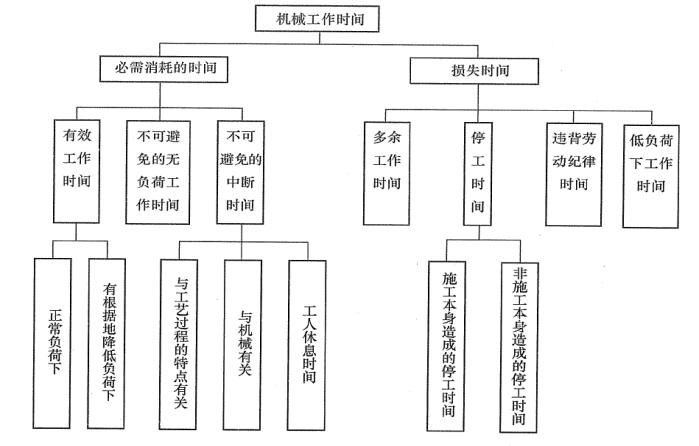
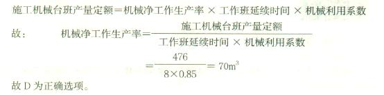

机械台班使用定额的编制内容包括( &nbsp; )。

A.拟定机械作业的正常施工条件  (正确)
B.确定机械纯工作一小时的正常生产率  (正确)
C.拟定机械的停工时间
D.确定机械的利用系数  (正确)
E.计算机械台班定额  (正确)
解析：
施工机械台班使用定额也称施工机械台班消耗定额，是指施工机械在正常施工条件下完成单位合格产品所必需的工作时间。它反映了合理地、均衡地组织劳动和使用机械时该机械在单位时间内的生产效率。

【知识点】机械台班使用定额的编制

【考点】机械台班使用定额的编制内容

【考察方向】原文挖空

【难度】易

【题库维护老师：ZKQ】

关于机械台班使用定额的编制中机械工作时间消耗分类的说法，正确的有( &nbsp;)。

A.筑路机在工作区末端调头耗费的时间属于不可避免的无负荷工作时间  (正确)
B.汽车装货和卸货时的停车所耗费的时间属于定期的不可避免中断工作时间
C.工人没有及时供料而使机械空运转的时间属于机械的多余工作时间  (正确)
D.暴雨时压路机停工耗费的时间属于非施工本身造成的机械停工时间  (正确)
E.由于工人擅离岗位等引起的机械停工时间属于低负荷下的工作时间
解析：
不可避免的无负荷工作时间是由施工过程的特点和机械结构的特点造成的机械无负荷工作时间，例如筑路机在工作区末端调头等；循环的不可避免中断，是在机械工作的每一个循环中重复一次，如汽车装货和卸货时的停车；机械的多余工作时间，是机械进行任务内和工艺过程内未包括的工作而延续的时间。如工人没有及时供料而使机械空运转的时间；非施工本身造成的停工，是由于气候条件所引起的停工现象，如暴雨时压路机的停工。违反劳动纪律引起的机械的时间损失，是指由于工人迟到早退或擅离岗位等引起的机械停工时间。因此正确答案为A、C、D。

【知识点】机械台班使用定额的编制

【考点】机械工作时间消耗的分类

【考察方向】原文挖空

【难度】易

【题库维护老师：ZKQ】

下列施工机械工作时间中，属于必需消耗的时间是（ &nbsp;）。

A.不可避免的无负荷工作时间  (正确)
B.低负荷下工作时间
C.多余工作和停工的时间
D.施工本身造成的停工时间
解析：
在必需消耗的工作时间里，包括有效工作、不可避免的无负荷工作和不可避免的中断三项时间消耗。低负荷下工作时间、多余工作和停工的时间、施工本身造成的停工时间都属于损失时间。

【知识点】机械台班使用定额的编制

【考点】机械工作时间消耗的分类

【考察方向】原文挖空

【难度】易

【题库维护老师：ZKQ】

筑路机在工作区末端掉头所消耗的时间，属于施工机械工作时间中的（ &nbsp;）。

A.有效工作时间
B.多余工作时间
C.低负荷下的工作时间
D.不可避免的无负荷工作时间  (正确)
解析：
不可避免的无负荷工作时间，是指施工过程的特点和机械结构的特点造成的机械无负荷工作时间。例如：筑路机在工作区末端掉头。

【知识点】机械台班使用定额的编制

【考点】机械工作时间消耗的分类

【考察方向】原文挖空

【难度】易

【题库维护老师：ZKQ】

筑路机在工作区末端调头属于工作时间消耗中的( &nbsp; )。

A.多余工作时间
B.有根据地降低负荷下的工作时间
C.不可避免的无负荷工作时间  (正确)
D.低负荷下工作时间
解析：
不可避免的无负荷工作时间是指由施工过程的特点和机械结构的特点造成的机械无负荷工作时间，例如筑路机在工作区末端调头等。

【知识点】机械台班使用定额的编制

【考点】机械工作时间消耗的分类

【考察方向】原文挖空

【难度】易

【题库维护老师：ZKQ】 

在机械工作时间消耗分类中，由于人工装料数量不足引起的机械不能满负荷工作的时间属于（ ）。

A.有根据地降低负荷下的工作时间
B.机械的多余工作时间
C.正常负荷下的有效工作时间
D.低负荷下的工作时间  (正确)
解析：
低负荷下的工作时间，是由于工人或技术人员的过错所造成的施工机械在降低负荷的情况下工作的时间。

【知识点】机械台班使用定额的编制

【考点】机械工作时间消耗的分类

【考察方向】原文挖空

【难度】易

【题库维护老师：ZKQ】 

下列机械工作时间消耗中，属于机械台班使用定额中不可避免的无负荷工作时间的是（　　）。

A.汽车在运送土方时没有装满导致的延长时间
B.筑路机在工作区末端掉头的时间  (正确)
C.未及时供给机械燃料而导致的停工时间
D.暴雨时压路机被迫停工时间
解析：
施工机械时间定额，是指在合理劳动组织与合理使用机械条件下，完成单位合格产品所必需的工作时间，包括有效工作时间（正常负荷下的工作时间和降低负荷下的工作时间）、不可避免的中断时间、不可避免的无负荷工作时间。

【知识点】机械台班使用定额的编制

【考点】机械工作时间消耗的分类

【考察方向】原文挖空

【难度】易

【题库维护老师：ZKQ】 

施工作业过程中，筑路机在工作区末端掉头消耗的时间应计入施工机械台班使用定额，其时间消耗的性质是（ ）。

A.不可避免的无负荷工作时间  (正确)
B.不可避免的停工时间
C.不可避免的中断工作时间
D.正常负荷下的工作时间
解析：
对于机械台班的必需消耗的工作时间里，包括有效工作时间、不可避免的无负荷工作时间和不可避免的中断工作时间。 不可避免的无负荷工作时间，是指由施工过程的特点和机械结构的特点造成的机械无负荷工作时间。例如筑路机在工作区末端调头等，都属于此项工作时间的消耗。

【知识点】机械台班使用定额的编制

【考点】机械工作时间消耗的分类

【考察方向】原文挖空

【难度】易

【题库维护老师：ZKQ】 

机械工作时间消耗的分类中，有效工作时间包括正常负荷下和( &nbsp; )的工作时间。

A.低负荷下
B.准备与结束
C.不可避免的无负荷下
D.有根据地降低负荷下  (正确)
解析：
在必需消耗的工作时间里，包括有效工作、不可避免的无负荷工作和不可避免的中断三项时间消耗。而在有效工作的时间消耗中又包括正常负荷下、有根据地降低负荷下的工时消耗。

【知识点】机械台班使用定额的编制

【考点】机械工作时间消耗的分类

【考察方向】原文挖空

【难度】易

【题库维护老师：ZKQ】

已知某挖土机挖土的一个工作循环需5分钟，每循环一次挖土0.5m³，工作班的延续时间为10小时，时间利用系数K＝0.7，则其产量定额为( &nbsp; )m³／台班。

A.12.8
B.42  (正确)
C.102
D.120
解析：
由公式施工机械台班产量定额＝<strong>机械净工作生产率</strong>×工作班延续时间×机械利用系数，再根据题中数据，则产量定额＝<strong>60／5</strong>×0.5×10×0.7＝42(m³／台班)。（<strong>确定机械净工作生产率，即机械纯工作一小时的正常生产率。</strong>）

【知识点】机械台班使用定额的编制

【考点】机械台班使用定额的编制内容

【考察方向】公式计算

【难度】中等

【题库维护老师：ZKQ】 

某施工机械纯工作效率为125m²/小时，每天工作8小时，机械利用系数为0.8，该机械工时需要有5个工人配合。则该机械台班的人工时间定额是（ &nbsp; &nbsp;）。

A.0.125工日/100m²
B.0.2工日/100m²
C.0.625工日/100m²  (正确)
D.1.6工日/100m²
解析：
在机械台班定额中，施工机械台班产量定额=机械净工作生产率×工作班延续时间×机械利用系数=125×8×0.8=800（m²）。施工机械时间定额=1/施工机械班产量定额=1/800。工人小组定额时间=施工机械时间定额×工人小组的人数=5/800=0.625（工日/100m²）。

【知识点】机械台班使用定额的编制

【考点】机械台班使用定额的编制内容

【考察方向】公式计算

【难度】易

【题库维护老师：ZKQ】

汽车运输重量轻而体积大的货物时，不能充分利用 载重吨位因而不得不在低于其计算负荷下工作的时间应计入（ &nbsp; &nbsp;）。

A.正常负荷下的工作时间
B.不可避免的中断时间
C.有根据地降低负荷下的工作时间  (正确)
D.损失的工作时间
解析：
有根据地降低负荷下的工作时间，是指在个别情况下由于技术上的原因，机械在低于其计算负荷下工作的时间。例如，汽车运输重量轻而体积大的货物时，不能充分利用汽车的载重吨位因而不得不降低其计算负荷。

【知识点】机械台班使用定额的编制

【考点】机械工作时间消耗的分类

【考察方向】原文挖空

【难度】易

【题库维护老师：ZKQ】

编制压路机台班使用定额时，属于必需消耗的时间的是（ &nbsp;）。

A.施工组织不好引起的停工时间
B.压路机在工作区末端调头时间  (正确)
C.压路机操作人员擅离岗位引起的停工时间
D.暴雨时压路机的停工时间
解析：
在必需消耗的工作时间里，包括有效工作、不可避免的无负荷工作和不可避免的中断三项时间消耗。不可避免的无负荷工作时间，是指由施工过程的特点和机械结构的特点造成的机械无负荷工作时间。例如筑路机在工作区末端调头等，都属于此项工作时间的消耗。

【知识点】机械台班使用定额的编制

【考点】机械工作时间消耗的分类

【考察方向】原文挖空

【难度】易

【题库维护老师：ZKQ】

机械工作时间按其性质可以分为( &nbsp; )

A.必需消耗的时间和损失时间  (正确)
B.有效工作时间和损失时间
C.必需消耗的时间和多余工作时间
D.必需消耗的时间和停工时间
解析：
机械工作时间消耗按其性质可以分为必需消耗的时间和损失时间两大类。必需消耗的工作时间，包括有效工作、不可避免的无负荷工作和不可避免的中断三项时间消耗。损失的工作时间，包括多余工作、停工、违背劳动纪律所消耗的工作时间和低负荷下的工作时间。

【知识点】机械台班使用定额的编制

【考点】机械工作时间消耗的分类

【考察方向】原文挖空

【难度】中等

【题库维护老师：ZKQ】

已知某挖土机挖土的一个工作循环需2分钟，每循环一次挖土0.5m3，工作班的延续时间为8小时，机械利用系数为0.85，则其台班产量定额为( &nbsp;)m3／台班。

A.12.8
B.15
C.102  (正确)
D.120
解析：
施工机械台班产量定额=机械净工作生产率×工作班延续时间×机械利用系数：(60÷2×0.5)×8×0.85=102m3。故C为正确选项。

【知识点】机械台班使用定额的编制

【考点】机械台班使用定额的编制内容

【考察方向】公式计算

【难度】中等

【题库维护老师：SUT】

在编制机械台班使用定额时，工程项目施工过程中由于未及时供给机械燃料引起停工而耗费的时间属于( &nbsp;)。

A.机械的多余工作时间
B.机械的停工时间  (正确)
C.违反劳动纪律引起的机械的时间损失
D.低负荷下的工作时间
解析：
机械的停工时间，按其性质也可分为施工本身造成和非施工本身造成的停工。前者是由于施工组织得不好而引起的停工现象，如由于未及时供给机械燃料而引起的停工。后者是由于气候条件所引起的停工现象，如暴雨时压路机的停工。上述停工中延续的时间，均为机械的停工时间。

【知识点】机械台班使用定额的编制

【考点】机械工作时间消耗的分类

【考察方向】概念释义

【难度】易

【题库维护老师：ZKQ】

在编制机械台班使用定额时，工程项目施工过程中把灰浆泵由一个工作地点转移到另一工作地点的工作中断所耗费的时间，属于( &nbsp;)。

A.正常负荷下的工作时间
B.不可避免的无负荷工作时间
C.与工艺过程特点有关的不可避免中断工作时间  (正确)
D.与机械有关的不可避免中断工作时间
解析：
与工艺过程的特点有关的不可避免中断工作时间，有循环的和定期的两种。循环的不可避免中断，是在机械工作的每一个循环中重复一次。如汽车装货和卸货时的停车。定期的不可避免中断，是经过一定时期重复一次。

【知识点】机械台班使用定额的编制

【考点】机械工作时间消耗的分类

【考察方向】概念释义

【难度】易

【题库维护老师：SUT】

下列机械工作时间中，属于必须消耗的时间是（ &nbsp;）。

A.不可避免的无负荷工作时间  (正确)
B.低负荷下工作时间
C.多余工作和停工的时间
D.施工本身造成的停工时间
解析：
本题考查的是机械定额的编制 

【知识点】机械台班使用定额的编制

【考点】机械工作时间消耗的分类

【考察方向】原文挖空

【难度】易

【题库维护老师：ZKQ】

在各项机械工作时间中，必须消耗的时间有（ &nbsp;）。

A.有根据地降低负荷下的工作时间  (正确)
B.多余工作时间
C.非施工本身造成的停工时间
D.不可避免的中断时间  (正确)
E.不可避免的无负荷工作时间  (正确)
解析：
 【知识点】机械台班使用定额的编制 【考点】机械台班使用定额的编制 【考查方向】概念释义 【难度】易 【题库维护老师：yxf】

下列选项中，属于机械作业损失时间的是（）。

A.低负荷下的工作时间  (正确)
B.有根据地降低负荷下的工作时间
C.无负荷时间
D.中断时间
解析：
 【知识点】机械台班使用定额的编制 【考点】机械台班使用定额的编制 【考查方向】概念释义 【难度】易 【题库维护老师：yxf】

已知某斗容量为1m3的正铲挖土机，机械台班产量为476m3，机械利用系数为0.85，则它在正常工作条件下，1小时纯工作时间内可以挖土约( &nbsp;)m3。

A.47
B.51
C.56
D.70  (正确)
解析：

【知识点】机械台班使用定额的编制

【考点】机械台班使用定额的编制内容

【考察方向】公式计算

【难度】中等

【题库维护老师：ZKQ】

