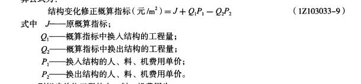
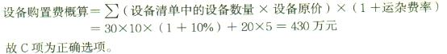
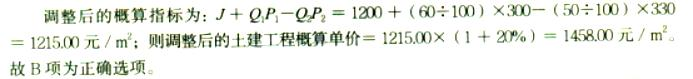

在编制单位建筑工程概算的时候，针对初步设计达到一定深度，建筑结构比较明确的工程项目适宜采用的方法是（）。

A.概算定额法  (正确)
B.概算指标法
C.类似工程预算法
D.预算单价法
解析：
建筑工程：概算定额法、概算指标法、类似工程预算法； 设备及安装工程：预算单价法、扩大单价法、概算指标法（设备价值百分比法和综合吨位指标法）。 选A，概算定额法要求，初步设计达到一定深度，建筑结构比较明确方可使用。 【知识点】单位工程概算的编制方法 【考点】单位建筑工程概算编制方法 【考查方向】概念释义 【难度】易 【题库维护老师：yxf】

某新建住宅的建筑面积为400㎡，按概算指标和地区材料预算价格计算出一般土建工程单位造价为1304元/㎡(其中人、料、机费用为900元/㎡)。按照当地造价管理部门规定，企业管理费费率为8%;规费以人、料、机和企业管理费之和为计算基础，规费费率为15%;利润以人、料、机、企业管理费和规费之和为计算基础，利润为7%;增值税税率为9%。由于土建工程与概算指标相比结构构件有部分变更，变更后每100㎡土建工程的人、料、机费用比概算指标对应部分的费用增加3000元。则修正后的土建工程单位造价为（ &nbsp;）元㎡。

A.1070
B.1155
C.1236
D.1347  (正确)
解析：
【计算公式】结构变化修正概算指标=原概算指标+概算指标中换入结构的工程量×概算指标中换入结构的人料机单价-概算指标中换出结构的工程量×概算指标中换出结构的人料机单价，代入题干中的数值，结构变化修正概算指标=900元/㎡+3000元/100㎡=930元/㎡;这里计算得出的是变化后的人料机费用。原概算造价为1304元/㎡，其中人料机费用为900元/㎡，可得综合费率=(1304-900)/900=44.89%。根据调整以后的人料机费用，调整以后的造价=930×(1+44.89%)=1347元/㎡，故选择D选项。

【知识点】单位工程概算的编制方法

【考点】单位建筑工程概算编制方法——概算指标法

【考察方向】公式计算

【难度】中等

【题库维护老师：ZKQ】 

若初步设计有详细的设备清单，则可用于编制设备安装工程概算且精确性最高的方法是（ &nbsp; &nbsp;）。

A.类似工程预算法
B.概算指标法
C.预算单价法  (正确)
D.扩大单价法
解析：
当初步设计有详细设备清单时，可直接按预算单价（预算定额单价）编制设备安装工程概算。用预算单价法编制概算，计算比较具体，精确性较高。当初步设计的设备清单不完备，或仅有成套设备的重量时，可采用主体设备、成套设备或工艺线的综合扩大安装单价编制概算。当初步设计的设备清单不完备，或安装预算单价及扩大综合单价不全，无法采用预算单价法和扩大单价法时，可采用概算指标编制概算。

设备安装工程概算的编制方法包括预算单价法、扩大单价法、概算指标法。

【知识点】单位工程概算的编制方法

【考点】设备及安装工程概算编制方法——设备安装工程概算的编制方法

【考察方向】概念释义

【难度】易

【题库维护老师：ZKQ】 

对一般附属、辅助和服务工程等项目，或投资小、比较简单的工程项目，在编制设计概算时一般采用（ &nbsp; &nbsp;）。

A.单位工程指标法
B.概算指标法  (正确)
C.概算定额
D.类似工程概算法
解析：
概算指标法计算精度较低，但由于其编制速度快，因此对一般附属、辅助和服务工程等项目，以及住宅和文化福利工程项目或投资比较小、比较简单的工程项目投资概算有一定实用价值。

【知识点】单位工程概算的编制方法

【考点】设备及安装工程概算编制方法——设备安装工程概算的编制方法

【考察方向】概念释义

【难度】易

【题库维护老师：ZKQ】

利用概算定额编制单位工程概算的工作有：①计算单位工程的人、料、机费用；②列出分项工程并计算工程量；③计算企业管理费、利润、规费和税金；④确定分部分项工程的概算定额单价；⑤计算单位工程概算造价；编制正确的顺序是（ &nbsp;）。

A.④②①⑤③
B.②④①③⑤  (正确)
C.①②③④⑤
D.④①②③⑤
解析：
利用概算定额法编制设计概算的具体步骤如下：

(1)按照概算定额分部分项顺序，列出各分项工程的名称。

(2)确定各分部分项工程项目的概算定额单价(基价)。

(3)计算单位工程的人、料、机费用。

(4)根据人、料、机费用，结合其他备项取费标准，分别计算企业管理费、利润、规费和税金。

(5)计算单位工程概算造价。

【知识点】单位工程概算的编制方法

【考点】单位建筑工程概算编制方法——概算定额法

【考察方向】原文挖空

【难度】中等

【题库维护老师：ZKQ】 

某拟建单位工程初步设计深度不够，不能准确地计算工程量，但工程设计采用的技术比较成熟而又有类似工程概算指标可以利用时，编制该单位工程概算宜采用的方法是（　　）。

A.概算定额法
B.概算指标法  (正确)
C.预算单价法
D.类似工程预算法
解析：
概算定额法要求初步设计达到一定深度，建筑结构比较明确时方可采用。当初步设计深度不够，不能准确地计算工程量，但工程设计采用的技术比较成熟而又有类似工程概算指标可以利用时，可以采用概算指标法编制工程概算。类似工程预算法适用于拟建工程初步设计与已完工程或在建工程的设计相类似且没有可用的概算指标的情况，但必须对建筑结构差异和价差进行调整。

【知识点】单位工程概算的编制方法

【考点】单位建筑工程概算编制方法

【考察方向】概念释义

【难度】易

【题库维护老师：ZKQ】

采用定额单价法编制施工图预算时，若分项工程采用的主要材料品种与定额单价中规定的材料品种不一致，正确的做法是（）。

A.直接套用定额单价并通过系数调整
B.编制补充定额
C.调整材料数量，不换价
D.按实际使用材料价格换算定额单价  (正确)
解析：
工程量计算完毕后，逐项套用相应概算定额单价和人工、材料消耗指标，然后分别将其填入工程概算表和工料分析表中。如遇设计图中的分项工程项目名称、内容与采用的概算定额手册中相应的项目有某些不相符时，则按规定对定额进行换算后方可套用。

【知识点】单位工程概算的编制方法

【考点】单位建筑工程概算编制方法——概算定额法

【考察方向】概念释义

【难度】易

【题库维护老师：ZKQ】 

某建设项目的建筑面积为10000m2，按类似工程概算指标计算的一般土建工程单位概算造价为1158.84元/m2（其中人、料、机费用为800元/㎡），项目所在地建筑安装工程企业管理费率为8%，按人、料、和企业管理费计算的规费费率为15%，利润率为7%，增值税税率为9%。与类似工程概算指标规定的结构特征比较，该项目结构有部分变更，换出结构构件中每100m2的人、料、机费用为12450元，换入结构构件中每100m2的人、料、机费用为15800元，人、料、机费用均不包含增值税可抵扣进项额。则该项目一般土建工程修正后的概算单价为（）元/m2。

A.833.50
B.1207.36  (正确)
D.1192.34
E.1316.84
解析：
概算单价的修正公式=原概算指标+新概算指标-旧概算指标；先用人料机的费用算出后再换算。该项目一般土建工程的人料机费用=800+15800/100-12450/100=833.5，由类似工程概算指标的一般土工程单位概算造价为1158.84而人料机费用为800即1158.84=800（1+x）可知，人料机占概算造价的比例为0.44855，因此该项目一般土建工程修正后的概算单价=人料机费用×（1+x）=833.5×（1+0.44855）=1207.37，选B。

【知识点】单位工程概算的编制方法

【考点】单位建筑工程概算编制方法——概算指标法

【考察方向】公式计算

【难度】中等

【题库维护老师：ZKQ】 

某单位建筑工程初步设计已达到一定深度，建筑结构明确，能够计算出概算工程量，则编制该单位建筑工程概算最适合的方法是（ ）。

A.类似工程预算法
B.概算指标法
C.概算定额法  (正确)
D.生产能力指数法
解析：
编制单位建筑工程概算的方法，包括概算定额法、概算指标法和类似工程预算法，而且它们的适用条件和特点（精确度）又各不相同。其中，概算定额法编制单位建筑工程概算的精度较高，并在初步设计达到一定深度、建筑结构比较明确时，可以采用。

【知识点】单位工程概算的编制方法

【考点】单位建筑工程概算编制方法——概算定额法

【考察方向】概念释义

【难度】易

【题库维护老师：ZKQ】

当初步设计深度不够，不能准确地计算工程量，但工程设计采用的技术比较成熟而又有类似工程概算指标可以利用时，可以采用（ ）编制工程概算。

A.类似工程预算法
B.概算指标法  (正确)
C.概算定额法
D.扩大单价法
解析：
当初步设计深度不够，不能准确地计算工程量，但工程设计采用的技术比较成熟而又有类似工程概算指标可以利用时，可以采用概算指标法编制工程概算。 类似工程预算法适用于拟建工程初步设计与已完工程或在建工程的设计相类似且没有可用的概算指标的情况，但必须对建筑结构差异和价差进行调整。 概算定额法又叫扩大单价法或扩大结构定额法。该方法要求初步设计达到一定深度，建筑结构比较明确时方可采用。

【知识点】单位工程概算的编制方法

【考点】单位建筑工程概算编制方法——概算指标法

【考察方向】概念释义

【难度】易

【题库维护老师：ZKQ】 

当初步设计达到一定深度，建筑结构比较明确时可以采用( &nbsp; )编制单位工程概算。

A.概算定额法  (正确)
B.概算指标法
C.类似工程预算法
D.预算单价法
解析：
概算定额法又叫扩大单价法或扩大结构定额法，该方法要求初步设计达到一定深度，建筑结构比较明确时方可采用。

【知识点】单位工程概算的编制方法

【考点】单位建筑工程概算编制方法——概算定额法

【考察方向】原文挖空

【难度】易

【题库维护老师：ZKQ】 

当设计对象的结构特征与概算指标有局部差异时，需要进行概算指标中的每lm²(1m³)造价的调整。关于调整概算指标中的每lm²(1m³)造价，应选用的计算公式的关系表述正确的是( &nbsp; )。

A.结构变化修正概算指标(元／m²)＝原概算指标＋概算指标中换入结构的工程量×换入结构的人、料、机费用单价－概算指标中换出结构的工程量×换出结构的人、料、机费用单价  (正确)
B.结构变化修正概算指标(元／m²)＝原概算指标＋概算指标中换出结构的工程量×换出结构的人、料、机费用单价－概算指标中换入结构的工程量×换入结构的人、料、机费用单价
C.结构变化修正慨算指标(元／m²)＝原概算指标＋概算指标中换入结构的工程量×换入结构的人、料、机费用单价
D.结构变化修正概算指标(元／m²)＝原概算指标－概算指标中换出结构的工程量×换出结构的人、料、机费用单价
解析：
调整概算指标中的每1m²(1m³)造价的公式：结构变化修正概算指标(元／m²)＝原概算指标＋概算指标中换入结构的工程量×换入结构的人、料、机费用单价－概算指标中换出结构的工程量×换出结构的人、料、机费用单价。

【知识点】单位工程概算的编制方法

【考点】单位建筑工程概算编制方法——概算指标法

【考察方向】公式计算

【难度】中等

【题库维护老师：ZKQ】

设备及安装工程概算的编制方法不包括( &nbsp; )。

A.预算单价法
B.扩大单价法
C.扩大结构定额法  (正确)
D.概算指标法
解析：
设备安装工程概算的编制方法包括：(1)预算单价法；(2)扩大单价法；(3)概算指标法；C项扩大结构定额法就是概算定额法，是建筑工程概算的编制方法。

【知识点】单位工程概算的编制方法

【考点】设备及安装工程概算编制方法—— 设备安装工程概算的编制方法

【考察方向】原文挖空

【难度】易

【题库维护老师：ZKQ】

下列( &nbsp; )作为建设工程概算的编制方法，适用于拟建工程初步设计与已完工程或在建工程的设计相类似且没有可用的概算指标的情况。

A.概算指标法
B.概算定额法
C.类似工程预算法  (正确)
D.类似工程概算法
解析：
类似工程预算法适用于拟建工程初步设计与已完工程或在建工程的设计相类似且没有可用的概算指标的情况。

【知识点】单位工程概算的编制方法

【考点】单位建筑工程概算编制方法——类似工程预算法

【考察方向】原文挖空

【难度】易

【题库维护老师：ZKQ】

某新建设项目建筑面积5000m2，按概算指标和地区材料预算单价等算出一般土建工程单位造价为1200元（其中，人.料.机费用1000元，综合费率20%)。但新建项目的设计资料与概算指标相比，其结构中有部分变更：设计资料中外墙1砖厚，预算单价200元/m3,而概算指标中外墙1砖厚，预算单价180元/m3，设计资料中每100m2建筑面积含外墙62m2，而概算指标中含47m3，其余不考虑，则调整后的一般土建工程概算单价为（ ）元/m2。

A.1152.72
B.1203.60
C.1487.28
D.1247.28  (正确)
解析：
调整概算指标中的每1 m2( 1m3)造价的公式为：调整后=原概算指标+概算指标换入的量×价-概算指标换出的量×价。单方造价中人材机为1000元/m2，调整后综合单价=(1000+200X62 / 100-180X47/100) X(1+20%) =1247.28 元/m2。【单位参照2021版教材例题1Z103033】

【知识点】单位工程概算的编制方法

【考点】单位建筑工程概算编制方法——概算指标法

【考察方向】公式计算

【难度】中等

【题库维护老师：ZKQ】

新建工程与某已建成工程仅外墙饰面不同，已建成工程外墙为水泥砂浆抹面，单价为8.75元/㎡，每平方米建筑面积消耗量为0.852㎡；新建工程外墙为贴釉面砖，单价为49.25元/㎡，每平方米建筑面积消耗量为0.814㎡，若已建成工程概算指标为536元/㎡，则新建工程修正概算指标为（）元/㎡

A.576.50
B.585.25
C.568.63  (正确)
D.613.26
解析：
换出不用的材料，换入拟用的材料。536-0.852*8.75+0.814*49.25=568.63。

【知识点】单位工程概算的编制方法

【考点】单位建筑工程概算编制方法——概算指标法

【考察方向】公式计算

【难度】中等

【题库维护老师：ZKQ】 

在编制建设工程设计概算时，对于拟建工程初步设计与已完工程或在建工程的设计相类似且没有可用的概算指标，但必须对建筑结构差异和价差进行调整的情况，可以采用的编制方法是(　　)。

A.单位工程指标法
B.概算指标法
C.概算定额法
D.类似工程预算法  (正确)
解析：
类似工程预算法：类似工程预算法是利用技术条件与设计对象相类似的已完工程或在建工程的工程造价资料来编制拟建工程设计概算的方法。该方法适用于拟建工程初步设计与已完工程或在建工程的设计相类似且没有可用的概算指标的情况，但必须对建筑结构差异和价差进行调整。

【知识点】单位工程概算的编制方法

【考点】单位建筑工程概算编制方法——类似工程预算法

【考察方向】原文挖空

【难度】易

【题库维护老师：ZKQ】

下列单位工程概算方法中，属于建筑工程概算编制方法的是(　　)。

A.概算定额法  (正确)
B.预算单价法
C.综合吨位指标法
D.扩大单价法
解析：
单位工程概算分建筑工程概算和设备及安装工程概算两大类。建筑工程概算的编制方法有概算定额法、概算指标法、类似工程预算法；设备及安装工程概算的编制方法有预算单价法、扩大单价法、设备价值百分比法和综合吨位指标法等。

【知识点】单位工程概算的编制方法

【考点】单位建筑工程概算编制方法

【考察方向】原文挖空

【难度】易

【题库维护老师：ZKQ】

某建设工程项目拟订购5台国产设备，订货价格为50万元/台，设备运杂费率为8%，设备安装费率为20%，采用概算指标法确定该项目的设备安装费为( &nbsp; &nbsp;)万元。

A.50  (正确)
B.54
C.24
D.20
解析：
设备安装费=设备原价×设备安装费率。50×5×20%=50万元。

【知识点】单位工程概算的编制方法

【考点】设备及安装工程概算编制方法——设备安装工程概算的编制方法

【考察方向】公式计算

【难度】易

【题库维护老师：ZKQ】

某工程项目所需设备原价800万元，运杂费率为5%，安装费率为10%，则该项目的设备及安装工程概算为（ &nbsp;）万元。

A.840
B.800
C.920  (正确)
D.862
解析：
设备购置费概算=∑（设备清单中的设备数量×设备原价）×（1+运杂费率）；设备安装费=设备原价×设备安装费率；设备及安装工程概算=设备购置费概算+设备安装费=800×（1+5%）+800×10%=920(万元）。

【知识点】单位工程概算的编制方法

【考点】设备及安装工程概算编制方法

【考察方向】公式计算

【难度】中等

【题库维护老师：hejiade】

某工程项目所需设备原价500万元，运杂费率为5%，安装费率为10%，则该项目的设备及安装工程概算为（ &nbsp;）万元。

A.500
B.540
C.575  (正确)
D.585
解析：
设备购置费概算=∑（设备清单中的设备数量×设备原价）×（1+运杂费率）；设备安装费=设备原价×设备安装费率；设备及安装工程概算=设备购置费概算+设备安装费=500×（1+5%）+500×10%=575（万元）。

【知识点】单位工程概算的编制方法

【考点】设备及安装工程概算编制方法

【考察方向】公式计算

【难度】中等

【题库维护老师：ZKQ】

某工程项目所需设备原价400万元，运杂费率为5%，安装费率为10%，则该项目的设备及安装工程概算为( &nbsp; &nbsp; )万元。

A.400
B.440
C.460  (正确)
D.462
解析：
设备购置费概算=∑（设备清单中的设备数量×设备原价）×（1+运杂费率）；设备安装费=设备原价×设备安装费率；设备及安装工程概算=设备购置费概算+设备安装费=400×（1+5%）+400×10%=460(万元）。

【知识点】单位工程概算的编制方法

【考点】设备及安装工程概算编制方法

【考察方向】公式计算

【难度】中等

【题库维护老师：ZKQ】

编制设备安装工程概算，当初步设计的设备清单不完备，可供采用的安装预算单价及扩大综合单价不全，适宜采用的概算编制方法是（ &nbsp; ） 。

A.概算定额法
B.扩大单价法
C.类似工程预算法
D.概算指标法  (正确)
解析：
概算定额法又叫扩大单价法或扩大结构定额法。它与利用预算定额编制单位建筑工程施工图预算的方法基本相同。其不同之处在于编制概算所采用的依据是概算定额，所采用的工程量计算规则是概算工程量计算规则。该方法要求初步设计达到一定深度，建筑结构比较明确时方可采用。

【知识点】单位工程概算的编制方法

【考点】单位建筑工程概算编制方法——概算指标法

【考察方向】概念释义

【难度】易

【题库维护老师：ZKQ】

某单位建筑工程初步设计深度不够，不能准确的计算工程量，但工程采用的技术比较成熟而又类似指标可以利用时，编制该工程设计概算宜采用的方法是( &nbsp; &nbsp;)。

A.扩大单价法
B.类似工程换算法
C.生产能力指数法
D.概算指标法  (正确)
解析：
当初步设计深度不够，不能准确地计算工程量，但工程设计采用的技术比较成熟而又有类似工程概算指标可以利用时，可以采用概算指标法编制工程概算。

【知识点】单位工程概算的编制方法

【考点】单位建筑工程概算编制方法——概算指标法

【考察方向】概念释义

【难度】易

【题库维护老师：ZKQ】

某建筑工程已有详细的设计图纸，建筑结构非常明确，采用的技术很成熟，则编制该单位建筑工程概算精度相对较高的方法是( &nbsp; )

A.概算定额法  (正确)
B.概算指标法
C.类似工程预算法
D.修正的概算指标法
解析：
单位工程概算分建筑工程概算和设备及安装工程概算两大类。建筑工程概算的编制方法有概算定额法、概算指标法、类似工程预算法；设备及安装工程概算的编制方法有预算单价法、扩大单价法、设备价值百分比法和综合吨位指标法等。概算定额法要求初步设计达到一定深度，建筑结构比较明确时方可采用。当初步设计深度不够，不能准确地计算工程量，但工程设计采用的技术比较成熟而又有类似工程概算指标可以利用时，可以采用概算指标法编制工程概算，但其精度较低。类似工程预算法是利用技术条件与设计对象相类似的已完工程或在建工程的工程造价资料来编制拟建工程设计概算的方法。该方法适用于拟建工程初步设计与已完工程或在建工程的设计相类似且没有可用的概算指标的情况，但必须对建筑结构差异和价差进行调整。

【知识点】单位工程概算的编制方法

【考点】单位建筑工程概算编制方法——概算定额法

【考察方向】概念释义

【难度】易

【题库维护老师：ZKQ】

当项目初步设计有详细设备清单时，设备安装工程概算宜采用的编制方法是( &nbsp; )

A.预算单价法  (正确)
B.扩大单价法
C.概算指标法
D.设备价值百分比法
解析：
设备及安装工程概算的编制方法有预算单价法、扩大单价法、设备价值百分比法和综合吨位指标法等。其中，预算单价法是指当初步设计有详细设备清单时，可直接按预算单价(预算定额单价)编制设备安装工程概算。根据计算的设备安装工程量，乘以安装工程预算单价，经汇总求得。

【知识点】单位工程概算的编制方法

【考点】设备及安装工程概算编制方法—— 设备安装工程概算的编制方法

【考察方向】原文挖空

【难度】易

【题库维护老师：ZKQ】

某建设工程项目，在初步设计阶段形成的设备清单不详细，仅有项目所需成套设备的重量，则对设备安装工程概算的编制最合适的方法是( &nbsp;)。

A.预算单价法
B.扩大单价法  (正确)
C.设备价值的百分比（安装费率）的概算指标法
D.每吨设备安装费的概算指标法
解析：
扩大单价法。当初步设计的设备清单不完备，或仅有成套设备的重量时，可采用主体设备、成套设备或工艺线的综合扩大安装单价编制概算。

【知识点】单位工程概算的编制方法

【考点】设备及安装工程概算编制方法——设备安装工程概算的编制方法

【考察方向】概念释义

【难度】易

【题库维护老师：SUT】

某建设工程项目设备出厂价为180万元，运杂费费率为10%，工具、器具及生产家具为设备购置费的5%，则工具、器具及生产家具购置费为( &nbsp;)万元。

A.0.9
B.8.1
C.9.0
D.9.9  (正确)
解析：
工具、器具及生产家具购置费一般以设备购置费为计算基数，按照部门或行业规定的工具、器具及生产家具费率计算。180×(1+10%)×5%=9.9万元。故D项为正确选项。

【知识点】单位工程概算的编制方法

【考点】设备及安装工程概算编制方法——设备购置费概算

【考察方向】公式计算

【难度】易

【题库维护老师：ZKQ】

某教学大楼决定采用类似工程预算法编制设计概算，需要利用已完工程或在建工程的工程造价资料，则应要求满足( &nbsp;)相类似。

A.工程设计对象
B.施工条件与设计对象
C.施工方案与设计对象
D.技术条件与设计对象  (正确)
解析：
类似工程预算法是利用技术条件与设计对象相类似的已完工程或在建工程的工程造价资料来编制拟建工程设计概算的方法。该方法适用于拟建工程初步设计与已完工程或在建工程的设计相类似且没有可用的概算指标的情况，但必须对建筑结构差异和价差进行调整。

【知识点】单位工程概算的编制方法

【考点】单位建筑工程概算编制方法——类似工程预算法

【考察方向】原文挖空

【难度】易

【题库维护老师：SUT】

如果拟建工程在建设地点、结构特征、地质及自然条件、建筑面积等方面与概算指标相同或相近，则编制设计概算时可采取的做法是( &nbsp;)。

A.直接套用概算定额编制
B.采用扩大单价法编制
C.采用预算单价法编制
D.直接套用概算指标编制  (正确)
解析：
在使用概算指标法时，如果拟建工程在建设地点、结构特征、地质及自然条件、建筑面积等方面与概算指标相同或相近，就可直接套用概算指标编制概算。

【知识点】单位工程概算的编制方法

【考点】单位建筑工程概算编制方法——概算指标法

【考察方向】原文挖空

【难度】易

【题库维护老师：ZKQ】

为某中心医院急救中心实验楼的一般附属工程编制设计概算，该附属工程投资小，比较简单。具有实用价值的快速编制概算的方法是( &nbsp;)。

A.概算指标法  (正确)
B.概算定额法
C.没备价值百分比法
D.综合吨位指标法
解析：
概算指标法计算精度较低，但由于其编制速度快，因此对一般附属、辅助和服务工程等项目，以及住宅和文化福利工程项目或投资比较小、比较简单的工程项目投资概算有一定实用价值。故A项为正确选项。

【知识点】单位工程概算的编制方法

【考点】单位建筑工程概算编制方法——概算指标法

【考察方向】概念释义

【难度】易

【题库维护老师：SUT】

某中心医院急救中心实验楼土建单位工程概算的内容如下：项目人、料、机费用总和为4000万元（其中定额人工费为800万元），企业管理费取费率为5%，利润为8%，规费取定额人工费的38%，税率为11%。则该项目概算造价总计为( &nbsp;)万元。

A.4640.0
B.4840.0
C.5372.4  (正确)
D.5872.4
解析：
企业管理费=4000×5%=200万元 利润=4200×8%=336万元 规费=800×38%=304万元 概算造价总计=(4000+200+336+304)×(1+ll%)=5372.4万元 故C项为正确选项。

【知识点】单位工程概算的编制方法

【考点】单位建筑工程概算编制方法——概算定额法

【考察方向】公式计算

【难度】易

【题库维护老师：SUT】

利用概算定额法编制单位工程设计概算的步骤有：①确定各分部分项工程项目的概算定额单价（基价）；②按照概算定额分部分项顺序，列出各分项工程的名称；③计算企业管理费、利润、规费和税金；④计算单位工程的人、料、机费用；⑤计算单位工程概算造价。正确的顺序是( &nbsp;)。

A.①②③④⑤
B.②①③④⑤
C.②①④③⑤  (正确)
D.①④②③⑤
解析：
利用概算定额法编制设计概算的具体步骤如下。 (1)按照概算定额分部分项顺序，列出各分项工程的名称。 (2) 确定各分部分项工程项目的概算定额单价(基价)。 (3 )计算单位工程的人、料、机费用。将己算出的各分部分项工程项目的工程量分别乘以概算定额单价、单位人工、材料消耗指标，即可得出各分项工程的人、料、机费用和人工、材料消耗 。 (4) 根据人、料、机费用，结合其他各项取费标准，分别计算企业管理费、利润、规费和税金。 ( 5 )计算单位工程概算造价。

【知识点】单位工程概算的编制方法

【考点】单位建筑工程概算编制方法——概算定额法

【考察方向】原文挖空

【难度】中等

【题库维护老师：SUT】

采用概算定额法编制单位建筑工程概算时，与利用预算定额编制单位建筑工程施工图预算的相同之处在于( &nbsp;)。

A.编制方法相同  (正确)
B.工程量计算规则相同
C.依据的定额相同
D.使用条件相同
解析：
利用概算定额编制单位建筑工程设计概算的方法，与利用预算定额编制单位建筑工程施工图预算的方法基本相同。

【知识点】单位工程概算的编制方法

【考点】单位建筑工程概算编制方法——概算定额法

【考察方向】原文挖空

【难度】易

【题库维护老师：ZKQ】

概算定额法又叫扩大单价法或扩大结构定额法。采用该方法必须满足一定的要求，不属于该方法的要求是（ &nbsp; ）。

A.初步设计达到一定深度
B.建筑结构比较明确
C.编制依据是概算定额
D.工程设计采用的技术比较成熟  (正确)
解析：
概算定额法又叫扩大单价法或扩大结构定额法。它与利用预算定额编制单位建筑工程施工图预算的方法基本相同。其不同之处在于编制概算所采用的依据是概算定额，所采用的工程量计算规则是概算工程量计算规则。该方法要求初步设计达到一定深度，建筑结构比较明确时方可采用。

【知识点】单位工程概算的编制方法

【考点】单位建筑工程概算编制方法——概算定额法

【考察方向】原文挖空

【难度】中等

【题库维护老师：ZKQ】

对于一般工业与民用建筑工程而言，单位工程概算按其工程性质分为建筑工程概算和设备及安装工程概算两大类。下列各项中属于设备及安装工程概算的编制方法的是（ &nbsp; ）。

A.概算定额法
B.概算指标法
C.类似工程预算法
D.预算单价法  (正确)
解析：
单位工程概算分建筑工程概算和设备及安装工程概算两大类。建筑工程概算的编制方法有概算定额法、概算指标法、类似工程预算法；设备及安装工程概算的编制方法有预算单价法、扩大单价法、设备价值百分比法和综合吨位指标法等。

【知识点】单位工程概算的编制方法

【考点】设备及安装工程概算编制方法

【考察方向】原文挖空

【难度】易

【题库维护老师：ZKQ】

当初步设计达到一定深度，建筑结构比较明确时，编制建筑工程概算可以采用（）。

A.单位工程指标法
B.概算指标法
C.概算定额法  (正确)
D.类似工程概算法
解析：
概算定额法又叫扩大单价法或扩大结构定额法。它与利用预算定额编制单位建筑工程施工图预算的方法基本相同。其不同之处在于编制概算所采用的依据是概算定额，所采用的工程量计算规则是概算工程量计算规则。该方法要求初步设计达到一定深度，建筑结构比较明确时方可采用。

【知识点】单位工程概算的编制方法

【考点】单位建筑工程概算编制方法——概算定额法

【考察方向】原文挖空

【难度】易

【题库维护老师：ZKQ】

某建设项目以80000元的价格订购了一批非标准设备，设备安装费率为20%，采用概算指标法编制该项目的设备安装费为( &nbsp; )。

A.1.6万元  (正确)
B.2.0万元
C.2.4万元
D.3.0万元
解析：
设备安装费＝设备原价×设备安装费率=80000×20%=1.6万元

【知识点】单位工程概算的编制方法

【考点】设备及安装工程概算编制方法——设备安装工程概算的编制方法

【考察方向】公式计算

【难度】易

【题库维护老师：ZKQ】

设备安装工程概算的编制方法包括（ &nbsp; &nbsp;）。

A.预算单价法  (正确)
B.概算定额法
C.扩大单价法  (正确)
D.类似工程预算法
E.概算指标法  (正确)
解析：
设备安装工程概算的编制方法包括预算单价法、扩大单价法、概算指标法。

【知识点】单位工程概算的编制方法

【考点】设备及安装工程概算编制方法——设备安装工程概算的编制方法

【考察方向】原文挖空

【难度】易

【题库维护老师：ZKQ】 

当设备清单不完备时，编制设备安装工程概算宜采用的方法有（ ）。

A.生产能力指数法
B.扩大单价法  (正确)
C.预算单价法
D.概算指标法  (正确)
E.类似工程预算法
解析：
设备安装工程费包括用于设备、工器具、交通运输设备、生产家具等的组装和安装，以及配套工程安装而发生的全部费用。 (1)<strong>预算单价法。当初步设计有详细设备清单时</strong>，可直接按预算单价（预算定额单价)编制设备安装工程概算。根据计算的设备安装工程量，乘以安装工程预算单价，经汇总求得。用预算单价法编制概算，计算比较具体，精确性较高。 (2)<strong>扩大单价法。当初步设计的设备清单不完备</strong>，或仅有成套设备的重量时，可采用主体设备、成套设备或工艺线的综合扩大安装单价编制概算。 (3)<strong>概算指标法。当初步设计的设备清单不完备</strong>，或安装预算单价及扩大合单价不全，无法采用预算单价法和扩大单价法时，可采用概算指标编制概算。

【知识点】单位工程概算的编制方法

【考点】设备及安装工程概算编制方法——设备安装工程概算的编制方法

【考察方向】原文填空

【难度】易

【题库维护老师：ZKQ】 

采用概算指标法计算设备安装工程费时,可采用的概算指标有（）。

A.按占设备价值百分比的概算指标  (正确)
B.按每吨设备安装费的概算指标  (正确)
C.按设备台、套等单位计量的概算指标  (正确)
D.按占总投资百分比的概算指标
E.按设备安装工程每平方米建筑面积的概算指标  (正确)
解析：
概算指标形式较多，概括起来主要可按以下几种指标进行计算。 ①按占设备价值的百分比(安装费率)的概算指标计算。 ②按每吨设备安装费的概算指标计算。 ③按座、台、套、组、根或功率等为计量单位的概算指标计算。 ④按设备安装工程每平方米建筑面积的概算指标计算。 

【知识点】单位工程概算的编制方法

【考点】设备及安装工程概算编制方法——设备安装工程概算的编制方法

【考察方向】原文挖空

【难度】易

【题库维护老师：ZKQ】 

设备安装工程概算的编制方法有( &nbsp; )。

A.预算单价法  (正确)
B.类似工程预算法
C.概算指标法  (正确)
D.扩大单价法  (正确)
E.单位估价表法
解析：
设备安装工程费包括用于设备、工器具、交通运输设备、生产家具等的组装和安装，以及配套工程安装而发生的全部费用。（1）预算单价法。当初步设计有详细设备清单时，可直接按预算单价（预算定额单价）编制设备安装工程概算。根据计算的设备安装工程量，乘以安装工程预算单价，经汇总求得。用预算单价法编制概算，计算比较具伴，精确性较高。（2）扩大单价法。当初步设计的设备清单不完备，或仅有成套设备的重量时，可采用主体设备、成套设备或工艺线的综合扩大安装单价编制概算。（3）概算指标法。当初步设计的设备清单不完备，或安装预算单价及扩大综合单价不全，无法采用预算单价法和扩大单价法时，可采用概算指标编制概算。概算指标形式较多，概括起来主要可按以下几种指标进行计算。

【知识点】单位工程概算的编制方法

【考点】设备及安装工程概算编制方法——设备安装工程概算的编制方法

【考察方向】原文挖空

【难度】易

【题库维护老师：ZKQ】

采用概算指标法编制设备安装工程概算时，概算指标形式主要有( &nbsp;)。

A.按占设备价值的百分比（安装费率）的概算指标计算  (正确)
B.按每吨设备安装费的概算指标计算  (正确)
C.按座、台、套、组、根或功率等为计量单位的概算指标计算  (正确)
D.按设备安装工程每平方米建筑面积的概算指标计算  (正确)
E.按类似项目中人机材的比例进行计算
解析：
概算指标形式较多，概括起来主要可按以下几种指标进行计算。①按占设备价值的百分比（安装费率）的概算指标计算。设备安装费＝设备原价×设备安装费率②按每吨设备安装费的概算指标计算。设备安装费＝设备总吨数×每吨设备安装费（元/吨）③按座、台、套、组、根或功率等为计量单位的概算指标计算。如工业炉，按每台安装费指标计算；冷水箱，按每组安装费指标计算安装费等等。④按设备安装工程每平方米建筑面积的概算指标计算。设备安装工程有时可按不同的专业内容（如通风、动力、管道等）采用每平方米建筑面积的安装费用概算指标计算安装费。

【知识点】单位工程概算的编制方法

【考点】设备及安装工程概算编制方法—— 设备安装工程概算的编制方法

【考察方向】原文挖空

【难度】中等

【题库维护老师：ZKQ】

现需对某行政大楼的设备及安装工程部分编制设计概算，其合适的方法有( &nbsp;)。

A.概算定额法
B.经验估计法
C.类似工程预算法
D.设备价值百分比法  (正确)
E.综合吨位指标法  (正确)
解析：
设备及安装工程概算的编制方法有预算单价法、扩大单价法、设备价值百分比法和综合吨位指标法等。

【知识点】单位工程概算的编制方法

【考点】设备及安装工程概算编制方法

【考察方向】原文挖空

【难度】易

【题库维护老师：ZKQ】

现需对某行政大楼的土建工程部分编制设计概算，其合适的方法有( &nbsp;)。

A.概算定额法  (正确)
B.概算指标法  (正确)
C.类似工程预算法  (正确)
D.设备价值百分比法
E.综合吨位指标法
解析：
概算定额法又叫扩大单价法或扩大结构定额法。它与利用预算定额编制单位建筑工程施工图预算的方法基本相同。其不同之处在于编制概算所采用的依据是概算定额，所采用的工程量计算规则是概算工程量计算规则。该方法要求初步设计达到一定深度，建筑结构比较明确时方可采用。当初步设计深度不够，不能准确地计算工程量，但工程设计采用的技术比较成熟而又有类似工程概算指标可以利用时，可以采用概算指标法编制工程概算。概算指标法将拟建厂房、住宅的建筑面积或体积乘以技术条件相同或基本相同的概算指标而得出人、料、机费用，然后按规定计算出企业管理费、利润、规费和税金等。概算指标法计算精度较低，但由于其编制速度快，因此对一般附属、辅助和服务工程等项目，以及住宅和文化福利工程项目或投资比较小、比较简单的工程项目投资概算有一定实用价值。类似工程预算法是利用技术条件与设计对象相类似的已完工程或在建工程的工程造价资料来编制拟建工程设计概算的方法。该方法适用于拟建工程初步设计与已完工程或在建工程的设计相类似且没有可用的概算指标的情况，但必须对建筑结构差异和价差进行调整。

【知识点】单位工程概算的编制方法

【考点】单位建筑工程概算编制方法

【考察方向】原文挖空

【难度】易

【题库维护老师：SUT】

新建工程与某已建工程仅外墙饰面不同。已建成工程外墙为水泥砂浆抹面，单价为 9.75 元/㎡,每平方米建筑面积消耗量为 0.852 ㎡；新建工程外墙为贴釉面砖，单价为 50.25 元/㎡,每平方米建筑面积消耗量为 0.814 ㎡,。若已建成工程概算指标为 436 元/㎡，则新建工程修正概算指标为（ ）元/㎡。

A.576.50
B.585.25
C.468.60  (正确)
D.613.26
解析：
结构变化修正概算指标（元／㎡） =J+Q1P1-Q2P2=436+50.25*0.814-9.75*0.852=468.5965。 

【知识点】单位工程概算的编制方法

【考点】单位建筑工程概算编制方法——概算指标法

【考察方向】公式计算

【难度】中等

【题库维护老师：ZKQ】 

某建设工程项目所需设备有甲、乙两种，出厂价格分别为每台为30万元和20万元，数量为10台和5台。运杂费费率为10%，卖方承担乙产品的运杂费。则该项目设备购置费概算为( &nbsp;)万元。

A.350
B.400
C.430  (正确)
D.440
解析：
 

【知识点】单位工程概算的编制方法

【考点】设备及安装工程概算编制方法——设备购置费概算

【考察方向】公式计算

【难度】易

【题库维护老师：ZKQ】

某新建项目建筑面积5000m2，按概算指标和地区材料预算单价等算出一般土建工程单位造价为1440元（其中，人、料、机费用1200元，综合费率20%）。但新建项目的设计资料与概算指标相比，其结构中有部分变更：设计资料中外墙1砖半厚，预算单价300元／m3，而概算指标中外墙1砖厚，预算单价330元／m3，并且设计资料中每100m2建筑面积含外墙60m3，而概算指标中含50m3。其余条件不考虑，则调整后的一般土建工程概算单价为( &nbsp;)元／m2。

A.1185.00
B.1458.00  (正确)
C.1461.60
D.1545.00
解析：

【知识点】单位工程概算的编制方法

【考点】单位建筑工程概算编制方法—— 概算指标法

【考察方向】公式计算

【难度】中等

【题库维护老师：ZKQ】

