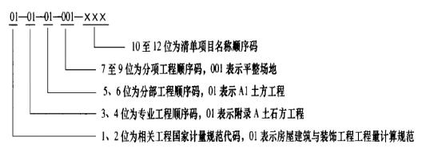
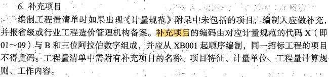
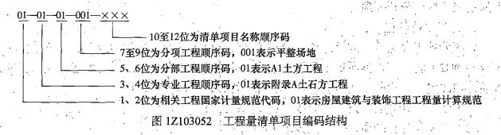

根据《建设工程工程量清单计价规范》（GB50500-2013）编制分部分项清单时，编制人员须确定项目名称、项目编码、计量单位、工程数量和（ &nbsp;&nbsp;）。

A.填表须知
B.项目特征  (正确)
C.项目总说明
D.项目工程内容
解析：
分部分项工程量清单所反映的是拟建工程分部分项工程项目名称和相应数量的明细清单，招标人负责编制，包括<strong>项目编码、项目名称、项目特征、计量单位、工程量</strong>和工作内容。

【知识点】分部分项工程项目清单的编制

【考点】分部分项工程项目清单的编制

【考察方向】原文挖空

【难度】易

【题库维护老师：ZKQ】

根据《建筑工程工程量清单计价规范》（GB50500-2013）,关于分部分项工程量清单中工程量计算的方法，正确的是（ &nbsp;&nbsp;）。

A.实际施工中的各种损耗应列入措施项目费中
B.所有招标清单项目工程量按实际施工工程量计算
C.采用工程量清单计算规则计算时，工程实体的工程量是唯一的  (正确)
D.计算综合单价时需考虑施工方案增加的工程量，但不考虑施工中的材料损耗
解析：
分部分项工程量清单中所列工程量应按《计量规范》的工程量计算规则计算。除另有说明外，<strong>所有清单项目的工程量以实体工程量为准</strong>，并以完成后的净值来计算。因此，在<strong>计算综合单价</strong>时应<strong>考虑施工中的各种损耗</strong>和需要增加的工程量，或在措施费清单中列入相应的措施费用。

【知识点】分部分项工程项目清单的编制

【考点】工程量的计算

【考察方向】概念释义

【难度】中等

【题库维护老师：ZKQ】

分部分项工程量清单项目编码分五级设置，用12位阿拉伯数字表示，其中3、4位为（）顺序码。

A.分部工程
B.分项工程
C.附录分类
D.专业工程  (正确)
解析：
项目编码是分部分项工程和措施项目清单名称的阿拉伯数字标识。分部分项工程量清单项目编码分五级设置，用12位阿拉伯数字表示。

其中1、2位为相关工程国家计量规范代码，3、4位为专业工程顺序码，5、6位为分部工程顺序码，7、8、9位为分项工程项目名称顺序码。

【知识点】分部分项工程项目清单的编制

【考点】项目编码的设置

【考察方向】概念释义

【难度】易

【题库维护老师：ZKQ】

在工程量清单中，构成分部分项工程量清单项目.措施项目自身价值本质的是（ &nbsp; &nbsp;）。

A.项目特征  (正确)
B.项目名称
C.项目工程量
D.项目计量单位
解析：
项目特征是指构成分部分项工程量清单项目、措施项目自身价值的本质特征。

【知识点】分部分项工程项目清单的编制

【考点】项目特征的描述

【考察方向】原文挖空

【难度】易

【题库维护老师：ZKQ】 

根据专业工程《计量规范》编制招标工程量清单是，有两种不同截面对的现浇混凝土矩形柱，一种是400mm *400mm，另一种是600mm*400mm，混凝土强度均为C30，其余特征相同，则在编制清单时这两个矩形柱的清单项应（ ）。

A.合并列项，项目名称为“矩形柱”，在项目特征中注明混凝土强度。
B.分别列项，项目名称均为“现浇混凝土矩形柱”，在项目特征中注明截面尺寸。
C.分别列项，一个项目名称为“C30现浇混凝土矩形柱400*400"，另一个项目名称为“C30现浇混凝土矩形柱600*400"。  (正确)
D.合并列项，项目名称为“矩形柱（400×400，600×400）”，工程数量一栏给出合并后的工程量
解析：
对清单项目特征不同的项目应分别列项，如基础工程，仅混凝土强度等级不同，足以影响投标人的报价，故应分开列项。 

【知识点】分部分项工程项目清单的编制

【考点】分部分项工程项目清单的编制

【考查方向】概念释义

【难度】易

【题库维护老师：hejiade】

根据《建设工程工程量清单计价规范》（GB50500-2013）编制的分部分项工程量清单，其工程数量是按照（ ）计算的。

A.设计文件图示尺寸的工程量净值  (正确)
B.设计文件结合不同施工方案确定的工程量平均值
C.工程实体量和损耗量之和
D.实际施工完成的全部工程量
解析：
所有清单项目的工程量以实体工程量为准，并以完成后的净值计算。采用工程量清单计算规则计算时，工程实体的工程量是唯一的。

【知识点】分部分项工程项目清单的编制

【考点】工程量的计算

【考察方向】原文挖空

【难度】中等

【题库维护老师：ZKQ】

招标人编制工程量清单时，对各专业工程现行（计量规范）中未包括的项目应作补充，则关于该补充项目及其编码的说法，正确的是（ ）。

A.该项目编码应有对应《计量规范》的代码和三位阿拉伯数字组成
B.清单编制人应将补充项目报省级或行业工程造价管理机构备案  (正确)
C.清单编制人在最后一个清单项目后面自行补充该项目，不需编码
D.该项目按《计量规范》中相近的清单项目编码
解析：
本题考查的是分部分项工程项目清单的编制。工程量清单补充项目编码由对应计量规范的代码 X 与 B和三位阿拉伯数字组成，并应从 XB001 起顺序编制，同一招标工程的项目不得有重码。而且编制工程量清单时如果出现《计量规范》附录中未包括的项目，编制人应做补充，并报省级或行业工程造价管理机构备案。

【知识点】分部分项工程项目清单的编制

【考点】补充项目

【考察方向】概念释义

【难度】易

【题库维护老师：ZKQ】

根据《建设工程工程量清单计价规范》（GB 50500—2013），编制的工程量清单中，某分部分项工程的项目编号 010302004005，则“01”的含义是（ ）。

A.分项工程顺序
B.分部工程顺序
C.专业工程顺序
D.相关工程国家计量规范代码  (正确)
解析：
本题考查项目编码的设置。  分部分项工程量清单项目编码以五级编码设置，采用十二位阿拉伯数字表示。  （1）第一级为相关工程国家计量规范代码（分二位），  （2）第二级为附录分类顺序码（分二位）；  （3）第三级为分部工程顺序码（分二位）；  （4）第四级为分项工程项目顺序码（分三位）；  （5）第五级为工程量清单项目顺序码（分三位）。

【知识点】分部分项工程项目清单的编制

【考点】项目编码的设置

【考察方向】原文挖空

【难度】易

【题库维护老师：ZKQ】

根据《建设工程量清单计价规范》（GB 50500—2008）编制的工程量清单中，某分部分项工程的项目编码是 010302004005，则“03”的含义是（ ）。

A.国家计量规范代码
B.分项工程顺序码
C.分部工程顺序码
D.专业工程顺序码  (正确)
解析：
其中 1、2 位为相关工程国家计量规范代码，3、4 位为专业工程顺序码，5、6 位为分部工程顺序码，7、8、9 位为分项工程项目名称顺序码，10 ~ 12 位为清单项目编码。

【知识点】分部分项工程项目清单的编制

【考点】项目编码的设置

【考察方向】原文挖空

【难度】易

【题库维护老师：ZKQ】 

根据《建设工程工程量清单计价规范》（GB50500-2013），关于分部分项工程量清单中项目名称的说法，正确的是（ ）。

A.《计量规范》中的项目名称是分项工程名称，以工程主要材料命名
B.编制清单时，项目名称应根据《计量规范》的项目名称结合拟建工程实际确定  (正确)
C.《计量规范》中的项目名称是分部工程名称，以工程实体命名
D.编制清单时，《计量规范》中的项目名称不能变化，但应补充项目规格、材质
解析：
分部分项工程量清单的项目名称应根据《计量规范》的项目名称结合拟建工程的实际确 定。《计量规范》中规定的“项目名称”为分项工程项目名称，一般以工程实体命名。编制工程量清单时，应以附录中的项目名称为基础，考虑该项目的规格、型号、材质等特征要求，并结合拟建工程的实际情况，对其进行适当的调整或细化，使其能够反映影响工程造价的主要因素。

【知识点】分部分项工程项目清单的编制

【考点】项目名称的确定

【考察方向】概念释义

【难度】易

【题库维护老师：ZKQ】 

根据《建设工程工程量清单计价规范》GB 50500-2013，除另有说明外，所有清单项目的工程量以( &nbsp; )为准，并以完成后的净值来计算。

A.实体工程量  (正确)
B.返工工程量及其损耗
C.工程施工方案
D.实际施工工程量
解析：
分部分项工程量清单中所列工程量应按《计量规范》的工程量计算规则计算，工程量计算规则是指对清单项目工程量计算的规定。除另有说明外，所有清单项目的工程量以实体工程量为准，并以完成后的净值来计算。

【知识点】分部分项工程项目清单的编制

【考点】工程量的计算

【考察方向】原文挖空

【难度】易

【题库维护老师：ZKQ】

分部分项工程量清单的编制中，五级编码设置的项目编码的位数是( &nbsp; )位。

A.8
B.10
C.12  (正确)
D.14
解析：
项目编码是分部分项工程量清单项目名称的数字标识。分部分项工程量清单项目编码以五级编码设置，采用十二位阿拉伯数字表示。各级编码代表含义：第一级为工程分类顺序码(分二位)；第二级为附录分类顺序码(分二位)；第三级为分部工程顺序码(分二位)；第四级为分项工程项目顺序码(分三位)；第五级为工程量清单项目顺序码(分三位)。

【知识点】分部分项工程项目清单的编制

【考点】项目编码的设置

【考察方向】原文挖空

【难度】易

【题库维护老师：ZKQ】

关于分部分项工程量清单汇总项目特征描述的作用的说法，错误的是（ ）。

A.项目特征是进行概算审查的依据  (正确)
B.项目特征是履行合同义务的基础
C.项目特征是确定综合单价的前提
D.项目特征是区分清单项目的依据
解析：
项目特征是区分清单项目的依据；项目特征是确定综合单价的前提；项目特征是履行合同义务的基础。

【知识点】分部分项工程项目清单的编制

【考点】项目特征的描述

【考察方向】原文挖空

【难度】易

【题库维护老师：ZKQ】

某分部分项工程的清单编号为010302004014，则该分部分项工程的清单项目顺序码为（ ） 。 

A.01
B.014  (正确)
C.03
D.004
解析：
项目编码是分部分项工程和措施项目清单名称的阿拉伯数字标识。分部分项工程量清单项目编码分五级设置，采用12位阿拉伯数字表示。

其中1/2位为相关工程国家计量规范代码，3、4位为专业工程顺序码，5、6位为分部工程顺序码，7、8、9位为分项工程项目名称顺序码，这九位应按《房屋建屋与装饰工程工程量计算规范》GB &nbsp;50854-2013，《通用安装工程工程量计算规范》 GB 50858-2013，《仿古建筑工程工程量计算规范》GB 50855-2013等各专业计量规范（上述规范以下简称计量规范）的规定设置；10-12位为清单项目编码，应根据拟建工程的工程量清单项目名称设置，同一招标工程编码不得有重码，这三位清单编码，应根据拟建工程的工程量清单项目名称设置，同一招标工程编码不得有重码，这三位清单项目编码由招标人针对招标工程项目具体编制，并应自001起顺序编码。

【知识点】分部分项工程项目清单的编制

【考点】项目编码的设置

【考察方向】概念释义

【难度】中等

【题库维护老师：ZKQ】

分部分项工程量清单中，（ &nbsp; &nbsp;）直接决定了清单项目的价格，是投标人确定综合单价最重要的依据。

A.项目编码
B.项目名称
C.项目特征  (正确)
D.工程量计算规则
解析：
工程量清单项目特征描述的重要意义在于：（1）项目特征是区分清单项目的依据。（2）项目特征是确定综合单价的前提。（3）项目特征是履行合同义务的基础。

【知识点】分部分项工程项目清单的编制

【考点】项目特征的描述

【考察方向】概念释义

【难度】易

【题库维护老师：ZKQ】

根据《建设工程工程量清单计价规范》GB50500－2013，所有招标工程量清单中的工程数量应以（ &nbsp; ）计算。

A.实体工程量为准，并以净值  (正确)
B.实体工程量为准，并以施工时的全部工程数量
C.招标时的图纸工程量为准，并以施工时的全部工程数量
D.施工单位的施工工程量为准
解析：
分部分项工程量清单中所列工程量应按《计量规范》的工程量计算规则计算。工程量计算规则是指对清单项目工程量计算的规定。除另有说明外，所有清单项目的工程量以实体工程量为准，并以完成后的净值来计算。

【知识点】分部分项工程项目清单的编制

【考点】工程量的计算

【考察方向】原文挖空

【难度】易

【题库维护老师：ZKQ】

根据《建设工程工程量清单计价规范》GB50500-2013，某分部分项工程的项目编码为01-02-03-004-005，其中“004”这一级编码的含义是（ &nbsp; &nbsp;）。

A.工程分类顺序码
B.清单项目顺序码
C.分部工程顺序码
D.分项工程顺序码  (正确)
解析：
项目编码是5级12位，即2-2-2-3-3，根据详略程度，详细的后面，粗略的在前面，现在问的是第4级，属于分项工程的顺序码，所以选D。

【知识点】分部分项工程项目清单的编制

【考点】项目编码的设置

【考察方向】概念释义

【难度】易

【题库维护老师：ZKQ】 

关于分部分项目工程量清单中项目特征描述的作用的说法，错误的是( &nbsp; )

A.项目特征是进行概算审查的依据  (正确)
B.项目特征是履行合同义务的基础
C.项目特征是确定综合单价的前提
D.项目特征是区别清单项目的依据
解析：
项目特征是区分清单项目的依据；项目特征是确定综合单价的前提；项目特征是履行合同义务的基础。

【知识点】分部分项工程项目清单的编制

【考点】项目特征的描述

【考察方向】原文挖空

【难度】易

【题库维护老师：ZKQ】

在进行工程量清单编制时，除另有说明外，分部分项工程量清单中所有清单项目的工程量以( &nbsp; )为准。

A.工程净量
B.实体工程量  (正确)
C.工程净量加上辅助工程量
D.实体工程量扣除必要的损耗
解析：
分部分项工程量清单中所列工程量应按《计量规范》的工程量计算规则计算。工程量计算规则是指对清单项目工程量计算的规定。除另有说明外，所有清单项目的工程量以实体工程量为准，并以完成后的净值来计算。

【知识点】分部分项工程项目清单的编制

【考点】工程量的计算

【考察方向】原文挖空

【难度】易

【题库维护老师：ZKQ】

根据《建设工程工程量清单计价规范》GB50500-2013，关于分部分项工程量清单中工程量计算的说法，正确的是( &nbsp;)。

A.实际施工中的各种损耗应列入措施项目费中
B.所有招标清单项目工程量按实际施工工程量计算
C.计算综合单价时需考虑施工方案增加的工程量，但不考虑施工中的材料损耗
D.采用工程量清单计算规则计算时，工程实体的工程量是唯一的  (正确)
解析：
分部分项工程量清单中所列工程量应按《计量规范》的工程量计算规则计算。工程量计算规则是指对清单项目工程量计算的规定。除另有说明外，所有清单项目的工程量以实体工程量为准，并以完成后的净值来计算。因此，在计算综合单价时应考虑施工中的各种损耗和需要增加的工程量，或在措施费清单中列入相应的措施费用。采用工程量清单计算规则，工程实体的工程量是唯一的。统一的清单工程量为各投标人提供了一个公平竞争的平台，也方便招标人对各投标人的报价进行对比。

【知识点】分部分项工程项目清单的编制

【考点】工程量的计算

【考察方向】原文挖空

【难度】易

【题库维护老师：ZKQ】

根据《建设工程工程量清单计价规范》GB50500-2013，某建筑工程其中一个标段的工程量清单中含有三个单位工程，每一单位工程中都有项目特征相同的实心砖墙砌体。则在编制招标工程量清单时，正确的做法是( &nbsp;)。

A.将三个部分的实心砖墙砌体工程量合并为一项分部分项工程
B.将三个不同单位工程的实心砖墙砌体工程量分别编码列项  (正确)
C.将三个单位工程中人工、材料、机械台班消耗量分别汇总分别列项
D.将三个单位工程分别编制不同的清单并在其中反映实心砖墙砌体
解析：
根据同一招标工程项目编码不得有重码的规定，工程量清单应以单位工程为编制对象，可将第一个单位工程的实心砖墙的项目编码编成010401003001，第二个单位工程的实心砖墙的项目编码编成010401003002，第三个单位工程的实心砖墙的项目编码编成010401003003，并分别列出各单位工程实心砖墙的工程量。A不正确；

清单计价下，分部分项工程的对象是分部分项工程，所以C不正确；

同时，作为统一招标标段的单位工程，不宜编制不同的招标清单D不正确，B正确。

【知识点】分部分项工程项目清单的编制

【考点】分部分项工程项目清单的编制

【考察方向】概念释义

【难度】中等

【题库维护人：ZKQ】 

根据《建设工程工程量清单计价规范》GB50500-2013，编制分部分项工程量清单时，编制人必须确定项目名称、项目编码、计量单位、工程数量和( &nbsp;)。

A.填表须知
B.项目特征  (正确)
C.项目总说明
D.项目工程内容
解析：
分部分项工程量清单所反映的是拟建工程分布分项工程项目名称和相应数量的明细清单，招标人负责编制，包括项目编码、项目名称、项目特征、计量单位、工程量和工作内容。

【知识点】分部分项工程项目清单的编制

【考点】分部分项工程项目清单的编制

【考察方向】原文挖空

【难度】易

【题库维护老师：ZKQ】

根据《建设工程工程量清单计价规范》GB50500-2013，招标人编制工程量清单时，其中有一项分部分项工程是采用最新材料的，而原规范中没有该项目，编制人对该项目作了补充。则关于该补充项目及其编码的说法，正确的是( &nbsp;)。

A.该项目编码应由对应《计量规范》的代码和三位阿拉伯数字组成
B.该项目按《计量规范》中相近或相似的清单项目编码
C.清单编制人在最后一个清单项目后面自行补充该项目，不需编码
D.清单编制人应将补充项目报省级或行业工程造价管理机构备案  (正确)
解析：
编制工程量清单时如果出现《计量规范》附录中未包括的项目，编制人应做补充，并报省级或行业工程造价管理机构备案。补充项目的编码由对应计量规范的代码X（即01〜09）与B和三位阿拉伯数字组成，并应从×B001起顺序编制，同一招标工程的项目不得重码。工程量清单中需附有补充项目的名称、项目特征、计量单位、工程量计算规则、工作内容。

【知识点】分部分项工程项目清单的编制

【考点】补充项目

【考察方向】原文挖空

【难度】易

【题库维护老师：ZKQ】

根据《建设工程工程量清单计价规范》GB50500-2013，编制工程量清单时，出现了《计量规范》中未包括的项目，则关于该项目清单项编制的说法，正确的是( &nbsp;)。

A.该清单项由清单编制人自行补充即可
B.该补充项目的编码由对应计量规范的代码X与B和三位阿拉伯数字组成，如XBO01  (正确)
C.工程量清单中仅需附有补充项目的名称、项目特征和计量单位以及工作内容
D.该补充项目的工程量计算规则应由投标人根据经验自行确定
解析：
编制工程量清单时如果出现《计量规范》附录中未包括的项目，编制人应做补充，并报省级或行业工程造价管理机构备案，A不正确；

补充项目的编码由对应计量规范的代码x（即01～09）与B和三位阿拉伯数字组成，并应从XBO01起顺序编制，D不正确，B正确；

同一招标工程的项目不得重码。工程量清单中需附有补充项目的名称、项目特征、计量单位、工程量计算规则、工作内容，所以C不正确。

【知识点】分部分项工程项目清单的编制

【考点】补充项目

【考察方向】原文挖空

【难度】中等

【题库维护老师：ZKQ】

某工程项目清单编码为01-02-03-004-005，其中004代表的是( &nbsp;)。

A.专业工程顺序码
B.分部工程顺序码
C.分项工程顺序码  (正确)
D.清单项目名称顺序码
解析：
项目编码是分部分项工程和措施项目清单名称的阿拉伯数字标识。分部分项工程量清单项目编码分五级设置，采用12位阿拉伯数字表示。其中1/2位为相关工程国家计量规范代码，3、4位为专业工程顺序码，5、6位为分部工程顺序码，<strong>7、8、9位为分项工程项目名称顺序码</strong>，这九位应按《房屋建屋与装饰工程工程量计算规范》GB &nbsp;50854-2013，《通用安装工程工程量计算规范》 GB 50858-2013，《仿古建筑工程工程量计算规范》GB 50855-2013等各专业计量规范（上述规范以下简称计量规范）的规定设置；10-12位为清单项目编码，应根据拟建工程的工程量清单项目名称设置，同一招标工程编码不得有重码，这三位清单编码，应根据拟建工程的工程量清单项目名称设置，同一招标工程编码不得有重码，这三位清单项目编码由招标人针对招标工程项目具体编制，并应自001起顺序编码。

【知识点】分部分项工程项目清单的编制

【考点】项目编码的设置

【考察方向】原文挖空

【难度】易

【题库维护老师：ZKQ】

根据2013版计量规范编制的工程量清单中，某分部分项工程的项目编码010302004005，则“01”的含义是（ &nbsp; ）。

A.分项工程顺序码
B.分部工程顺序码
C.专业工程顺序码
D.工程分类顺序码  (正确)
解析：
项目编码是分部分项工程和措施项目清单名称的阿拉伯数字标识。分部分项工程量清单项目编码分五级设置，采用12位阿拉伯数字表示。其中1/2位为相关工程国家计量规范代码，3、4位为专业工程顺序码，5、6位为分部工程顺序码，7、8、9位为分项工程项目名称顺序码。

【知识点】分部分项工程项目清单的编制

【考点】项目编码的设置

【考察方向】原文挖空

【难度】易

【题库维护老师：ZKQ】

分部分项工程项目清单中项目特征描述通常包括（ &nbsp;）。

A.项目的管理模式
B.项目的材质、规格  (正确)
C.项目的工艺特征  (正确)
D.项目的组织方式
E.可能对项目施工方法产生影响的特征  (正确)
解析：
清单项目特征主要涉及项目的自身特征（材质、型号、规格、品牌）、项目的工艺特征以及对项目施工方法可能产生影响的特征。

【知识点】分部分项工程项目清单的编制

【考点】项目特征的描述

【考察方向】原文挖空

【难度】易

【题库维护老师：ZKQ】 

根据《建设工程工程量清单计价规范》关于项目特征的说法，正确的有( &nbsp;)。

A.分部分项工程量清单的项目特征是确定综合单价的重要依据  (正确)
B.项目特征主要涉及项目的自身特征、工艺特征及对项目施工方法可能产生影响的特征  (正确)
C.项目名称相同、项目特征不同的清单项目应分别列项  (正确)
D.项目特征是指构成分部分项工程量清单项目、措施项目自身价值的本质特征  (正确)
E.项目特征应根据《计量规范》的项目特征进行统一描述，招标人不应根据拟建项目实际情况更改项目特征的描述
解析：
项目特征是指构成分部分项工程量清单项目、措施项目自身价值的本质特征。分部分项工程量清单项目特征应按《计量规范》的项目特征，结合拟建工程项目的实际予以描述。 

清单项目特征主要涉及项目的自身特征（材质、型号、规格、品牌）、项目的工艺特征以及对项目施工方法可能产生影响的特征。

对清单项目特征不同的项目应分别列项，如基础工程，仅混凝土强度等级不同，足以影响投标人的报价，故应分开列项。

本题考查的是工程量清单项目特征描述的含义。

【知识点】分部分项工程项目清单的编制

【考点】项目特征的描述

【考察方向】原文挖空

【难度】中等

【题库维护老师：ZKQ】 

根据《建设工程工程量清单计价规范》,关于招标工程量清单中项目特征的说法,正确的有( &nbsp; )。

A.项目特征是确定一个清单项目综合单价的重要依据  (正确)
B.项目特征主要涉及项目的自身特征,不涉及项目的工艺特征
C.项目特征是区分清单项目的重要依据  (正确)
D.项目特征决定了工程实体的实质内容,直接决定工程实体的自身价值  (正确)
E.仅有分部分项工程量清单项目需要进行项目特征描述
解析：
分部分项工程量清单的项目特征是确定一个清单项目综合单价的重要依据，在编制的工程量清单中必须对其项目特征进行准确和全面的描述。E错误。 清单项目特征主要涉及项目的自身特征(材质、型号、规格、品牌)、项目的工艺特征以及对项目施工方法可能产生影响的特征。B错误。

【知识点】分部分项工程项目清单的编制

【考点】项目特征的描述

【考察方向】原文挖空

【难度】中等

【题库维护老师：ZKQ】

在分部分项工程量清单中，对项目特征进行描述的意义是（ ）。

A.是区分清单项目的依据  (正确)
B.是处理工程索赔的依据
C.是确定综合单价的前提  (正确)
D.是工程付款和结算的依据
E.是履行合同义务的基础  (正确)
解析：
分部分项工程量清单的项目特征是确定一个清单项目综合单价的重要依据，在编制工程量清单中必须 对其项目特征进行准确和全面的描述。  重要意义：（1）项目特征是区分清单项目的依据；  （2）项目特征是确定综合单价的前提；  （3）项目特征是履行合同义务的前提。

【知识点】分部分项工程项目清单的编制

【考点】项目特征的描述

【考察方向】原文挖空

【难度】中等

【题库维护老师：ZKQ】 

下列关于工程量清单编制的说法，正确的是（ ）。

A.招标工程量清单的准确性和完整性由编制人负责
B.项目编码采用全国统一的五级十二位编码形式
C.当计量单位有两个或两个以上时，应选择最适宜表述该项目特征并方便计量的单位  (正确)
D.项目名称应根据《计量规范》的项目名称结合拟建工程的实际确定  (正确)
E.补充项目的编码由对应计量规范的代码 X 和三位阿拉伯数字组成
解析：
招标工程量清单必须作为招标文件的组成部分，由招标人提供，招标人对其准确性和完整性负责。项目编码的 10-12 位由招标人针对招标项目具体编制。补充项目的编码由对应计量规范的代码 X（即 01～09）与B 和三位阿拉伯数字组成。从 XB001 起顺序编制。

【知识点】项目编码的设置

【考点】项目编码的设置

【考察方向】概念释义

【难度】中等

【题库维护老师：ZKQ】 

按《建设工程工程量清单计价规范》（GB50500-2013）规定，工程量清单的组成包括（ ）。

A.分部分项工程量清单  (正确)
B.措施项目清单  (正确)
C.其他项目清单  (正确)
D.通用项目清单
E.专用项目清单
解析：
招标工程量清单应以单位（项）工程为单位编制，应由分部分项工程量清单、措施项目清单、其他项目清单、规费和税金项目清单组成。

【知识点】分部分项工程项目清单的编制

【考点】分部分项工程项目清单的编制

【考察方向】原文挖空

【难度】易

【题库维护老师：ZKQ】

分部分项工程量清单应按建设工程工程量计量规范的规定，确定( &nbsp; &nbsp;)。

A.项目特征  (正确)
B.项目编码  (正确)
C.计量单位  (正确)
D.项目名称  (正确)
E.计算方法
解析：
分部分项工程量清单应包括项目编码、项目名称、项目特征、计量单位和工程量和工作内容。

【知识点】分部分项工程项目清单的编制

【考点】分部分项工程项目清单的编制

【考察方向】原文挖空

【难度】易

【题库维护老师：ZKQ】

在进行工程量清单编制时，分部分项工程项目工程量清单应按建设工程工程量计量规范的规定，确定( &nbsp; )

A.项目名称  (正确)
B.项目编码  (正确)
C.项目内容
D.计量单位  (正确)
E.项目特征  (正确)
解析：
在进行工程量清单编制时，分部分项工程项目工程量清单应按建设工程工程量计量规范的规定，确定项目编码、项目名称、项目特征、计量单位，并按不同专业工程量计量规范给出的工程量计算规则，进行工程量的计算。

【知识点】分部分项工程项目清单的编制

【考点】分部分项工程项目清单的编制

【考察方向】原文挖空

【难度】易

【题库维护老师：ZKQ】

根据《建设工程工程量清单计价规范》GB50500-2013，工程量清单项目特征描述的重要意义在于( &nbsp;)。

A.项目特征是区分清单项目的依据  (正确)
B.项目特征是确定综合单价的前提  (正确)
C.项目特征是履行合同义务的基础  (正确)
D.项目特征是计量单位选择的依据
E.项目特征是确定工作内容的依据
解析：
工程量清单项目特征描述的重要意义在于： （1）项目特征是区分清单项目的依据。 （2）项目特征是确定综合单价的前提。 （3）项目特征是履行合同义务的基础。

【知识点】分部分项工程项目清单的编制

【考点】项目特征的描述

【考察方向】原文挖空

【难度】易

【题库维护老师：ZKQ】

根据《建设工程工程量清单计价规范》GB50500-2013，关于项目编码方式的说法，正确的有( &nbsp;)。

A.编码的第1～9位应根据专业工程计量规范的规定设置  (正确)
B.编码的第10～12位由清单编制人自行设置  (正确)
C.同一招标工程编码不得有重码  (正确)
D.不同的单项工程中内容完全相同的分项工程编码应该相同
E.编码的第1～2位是相关工程国家计量规范的代码  (正确)
解析：
项目编码是分部分项工程和措施项目清单名称的阿拉伯数字标识。分部分项工程量清单项目编码分五级设置，用12位阿拉伯数字表示。其中1、2位为相关工程国家计量规范代码，E正确；

3、4位为专业工程顺序码，5、6位为分部工程顺序码，7、8、9位为分项工程项目名称顺序码，这9位应按各专业计量规范的规定设置，A正确；

10—12位为清单项目编码，应根据拟建工程的工程量清单项目名称设置，B正确；

同一招标工程编码不得有重号，C正确，D不正确；

这三位清单项目编码由招标人针对招标工程项目具体编制，并应自001起顺序编制。

【知识点】分部分项工程项目清单的编制

【考点】项目编码的设置

【考察方向】概念释义

【难度】易

【题库维护老师：ZKQ】

根据《建设工程工程量清单计价规范》GB50500-2013，招标工程量清单中项目名称设置的说法，正确的有( &nbsp;)。

A.项目名称一般为分项工程名称  (正确)
B.项目名称必须与规范中的名称一致，不能随意修改
C.项目名称的设置应结合拟建工程的实际情况  (正确)
D.项目名称一般以工程实体命名  (正确)
E.项目名称应以规范中的项目名称为基础，考虑项目的规格、型号等特征进行细化  (正确)
解析：
分部分项工程量清单的项目名称应根据《计量规范》的项目名称结合拟建工程的实际确定，B错误，C、E正确；

《计量规范》中规定的“项目名称”为分项工程项目名称，一般以工程实体命名。A、D正确。

【知识点】分部分项工程项目清单的编制

【考点】项目名称的确定

【考察方向】原文挖空

【难度】中等

【题库维护老师：ZKQ】

在分部分项工程量清单项目编码中，第二级顺序码为（ &nbsp;）。

A.工程分类顺序码
B.专业工程顺序码  (正确)
C.分部工程顺序码
D.工序清单顺序码
解析：
 【知识点】分部分项工程项目清单的编制 【考点】分部分项工程项目清单的编制 【考查方向】概念释义 【难度】易 【题库维护老师】yxf

下列选项中，招标工程量清单中对于补充项目进行编码正确的一项是（）。

A.010103005002
B.B010104001001
C.010102002B
D.01B001  (正确)
解析：
【知识点】分部分项工程项目清单的编制 【考点】分部分项工程项目清单的编制 【考查方向】概念释义 【难度】易 【题库维护老师】yxf

某建设工程招标工程量清单中，其分部分项工程项目清单中一项“挖沟槽石方”作业的项目编码为“010102002003”，则其中，反映该项作业属于何种分项工程的数字为（）。

A.01
B.002  (正确)
C.03
D.010
解析：
 【知识点】分部分项工程项目清单的编制 【考点】分部分项工程项目清单的编制 【考查方向】概念释义 【难度】易 【题库维护老师】yxf

