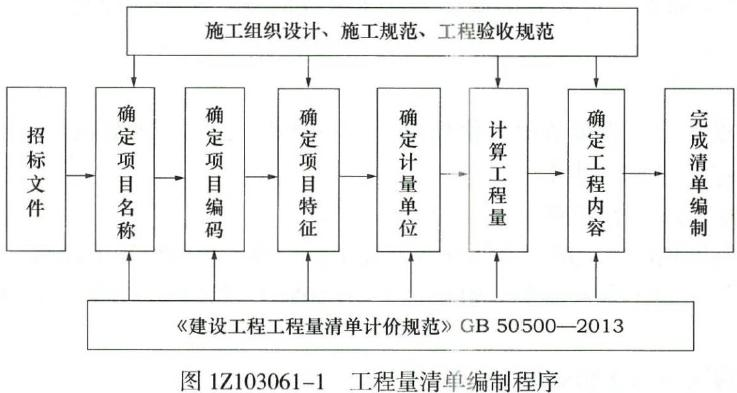

工程量清单编制时，应在确定项目特征之后进行的程序有（）。

A.确定计量单位  (正确)
B.计算工程量  (正确)
C.确定项目名称
D.确定项目编码
E.确定工程内容  (正确)
解析：
工程量清单计价过程可以分为两个阶段：工程量清单编制和工程量清单应用。程量清单的编制程序：招标文件→确定项目名称→确定项目编码→确定项目特征→确定计量单位→计算工程量→确定工程内容→完成清单编制。

【知识点】工程量清单计价的基本过程

【考点】工程量清单计价的基本过程

【考察方向】原文挖空

【难度】易

【题库维护老师：ZKQ】

招标方编制工程量清单时有以下工作:①确定项目编码:②研究招标文件,确定清单项目名称:③确定计量单位;④计算工程数量:⑤确定项目特征,正确的顺序是（ &nbsp; &nbsp;）。

A.①②③④⑤
B.①②⑤③④
C.②③⑤④①
D.②①⑤③④  (正确)
解析：
如下图： 

【知识点】工程量清单计价的基本过程

【考点】工程量清单计价的基本过程

【考察方向】原文挖空

【难度】易

【题库维护老师：ZKQ】 

