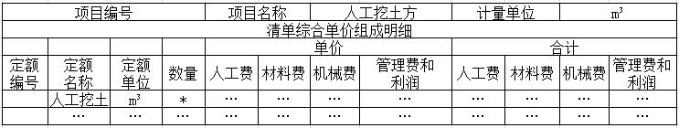

下列关于工程量清单计价描述正确的是（）。

A.投标时，投标人发现工程量清单项目特征描述与设计图纸的描述不符，报价时应以设计图纸为准
B.施工时，承包人发现工程量清单项目特征描述与设计图纸的描述不符，报价时应以设计图纸为准
C.投标人的投标报价不得给与招标人任何的优惠
D.计日工综合单价与总承包服务费由投标人自主确定  (正确)
解析：
A选项，应以工程量清单的项目特征描述为准； B选项，应根据实际施工的项目特征依据合同约定重新确定； C选项，清单招投标计价不能进行“总价”优惠。 【知识点】投标报价的编制与审核 【考点】投标报价的编制与审核 【考查方向】概念释义 【难度】易 【题库维护老师】yxf

投标过程中，若投标人发现招标工程量清单项目特征描述与施工图纸不符时，应以（ &nbsp;&nbsp;）为准进行报价。

A.招标工程量清单的项目特征  (正确)
B.招标文件中的施工图纸说明
C.实际施工的项目特征
D.投标人按规范修正后的项目特征
解析：
在招投标过程中，若出现工程量清单特征描述与设计图纸不符，投标人应<strong>以招标工程量清单的项目特征描述为准</strong>，确定投标报价的综合单价；若施工中施工图纸或设计变更与招标工程量清单项目特征描述不一致，发承包双方应按实际施工的项目特征依据合同约定重新确定综合单价。

【知识点】投标报价的编制与审核

【考点】单价项目

【考察方向】概念释义

【难度】易

【题库维护老师：ZKQ】

投标过程中，投标人发现招标工程量清单项目特征描述与设计图纸的描述不符时，报价时应以（ &nbsp;）为准。

A.投标人按规范修正后的项目特征
B.招标工程量清单的项目特征  (正确)
C.实际施工项目的具体特征
D.招标文件中的设计图纸及其说明
解析：
本题考查的是投标文件的编制与审查。在招投标过程中，若出现工程量清单特征描述与设计图纸不符，投标人应以招标工程量清单的项目特征描述为准，确定技标报价的综合单价;若施工中施工图纸或设计变更与招标工程量清单项目特征描述不一致，发承包双方应按实际施工的项目特征依据合同约定重新确定综合单价。

【知识点】投标报价的编制与审核

【考点】单价项目

【考察方向】原文挖空

【难度】易

【题库维护老师：ZKQ】 

下列关于其他项目清单的说法中不正确的是（ ）。

A.投标人可以随意改动其他项目清单中的专业工程暂估价  (正确)
B.投标人不得随意改动其他项目清单中的暂列金额
C.投标人不得随意更改其中招标人填写的计日工的数量
D.投标人对总承包服务费可自主进行报价
解析：
（1）暂列金额按招标人列出的金额填写，不得变动  （2）暂估价不得变动和更改。材料暂估价按招标人列出的单价计入综合单价，专业暂估价按招标人列出的金额填写。  （3）计日工，按清单列出的项目和估算的数量，自主确定综合单价、计算费用。  （4）总承包服务费按招标人列出的服务内容，投标人根据自身情况自主确定。

【知识点】投标报价的编制与审核

【考点】其他项目费

【考察方向】原文挖空

【难度】中等

【题库维护老师：ZKQ】

在招投标过程中，若出现招标文件中分部分项工程量清单特征描述与设计图纸不符，投标人确定投标报价的综合单价应该以（ ）为准。

A.设计图纸
B.分部分项工程量清单的项目特征的描述  (正确)
C.企业定额
D.实际施工的项目特征
解析：
工程量清单中项目特征的描述决定了清单项目的实质，直接决定了工程的价值，是投标人确定综合单价最重要的依据。在招投标过程中，若出现招标文件中分部分项工程量清单特征描述与设计图纸不符，投标人应以分部分项工程量清单的项目特征描述为准，确定投标报价的综合单价；若施工中施工图纸或设计变更与工程量清单项目特征描述不一致时，发、承包双方应按实际施工的项目特征，依据合同约定重新确定综合单价。

【知识点】投标报价的编制与审核

【考点】单价项目

【考察方向】原文挖空

【难度】易

【题库维护老师：ZKQ】

根据《建设工程工程量清单计价规范》，关于投标人的投标总价编制的说法，正确的是（　）。

A.为降低投标总价，投标人可以将暂列金额降至零
B.投标总价可在分部分项工程费、措施项目费、其他项目费和规费、税金合计金额上做出优惠
C.开标前投标人来不及修改标书时，可在投标者致函中给出优惠比例并将优惠后的总价作为新的投标价
D.投标人对投标报价的任何优惠均应反映在相应清单项目的综合单价中  (正确)
解析：
投标人的投标总价应当与组成招标工程量清单的分部分项工程费、措施项目费、其他项目费和规费、税金的合计金额相一致，即投标人在进行工程项目工程量清单招标的投标报价时，不能进行投标总价优惠（或降价、让利），投标人对投标报价的任何优惠（或降价、让利）均应反映在相应清单项目的综合单价中。暂列金额、暂估价不得变动和更改；

【知识点】投标报价的编制与审核

【考点】投标报价的编制与审核

【考察方向】概念释义

【难度】中等

【题库维护老师：ZKQ】 

关于工程量清单招标方式下列投标人报价的说法，正确的是（　　）

A.专业工程暂估价中的专业工程应由投标人自主确定价格并计入报价
B.暂估价中的材料应按暂估单价计入综合单价  (正确)
C.措施项目中的总价项目应包括规费和税金
D.投标人报价时可以给予一定幅度的总价优惠
解析：
选项A：专业工程暂估价必须 按照招标工程量清单中列出的金额填写；A错误

选项B：暂估价中的材料.工程设备必须按照暂估单价计入综合单价；B正确

选项C：措施项目中的总价项目应采用综合单价方式报价，包括除规费.税金外的全部费用；C错误

选项D：投标人在进行工程项目工程量清单招标的投标报价时，不能进行投标总价优恵。D错误

【知识点】投标报价的编制与审核

【考点】投标报价的编制与审核

【考察方向】概念释义

【难度】中等

【题库维护老师：ZKQ】 

在编制投标报价之前，首先要做的工作是( &nbsp; )。

A.清单工程量的复核  (正确)
B.安排人力和机械
C.准备材料
D.选择施工方法
解析：
在编制投标报价之前，需要先对清单工程量进行复核。

因为工程量清单中的各分部分项工程量并不十分准确，若设计深度不够则可能有较大的误差，而工程量的多少是选择施工方法、安排人力和机械、准备材料必须考虑的因素，自然也影响分项工程的单价，因此一定要对工程量进行复核。

【知识点】投标报价的编制与审核

【考点】投标报价的编制与审核

【考察方向】原文挖空

【难度】易

【题库维护老师：ZKQ】

工程量清单计价模式下，投标人应该按照招标工程量清单中列出的金额填写且不得变动的项目是（）。

A.暂列金额和专业工程暂估价  (正确)
B.暂列金额和总承包服务费
C.计日工和总承包服务费
D.计日工和专业工程暂估价
解析：
1.暂列金额应按照招标工程量清单中列出的金额填写，不得变动。 2.暂估价不得变动和更改。暂估价中的材料、工程设备必须按照暂估单价计入综合单价;专业工程暂估价必须按照招标工程量清单中列出的金额填写。 3.计日工应按照招标工程量清单列出的项目和估算的数量，自主确定各项综合单价并计算费用。 4.总承包服务费应根据招标工程量列出的专业工程暂估价内容和供应材料、设备情况，按照招标人提出协调、配合与服务要求和施工现场管理需要自主确定。

【知识点】投标报价的编制与审核

【考点】其他项目费

【考察方向】原文挖空

【难度】中等

【题库维护老师：ZKQ】

实行工程量清单计价的招标工程，投标人可完全自主报价的是( &nbsp; &nbsp;)。

A.暂列金额
B.总承包服务费  (正确)
C.专业工程暂估价
D.措施项目费
解析：
选项AC是由业主给定的暂定价格，由业主支配使用，如有剩余归业主所有。选项D，措施项目费中的安全文明施工费应按照国家或省级.行业主管部门的规定计算确定。 选项B，总承包服务费应根据招标工程量列出的专业工程暂估价内容和供应材料.设备情况，按照招标人提出协调.配合与服务要求和施工现场管理需要自主确定。所以可完全自主报价的是总承包服务费。

【知识点】投标报价的编制与审核

【考点】投标报价的编制与审核

【考察方向】原文挖空

【难度】易

【题库维护老师：ZKQ】

根据《建设工程工程量清单计价规范》，某工程项目的钢筋由发包人在施工合同与承包人一起招标采购，编制招标工程量清单时，招标人将HR335钢筋暂估价定为4200元吨，已知市场平均价格为3650元吨。若甲投标人自行采购，其采购单价低于市场平均价格，则甲投标人在投标报价时HR335钢筋应采用的单价是( &nbsp; &nbsp;)。

A.4200元/吨  (正确)
B.甲投标人自行采购价格
C.3650元/吨
D.预计招标采购价格
解析：
本题考查的是投标价的编制与审核。发包人与承包人共同作为招标人对钢筋进行招标。其中HR335作为暂估价列入招标工程量清单。招标工程量清单中提供了暂估单价的材料、工程设备，按暂估的单价计入综合单价。所以招标人应根据招标工程量清单提供的暂估价金额填报综合单价。

【知识点】投标报价的编制与审核

【考点】投标报价的编制与审核

【考察方向】概念释义

【难度】易

【题库维护老师：ZKQ】 

根据《建设工程工程量清单计价规范》,招标人对土方开挖清单项的项目特征描述一般有挖方深度、基坑底宽、场内运距、弃土运距和( &nbsp; )。

A.放坡的坡度系数
B.槽底钎探
C.土壤类别  (正确)
D.排地表水的方式
解析：
【历年真题仅供参考】本题考查的是工程量清单计价方法。挖沟槽土方项目特征包括：土壤类别、挖土深度、弃土运距。

【知识点】投标报价的编制与审核

【考点】投标报价的编制与审核

【考察方向】概念释义

【难度】易

【题库维护老师：ZKQ】 

投标企业没有企业定额时，可根据企业自身情况参照某定额进行调整。该定额是(　　)。

A.行业计价定额
B.预算定额
C.国家计价定额
D.消耗量定额  (正确)
解析：
投标企业没有企业定额时可根据企业自身情况参照消耗量定额进行调整。

【知识点】投标报价的编制与审核

【考点】单价项目

【考察方向】概念释义

【难度】易

【题库维护老师：ZKQ】

按照《建设工程工程量清单计价规范》规定，投标报价中的企业管理费费率应当（ &nbsp;）。

A.按照国家定额标准确定
B.按照行业建设主管部门对定标准确定
C.由投标人根据本企业近年的企业管理费核算数据自行测定  (正确)
D.按照招标文件规定标准确定
解析：
企业管理费费率可由投标人根据本企业近年的企业管理费核算数据自行测定，当然也可以参照当地造价管理部门发布的平均参考值。

【知识点】投标报价的编制与审核

【考点】单价项目

【考察方向】原文挖空

【难度】易

【题库维护老师：ZKQ】

关于投标报价，下列说法错误的是( &nbsp; &nbsp;)。

A.在编制投标报价之前，需要先对清单工程量进行复核
B.综合单价中应包括招标文件中划分的应由投标人承担的风险范围及其费用
C.投标人在进行投标报价时，为了中标，可以进行投标总价优惠  (正确)
D.投标人对投标报价的任何优惠（或降价、让利）均应反映在综合单价中
解析：
C错，投标人在进行工程项目工程量清单招标的投标 报价时，不能进行投标总价优惠（或降价、让利），投标人对投标报价的任何优惠（或降价、让利）均应反映在相应清单项目的综合单价中。

【知识点】投标报价的编制与审核

【考点】投标报价的编制与审核

【考察方向】概念释义

【难度】易

【题库维护老师：ZKQ】

根据《建设工程工程量清单计价规范》GB 50500-2013,投标人在确定分项工程的综合单价时,若出现某招标工程量清单项目特征描述与设计图纸不符,但均符合设计规范,应以( &nbsp; )为准。

A.招标工程量清单的项目特征描述  (正确)
B.设计图纸及其说明
C.设计规范
D.实际施工的项目特征
解析：
在招投标过程中，出现工程量清单特征描述与设计图纸不符，以招标工程量清单的项目特征描述为准，确定综合单价。

【知识点】投标报价的编制与审核

【考点】单价项目

【考察方向】原文挖空

【难度】易

【题库维护老师：ZKQ】

根据《建设工程工程量清单计价规范》 （GB50500-2013） ，关于投标报价的说法，错误的是（ ） 。

A.暂列金额应按照招标工程量清单中列出的金额填写，不得变动
B.专业工程暂估价必须按照招标工程量清单中列出的金额填写
C.计日工应按照招标文件中的数量和单价计算总费用  (正确)
D.总承包服务费应按照招标人的要求和现场管理需要自主确定
解析：
1.暂列金额应按照招标工程量清单中列出的金额填写，不得变动。 2.暂估价不得变动和更改。暂估价中的材料、工程设备必须按照暂估单价计入综合单价；专业工程暂估价必须按照招标工程量清单中列出的金额填写。 3.计日工应按照招标工程量清单列出的项目和估算的数量，自主确定各项综合单价并计算费用。 4.总承包服务费应根据招标工程量列出的专业工程暂估价内容和供应材料、设备情况，按照招标人提出协调、配合与服务要求和施工现场管理需要自主确定。

【知识点】投标报价的编制与审核

【考点】其他项目费

【考察方向】原文挖空

【难度】易

【题库维护老师：ZKQ】

关于投标总价的说法，错误的是( &nbsp; )

A.投标总价应当与组成招标工程量清单的分部分项工程费、措施项目费、其他项目费和规费、税金的合计金额相一致
B.投标总价应根据招标工程量列出的专业工程暂估价内容和供应材料、设备情况来确定  (正确)
C.投标人在进行工程项目工程量清单招标的投标报价时，不能进行投标总价优惠
D.对投标报价的任何优惠均应反映在相应清单项目的综合单价中
解析：
投标人的投标总价应当与组成招标工程量清单的分部分项工程费、措施项目费、其他项目费和规费、税金的合计金额相一致，即投标人在进行工程项目工程量清单招标的投标报价时，不能进行投标总价优惠(或降价、让利)，投标人对投标报价的任何优惠(或降价、让利)均应反映在相应清单项目的综合单价中。

【知识点】投标报价的编制与审核

【考点】投标总价

【考察方向】概念释义

【难度】易

【题库维护老师：ZKQ】

在招标投标过程中，若招标文件中分部分项工程量清单特征描述与设计图纸不符，投标人确定投标报价综合单价的依据应当是( &nbsp; )

A.设计图纸
B.招标工程量清单  (正确)
C.发承包双方的合同约定
D.设计变更文件
解析：
确定分部分项工程和措施项目中的单价项目综合单价的最重要依据之一是该清单项目的特征描述，投标人投标报价时应依据招标工程量清单项目的特征描述确定清单项目的综合单价。在招投标过程中，若出现工程量清单特征描述与设计图纸不符，投标人应<strong>以招标工程量清单的项目特征描述为准，确定投标报价的综合单价</strong>。

【知识点】投标报价的编制与审核

【考点】单价项目

【考察方向】原文挖空

【难度】易

【题库维护老师：ZKQ】

关于企业定额的说法，正确的是( &nbsp;)。

A.投标报价必须依据企业定额，否则投标报价完全没有竞争力
B.没有企业定额的，投标报价可以根据企业自身情况参照消耗量定额进行调整  (正确)
C.企业定额的编制必须以本企业做过的最好项目的消耗量为依据
D.企业定额应该基于消耗量定额并统一调整一定的幅度来编制
解析：
投标企业没有企业定额时可根据企业自身情况参照消耗量定额进行调整。

【知识点】投标报价的编制与审核

【考点】单价项目

【考察方向】概念释义

【难度】易

【题库维护老师：ZKQ】

根据《建设工程工程量清单计价规范》GB50500-2013，确定分部分项工程和措施项目中的单价项目综合单价的最重要依据之一是( &nbsp;)。

A.项目名称
B.工作流程
C.项目特征  (正确)
D.计量单位
解析：
确定分部分项工程和措施项目中的单价项目综合单价的<strong>最重要依据之一</strong>是该<strong>清单项目的特征描述</strong>，投标人投标报价时应依据招标工程量清单项目的特征描述确定清单项目的综合单价。在招投标过程中，若出现工程量清单特征描述与设计图纸不符，投标人应以招标工程量清单的项目特征描述为准，确定投标报价的综合单价；若施工中施工图纸或设计变更与招标工程量清单项目特征描述不一致，发承包双方应按实际施工的项目特征依据合同约定重新确定综合单价。

【知识点】投标报价的编制与审核

【考点】单价项目

【考察方向】原文挖空

【难度】易

【题库维护老师：ZKQ】

在投标过程中，投标人发现招标文件某分部分项工程量清单项目特征描述与设计图纸不符，则投标人报价时应按( &nbsp;)确定综合单价。

A.设计图纸的描述
B.工程量清单的项目特征  (正确)
C.实际施工的项目特征
D.投标人按规范修正后的项目特征
解析：
在招投标过程中，若出现工程量清单特征描述与设计图纸不符，投标人应以招标工程量清单的项目特征描述为准，确定投标报价的综合单价；若施工中施工图纸或设计变更与招标工程量清单项目特征描述不一致，发承包双方应按实际施工的项目特征依据合同约定重新确定综合单价。

【知识点】投标报价的编制与审核

【考点】单价项目

【考察方向】原文挖空

【难度】易

【题库维护老师：ZKQ】

工程量清单招标时，投标人编制投标报价前应认真复核工程量清单中的分部分项工程量，因为该工程量会影响（ &nbsp;&nbsp;）。

A.施工方法选择  (正确)
B.投标总价的计算  (正确)
C.劳动力和机具的选择  (正确)
D.结算工程量的确定
E.投标综合单价报价  (正确)
解析：
在编制投标报价之前，需要先对清单工程量进行复核。因为工程量清单中的各分部分项工程量并不十分准确，若设计深度不够则可能有较大的误差，而工程量的多少是选择<strong>施工方法、安排人力和机械、准备材料</strong>必须考虑的因素，自然也影响分项工程的单价，因此一定要对工程量进行复核。这里既然<strong>影响单价</strong>，则必然会影响总价。

【知识点】投标报价的编制与审核

【考点】投标报价的编制与审核

【考察方向】概念释义

【难度】易

【题库维护老师：ZKQ】

在编制投标报价前，投标人应先对清单工程量进行复核，这样做的原因有( &nbsp;)。

A.若采用单价合同，清单工程量就是结算工程量
B.工程量是选择施工方法、安排人、料、机必须考虑的因素  (正确)
C.招标人提供的分部分项工程量可能有误差  (正确)
D.为了采取不平衡报价以获得额外的利润
E.工程量的多少会影响综合单价的填报  (正确)
解析：
在编制投标报价之前，需要先对清单工程量进行复核。因为工程量清单中的各分部分项工程量并不十分准确，若设计深度不够则可能有较大的误差，而工程量的多少是选择施工方法、安排人力和机械、准备材料必须考虑的因素，自然也影响分项工程的单价，因此一定要对工程量进行复核。

【知识点】投标报价的编制与审核

【考点】投标报价的编制与审核

【考察方向】概念释义

【难度】易

【题库维护老师：ZKQ】

根据《建设工程工程量清单计价规范》GB50500-2013，关于其他项目费报价的说法，正确的有( &nbsp;)。

A.暂列金额应按照招标工程量清单中列出的金额填写，不得变动  (正确)
B.材料暂估价应该按照投标人实际的情况和市场情况进行调整
C.根据招标工程量清单中估计的计日工数量自主确定计日工单价，不计入投标总价
D.总承包服务费应根据招标工程量清单中列出的专业工程工作内容自主确定  (正确)
E.专业工程暂估价应根据招标工程量清单中列出的金额填写  (正确)
解析：
1.暂列金额应按照招标工程量清单中列出的金额填写，不得变动。 2.暂估价不得变动和更改。暂估价中的材料、工程设备必须按照暂估单价计入综合单价；专业工程暂估价必须按照招标工程量清单中列出的金额填写。 3.计日工应按照招标工程量清单列出的项目和估算的数量，自主确定各项综合单价并计算费用。 4.总承包服务费应根据招标工程量列出的专业工程暂估价内容和供应材料、设备情况，按照招标人提出协调、配合与服务要求和施工现场管理需要自主确定。

【知识点】投标报价的编制与审核

【考点】投标报价的编制与审核

【考察方向】概念释义

【难度】中等

【题库维护老师：ZKQ】

下面关于投标价编制内容的说法，正确的是（ &nbsp; ）。

A.投标人可以考虑对投标总价作适当优惠
B.规费和税金不得作为竞争性费用  (正确)
C.暂列金额应按照其他项目清单中列出的金额填写，不得变动  (正确)
D.投标人可根据工程项目实际情况以及施工组织设计或施工方案，自主确定措施项目费
E.投标企业没有企业定额时可根据企业自身情况参照消耗量定额进行调整  (正确)
解析：
投标人在进行工程项目工程量清单招标的投标报价时，不能进行投标总价优惠（或降价、让利），投标人对投标报价的任何优惠（或降价、让利）均应反映在相应清单项目的综合单价中。（A有误）

规费和税金必须按国家或省级、行业建设主管部门规定的标准计算，不得作为竞争性费用。（B正确）

暂列金额应按照招标工程量清单中列出的金额填写，不得变动。（C正确）

由于各投标人拥有的施工设备、技术水平和采用的施工方法有所差异，因此投标人应根据自身编制的投标施工组织设计或施工方案确定措施项目，投标人根据投标施工组织设计或施工方案调整和确定的措施项目应通过评标委员会的评审。（D有误）

【知识点】投标报价的编制与审核

【考点】投标报价的编制与审核

【考察方向】概念释义

【难度】中等

【题库维护老师：ZKQ】

某工程的招标工程量清单中人工挖土方数量为5800m3，投标单位根据己方施工方案确定的挖土工程量为11200m3，人工、材料、机械费用之和为50元/m3，综合单价确定为80元/m3，则在如下人工挖土方分项工程的综合单价分析表汇总，“*”位置对应的数量应为(　)。

A.1.93  (正确)
B.1.60
C.0.63
D.0.52
解析：
本题考查的是投标报价的编制与审核。清单量为5800m3，投标单位实际工程量为11200m3，进行综合单价分析时，工程量换算数量为11200/5800=1.93.

【知识点】投标报价的编制与审核

【考点】投标报价的编制与审核

【考察方向】公式计算

【难度】易

【题库维护老师：ZKQ】

