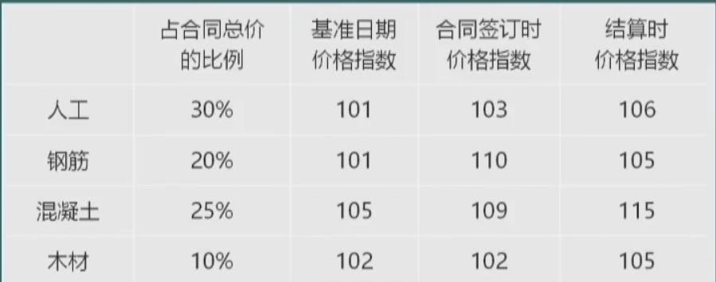
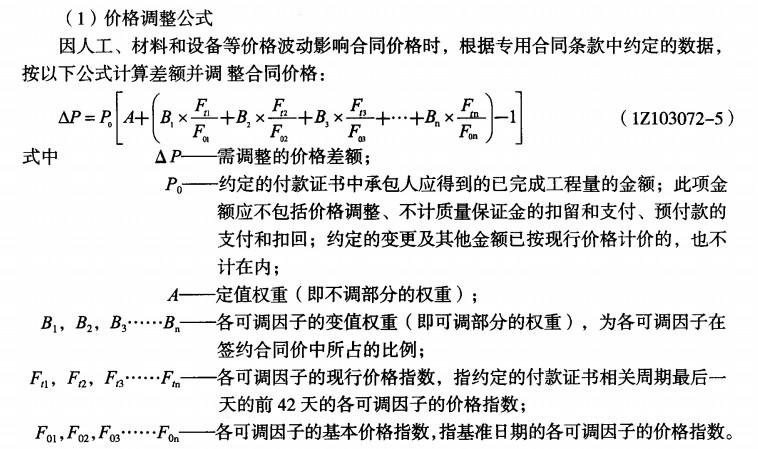
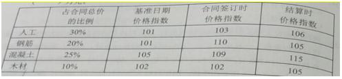
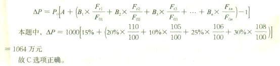

若无合同约定，则应由承包人采购的材料市场价上涨超过（）的时候，合同价款应予以调整。

A.5%  (正确)
B.10%
C.15%
D.20%
解析：
若无合同约定，则应由承包人采购的材料市场价上涨超过5%的时候，合同价款应予以调整。 【知识点】市场价格波动引起的调整 【考点】市场价格波动引起的调整 【考查方向】原文挖空 【难度】易 【题库维护老师】yxf

由于发包人设计变更原因导致承包人未按期竣工，需对原约定竣工日期后继续施工的工程进行价格调整时，宜采用的价格指数是（ &nbsp;）。

A.原约定竣工日期与实际竣工日期的两个价格指数中较低的一个
B.原约定竣工日期与实际竣工日期的两个价格指数中较高的一个  (正确)
C.原约定竣工日期与实际竣工日期的两个价格指数的平均值
D.承包人与发包人协商新的价格指数
解析：
按《建设工程施工合同（示范文本）~（GF-2017-0201）除专用合同条款另有约定外，市场价格波动超过合同当事人约定的范围，合同价格应当调整。合同当事人可以在专用合同条款中约定选择以下一种方式对合同价格进行调整。

【知识点】市场价格波动引起的调整

【考点】市场价格波动引起的调整

【考察方向】概念释义

【难度】易

【题库维护老师：ZKQ】 

根据《建设工程工程量清单计价规范》，某工程采用价格调整公式进行价格调整。施工中由于承包人返工的原因导致工期延误，则约定竣工日期后继续施工的工程，在使用价格调整公式时，应采用的价格指数是（）。

A.原约定竣工日期与实际竣工日期的两个价格指数中较低者  (正确)
B.原约定竣工日期的价格指数
C.实际竣工日期的价格指数
D.原约定竣工日期与实际竣工日期的两个价格指数中较高者
解析：
因承包人原因未按期竣工的，对合同约定的竣工日期后继续施工的工程，在使用价格调整公式时，应采用计划竣工日期与实际竣工日期的两个价格指数中较低的一个作为现行价格指数。

【知识点】市场价格波动引起的调整

【考点】市场价格波动引起的调整

【考察方向】原文挖空

【难度】易

【题库维护老师：ZKQ】 

某工程施工合同约定采用造价信息进行价格调整。施工期间,项目所在地省级造价管理机构发布了工人工资指导价上调10%的通知并即时生效,该工程在颁布通知当月完成的合同价款为300万元,其中人工费为60万元(已知该人工费单价比发布的指导价高出30%)则该工程当月人工费纳算的做法是( &nbsp; )。

A.不予上调  (正确)
B.按照通知要求上调10%
C.由总监理工程师确定新的单价
D.由发承包双方协商后适当调整
解析：
人工单价发生变化且符合省级或行业建设主管部门发布的人工费调整规定，合同当事人应按省级或行业建设主管部门或其授权的工程造价管理机构发布的人工费等文件调整合同价格，但承包人对人工费或人工单价的报价高于发布价格的除外。

【知识点】市场价格波动引起的调整

【考点】市场价格波动引起的调整

【考察方向】原文挖空

【难度】易

【题库维护老师：ZKQ】

根据《建设工程工程量清单计价规范》GB50500-2013，由于业主原因未在约定的工期内竣工的，则对原约定竣工日期后继续施工的工程，在使用价格调整公式进行价格调整时，应采用的价格指数是( &nbsp;)。

A.原约定竣工日期的价格指数
B.实际竣工日期的价格指数
C.原约定竣工日期与实际竣工日期的两个价格指数中较低者
D.原约定竣工日期与实际竣工日期的两个价格指数中较高者  (正确)
解析：
因发包人原因未按期竣工的，对合同约定的竣工日期后继续施工的工程，在使用价格调整公式时，应采用计划竣工日期与实际竣工日期的两个价格指数中较高的一个作为现行价格指数。

【知识点】市场价格波动引起的调整

【考点】市场价格波动引起的调整

【考察方向】原文挖空

【难度】易

【题库维护老师：ZKQ】

某工程在施工期间，项目所在地省级造价管理机构发布了人工费上调10%的通知并即时生效，该工程当月完成合同价款200万元，其中人工费为40万元，比定额人工费高出20%，则关于该工程当月人工费的说法，正确的是( &nbsp;).

A.应按照要求上调10%，即增加人工费4万元
B.该工程人工费已经高于定额人工费，不予上调  (正确)
C.该工程人工费应按合同约定，不需受该通知影响
D.发承包双方应予充分协商是否上调人工费
解析：
人工单价发生变化且符合省级或行业建设主管部门发布的人工费调整规定，合同当事人应按省级或行业建设主管部门或其授权的工程造价管理机构发布的人工费等文件调整合同价格，但承包人对人工费或人工单价的报价高于发布价格的除外。

【知识点】市场价格波动引起的调整

【考点】市场价格波动引起的调整

【考察方向】原文挖空

【难度】易

【题库维护老师：ZKQ】

根据《建设工程工程量清单计价规范》GB50500-2013，发承包双方约定采用造价信息进行施工中的材料价格调整的说法，正确的是( &nbsp;)。

A.其单价和采购数量应由承包人决定，向发包人备案
B.其单价由发包人审批，采购数量由承包人自行决定
C.其单价和采购数量均应由发包人审批  (正确)
D.其单价由承包人自行决定，采购数量由发包人审批
解析：
合同履行期间，因人工、材料、工程设备和机械台班价格波动影响合同价格时，人工、机械使用费按照国家或省、自治区、直辖市建设行政管理部门、行业建设管理部门或其授权的工程造价管理机构发布的人工、机械使用费系数进行调整；需要进行价格调整的材料，其单价和采购数应由发包人复核，发包人确认需调整的材料单价及数量，作为调整合同价格的依据。

【知识点】市场价格波动引起的调整

【考点】市场价格波动引起的调整

【考察方向】原文挖空

【难度】易

【题库维护老师：ZKQ】

某工程施工合同约定根据价格调整公式调整合同价，已知不调值部分占合同价的比例为15%，可参与调值部分的费用类型、占合同总价的比例和相关价格指数见下表，若结算当月完成的合同额为1000万元，则调整后的合同金额为（　　）。 

A.1050  (正确)
B.1034
C.1017
D.1000
解析：
 

列式计算：[30%×106÷101+20%×105÷101+25%×115÷105+10%×105÷102+1×15%]×1000=1050（元）（注意题目所求为调整后的合同金额，原公式里要减1，这里不用）

【知识点】市场价格波动引起的调整

【考点】市场价格波动引起的调整

【考察方向】公式计算

【难度】中等

【题库维护老师：ZKQ】

某合同价为 30 万元的分项工程采用调值公式法进行价差调整。可调值部分占合同总价的 70％，可调值部分由 A.B.C 三项成本要素构成，分别占合同价的 10％、25％、35％，基准日期价格指数分别为 100、98、100，结算依据的价格指数分别为 110、95、203，则结算的价款为（ ）万元。

A.10.89
B.40.89  (正确)
C.31.32
D.1.32
解析：
 

因此，参照公式，可做如下计算

 

（注意，这里求结算价款，无需减1）

【知识点】市场价格波动引起的调整

【考点】市场价格波动引起的调整

【考察方向】公式计算

【难度】中等

【题库维护老师：ZKQ】

某工程随工合同约定根据价格调整公式调整合同价,已知不调值部分占合同价的比例为15%,可参与调值部分的费用类型、占合同总价的比例和相关价格指数见下表,若结算当月完成的合同额为1000万元,则调整后的合同金额为( &nbsp;)。  &nbsp; &nbsp;

A.1050  (正确)
B.1034
C.1017
D.1000
解析：
列式计算：1000*15%+1000*0.3*106/101+1000*0.2*105/101+1000*0.25*115/105+1000*0.1*105/102=1050。同时注意所求是调整后的合同金额，无需像公式里那样减1.

【知识点】市场价格波动引起的调整

【考点】市场价格波动引起的调整

【考察方向】公式计算

【难度】中等

【题库维护老师：ZKQ】 

某工程约定当价格波动超过一定范围时根据价格调整公式调整合同价。已知不调整部分占合同总价的15%，可以调整部分有人工费、运输费、钢筋价格、混凝土价格，其占合同总价的比例分别为20%、10%、25%和30%。基准日期的价格指数均为100，结算时采用的价格指数分别为110、105、106、108。若结算当月完成的合同额1000万元，则调整后的合同金额为( &nbsp;)万元。

A.914
B.1059
C.1064  (正确)
D.1137
解析：
因人工、材料和设备等价格波动影响合同价格时，根据专用合同条款中约定的数据，按以下公式计算差额并调整合同价格：

【知识点】市场价格波动引起的调整

【考点】市场价格波动引起的调整

【考察方向】公式计算

【难度】中等

【题库维护老师：ZKQ】

