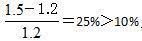
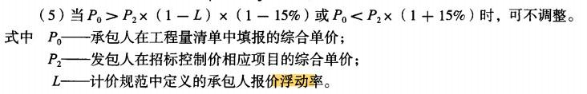
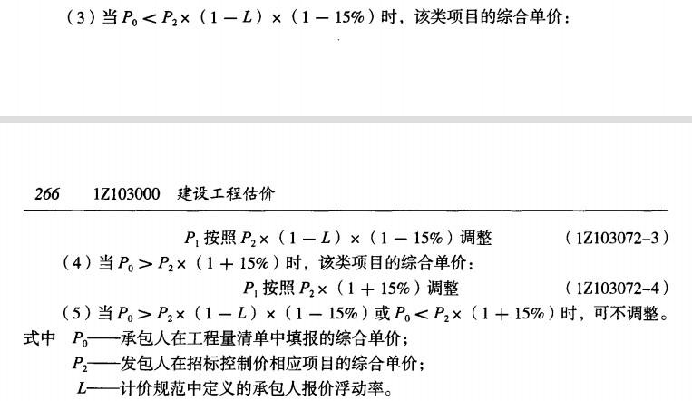

某独立土方工程，招标工程量清单量为100万m³，合同约定土方工程单价5元/m³，若实际工程量超过清单量15%，则单价调低至4元/m³；若实际工程量比清单量减少超过15%，则单价调高至6元/立方米。工程结束时发现实际土方工程量为80万立方米，则工程款应为（ &nbsp;）万元。

A.500
B.480  (正确)
C.455
D.425
解析：
工程量减量超过15%，剩余部分综合单价应调高。 【知识点】工程量偏差 【考点】工程量偏差 【考查方向】计算 【难度】易 【题库维护老师】yxf

某独立土方工程，招标工程量清单量为100万m³，合同约定土方工程单价5元/m³，若实际工程量超过清单量15%，则单价调低至4元/m³；若实际工程量比清单量减少超过15%，则单价调高至6元/立方米。工程结束时发现实际土方工程量为130万立方米，则工程款应为（ &nbsp;）万元。

A.500
B.650
C.520
D.635  (正确)
解析：
工程量增量超过15%，超出部分综合单价应调低。 【知识点】工程量偏差 【考点】工程量偏差 【考查方向】计算 【难度】易 【题库维护老师】yxf

根据《建设工程工程量清单计价范围》（CB50500—2013），当合同中没有约定时，对于任一招标工程量清单项目，如果因工程变更等原因导致工程量偏差超过（ &nbsp;&nbsp;）时，合同单价应进行调整。

A.20%
B.15%  (正确)
C.10%
D.5%
解析：
本题考查的是“工程量偏差”。

《工程量清单计价规范》规定如下：

（1）合同履行期间，当予以计算的实际工程量与招标工程量清单出现偏差，且符合下述两条规定的，发承包双方应调整合同价款。

（2）对于任一招标工程量清单项目，如果因工程量偏差和工程变更等原因导致<strong>工程量偏差超过15%</strong> 时，可进行调整。当工程量<strong>增加15% 以上</strong>时，增加部分的工程量的<strong>综合单价应予调低</strong>；当工程量<strong>减少15% 以上</strong>时，减少后剩余部分的工程量的<strong>综合单价应予调高</strong>。

（3）如果工程量出现超过15% 的变化，且该变化引起相关措施项目相应发生变化时，按系数或单一总价方式计价的，工程量增加的措施项目费调增，工程量减少的措施项目费调减。&nbsp; &nbsp;

【知识点】工程量偏差

【考点】工程量偏差

【考察方向】原文挖空

【难度】易

【题库维护老师：ZKQ】

某土方工程招标文件中，清算工程量为3000m³;合同约定土方工程综合单价80元/m³，当实际工程量增加15%以上时，增加部分的工程量综合单价72元/m³，工程结束实际完成并经发包人确认的工程量为3600m³，则工程价款为（ &nbsp;）元。

A.259200
B.286800  (正确)
C.283200
D.288000
解析：
工程量偏差引起的价格调整：实际完成3600m³，其中超过清单工程量的15%以内的工程量按照原价计算，15%以外的按照调整后的价格计算。 工程价款=3000*(1+15%)*80+【3600-3000*(1+15%)】*72=286800元;故选择B选项。

【知识点】工程量偏差

【考点】工程量偏差

【考察方向】公式计算

【难度】易

【题库维护老师：ZKQ】 

根据《建设工程工程量清单计价规范》（GB 50500-2013），对于任一招标工程量清单项目，如果因工程量偏差和工程变更等原因导致工程量偏差超过（）时，可进行调整。

A.15%  (正确)
B.12%
C.20%
D.10%
解析：
合同履行期间，当予以计算的实际工程量与招标工程量清单出现偏差，且符合下述两条规定的，发承包双方应调整合同价款；

对于任一招标工程量清单项目，如果因工程量偏差和工程变更等原因导致工程量偏差超过15%时，可进行调整。当工程量增加15%以上时，增加部分的工程量的综合单价应予调低；当工程量减少15%以上时，减少后剩余部分的工程量的综合单价应予调高。

如果工程量出现超过15%的变化，且该变化引起相关措施项目相应发生变化时，按系数或单一总价方式计价的，工程量增加的措施项目费调增，工程量减少的措施项目费调减。

【知识点】工程量偏差

【考点】工程量偏差

【考察方向】原文挖空

【难度】易

【题库维护老师：ZKQ】

某独立土方工程，招标文件中估计工程量为80万m³，合同中规定：土方工程单价为10元/m³，当实际工程量超过估计工程量15％时，调整单价，单价调为9元/m³。工程结束时实际完成土方工程量为100万m³，则土方工程款为（ &nbsp; &nbsp;）万元。

A.736
B.920
C.992  (正确)
D.1150
解析：
本题的计算过程如下：合同约定范围内（15％以内）的工程款为：80×（1＋15％）×10＝920万元； 超过15％之后部分工程量的工程款为：［100－80×（1＋15％）］×9＝72万元；则土方工程款合计＝920＋72＝992万元。

【知识点】工程量偏差

【考点】工程量偏差

【考察方向】公式计算

【难度】易

【题库维护老师：ZKQ】 

某混凝土工程招标清单工程量为200m3，合同约定的综合单价为600元/m3，当实际完成并经监理工程师确认的工程量超过清单工程量15%时可调整综合单价，调价系数为0.9.施工过程中，因设计变更导致实际工程量为250m3。则该混凝土的工程价款为（ &nbsp; &nbsp;）万元。

A.12.00
B.14.88  (正确)
C.14.74
D.15.00
解析：
超出工程量百分比：（250-200）/200=25%&gt;15%，需调价。 超过15%的工程量：250-200×（1+15%）=20m3； 超过部分的综合单价：600×0.9=540元/m3。 故工程款：230×600+20×540=148800元

【知识点】工程量偏差

【考点】工程量偏差

【考察方向】公式计算

【难度】易

【题库维护老师：ZKQ】 

某混凝土工程，工程量清单的工程量为 2000m³，合同约定的综合单价为 400 元/ m³，当实际工程量超过清单工程量 10%时可调整单价，调整系数为 0.9。工程结束时实际工程量为 2400 m³，则该混凝土工程的结算价款是（ ）万元。

A.96.0
B.95.2  (正确)
C.94.4
D.86.4
解析：
本题的计算过程为：合同约定范围内（10%以内）的工程款为：2000×（1+10%）×400=88万元；超过 10%之后部分工程量的工程款为：[2400- 2000×（1+10%）]×400×0.9=7.2 万元；则土方工程款合计=88+7.2=95.2 万元。

【知识点】工程量偏差

【考点】工程量偏差

【考察方向】公式计算

【难度】易

【题库维护老师：ZKQ】

某土方工程，招标文件中估计的工程量为 10 万立方米，合同规定土方工程单价为 10 元/m 3，实际挖土量为 15 万立方米，得到监理和业主认可的工程量为 12.5 万立方米，合同规定当超过实际量的 15%时给予调整，调整后价为 8 元/m3，施工单位可以得到的工程款为（ ）万元。

A.140
B.120
C.123  (正确)
D.143
解析：
监理认可量为实际量，实际量为 12.5 万立方，合同量为 10 万立方，超出量为 2.5 万立方，2.5/10=0.25 ＞0.15，因此进行价款调整。10×1.15×10+（12.5-11.5）×8=123 万元。

【知识点】工程量偏差

【考点】工程量偏差

【考察方向】公式计算

【难度】易

【题库维护老师：ZKQ】

采用清单计价的某分部分项工程，招标控制价的综合单价为 320 元，投标报价的综合单价为 265 元，该工程投标报价下浮率为 5%，结算时，该分部分项工程工程量比清单量增加了 18%，且合同未确定综合单价调整方法，则综合单价的处理方式是（ ）

A.上浮 18%
B.下调 5%
C.调整为 292.5 元
D.可不调整  (正确)
解析：
本题考查的是工程变更类合同价款调整事项。工程量偏差超过 15%时，其综合单价可以调整。已标价清单中的投标报价 P0＝ 265（元），招标控制价 P2×（1－ L） ×（1－ 0.15）＝ 320×0.95×0.85＝ 258.4（元）。因 265＞258.4，即 P0＞P2×（1－ L） ×（1－ 0.15），故无需调整。

【知识点】工程量偏差

【考点】工程量偏差

【考察方向】公式计算

【难度】中等

【题库维护老师：ZKQ】 

某独立土方工程，招标工程量清单中的工程数量为1000m3，承包人投标报价中的综合单价为30元/m3，合同约定，当实际工程量超过清单工程量15%时调整单价，调整系数为0.9。工程结束时承包人实际完成并经监理工程师确认的工程量为1400m3，择该土方工程的工程量价款为( &nbsp; )元。

A.42300
B.41250  (正确)
C.40800
D.37800
解析：
根据“计价规范”，当工程量偏差超过约定的幅度（15%）时，超过的部分应执行新单价（30×0.9=27元/m3）。于是，该土方工程的工程量价款=1000×（1+15%）×30+[1400－1000×（1+15%）]×27=41250（元）。

【知识点】工程量偏差

【考点】工程量偏差

【考察方向】公式计算

【难度】易

【题库维护老师：ZKQ】  

某工程项目招标控制价的综合单价为350元，投标报价的综合单价为406元，则工程变更后的综合单价调整为（ &nbsp; &nbsp;）元。

A.402.5  (正确)
B.406.0
C.466.9
D.470.95
解析：
406÷350= 1.16，偏差为16%; P0&gt;P2×(1+15%)，该项目的综合单价按照 P2×(1+15%)调整，即 350×(1+15%)=402.50 (元）。

【知识点】工程量偏差

【考点】工程量偏差

【考察方向】公式计算

【难度】易

【题库维护老师：ZKQ】

根据发包人与承包人签订的施工合同，某分项工程招标工程量为3000m3，单价为200元/m3。合同中约定，当实际工程量与招标工程量偏差超过15％时可调整单价，工程量增加或减少15％以上的调整系数分别为0.9或者1.1。现已知该项工程实际工程量为3200m3，则总价应为( &nbsp; )万元。

A.57.6
B.60.0
C.64.0  (正确)
D.70.4
解析：
《建设工程工程量清单计价规范》(GB 50500—2013)规定：

(1)合同履行期间，当应予计算的实际工程量与招标工程量清单出现偏差，且符合下述两条规定时，发承包双方应调整合同价款。

(2)对于任一招标工程量清单项目，如果因工程量偏差和工程变更等原因导致工程量偏差超过15％时，可进行调整。当工程量增加15％以上时，增加部分的工程量的综合单价应予调低；当工程量减少15％以上时，减少后剩余部分的工程量的综合单价应予调高。

(3)如果工程量出现超过15％的变化，且该变化引起相关措施项目相应发生变化时，按系数或单一总价方式计价的，工程量增加的措施项目费调增，工程量减少的措施项目费调减。实际工程量为3200m3，与招标工程量的偏差为(3200－3000)/3000×100％＝6.67％＜15％，因此实际工程量按约定单价计算，即总价＝3200×200＝640000(元)＝64.0(万元)。

【知识点】工程量偏差

【考点】工程量偏差

【考察方向】公式计算

【难度】中等

【题库维护老师：ZKQ】

根据《建设工程工程量清单计价规范》(GB 50500—2013)，若合同未约定，当工程量清单项目的工程量偏差增加( &nbsp; )以上时，增加部分的工程量的综合单价应予调低。

A.10％
B.15％  (正确)
C.20％
D.25％
解析：
《建设工程工程量清单计价规范》(GB 50500—2013)规定，对于任一招标工程量清单项目，如果因工程量偏差和工程变更等原因导致工程量偏差超过15％时，可进行调整。当工程量增加15％以上时，增加部分的工程量的综合单价应予调低；当工程量减少15％以上时，减少后剩余部分的工程量的综合单价应予调高。

【知识点】工程量偏差

【考点】工程量偏差

【考察方向】原文挖空

【难度】易

【题库维护老师：ZKQ】

根据《建设工程工程量清单计价规范&gt;GB50500-2013，对于任一招标工程量清单项目，如果因工程量偏差和工程变更等原因导致工程量偏差最小超过( &nbsp;)时，可进行综合单价的调整。

A.±5%
B.±10%
C.±15%  (正确)
D.±20%
解析：
对于任一招标工程量清单项目，如果因工程量偏差和工程变更等原因导致工程量偏差超过15%时，可进行调整。当工程量增加15%以上时，增加部分的工程量的综合单价应予调低；当工程量减少15%以上时，减少后剩余部分的工程量的综合单价应予调高。

【知识点】工程量偏差

【考点】工程量偏差

【考察方向】原文挖空

【难度】易

【题库维护老师：ZKQ】

对于任一招标工程量清单项目，如果因本条规定的工程量偏差和工程变更等原因导致工程量偏差超过15%，调整的原则为（ &nbsp;）。

A.当工程量增加15%以上时，其增加部分的工程量的综合单价应予调高
B.当工程量增加15%以上时，其增加部分的工程量的综合单价应予调低  (正确)
C.当工程量减少15%以上时，减少后剩余部分的工程量的综合单价应予调高  (正确)
D.当工程量减少15%以上时，减少后剩余部分的工程量的综合单价应予调低
E.当工程量增加或减少15%以上时，不予调整
解析：
对于任一招标工程量清单项目，如果因本条规定的工程量偏差和工程变更等原因导致工程量偏差超过15%，调整的原则为：当工程量增加15%以上时，其增加部分的工程量的综合单价应予调低；当工程量减少15%以上时，减少后剩余部分的工程量的综合单价应予调高。

【知识点】1Z103072 合同价款调整

【考点】五、工程量偏差

【考察方向】原文挖空

【难度】易

【题库维护老师：ZKQ】

因非承包人原因的工程变更引起已标价工程数量发生变化的，其工程数量正确的调整方法有( &nbsp; )

A.当清单工程量变化幅度在20％以内时，其综合单价不作调整
B.当合同中已有适用的综合单价，按合同中已有的综合单价确定  (正确)
C.合同中有类似的综合单价，参照类似的综合单价  (正确)
D.合同中没有适用或类似的综合单价，由承包人提出变更项目的单价，经发包人确认后执行  (正确)
E.该项工程量增加在合同约定幅度以上时，增加部分的工程量的综合单价应调高
解析：
已标价工程量清单中有适用于变更工程项目的，应采用该项目的单价；但当工程变更导致该清单项目的工程数量发生变化，且工程量偏差超过15％。此时，调整的原则为：当工程量增加15％以上时，其增加部分的工程量的综合单价应予调低；当工程量减少15％以上时，减少后剩余部分的工程量的综合单价应予调高。量多就减单价，量少就加单价故选项A、E错误。

【知识点】工程量偏差

【考点】工程量偏差

【考察方向】原文挖空

【难度】易

【题库维护老师：ZKQ】

根据《建设工程工程量清单计价规范》GB50500-2013，对于任一招标工程量清单项目，如果出现工程量偏差，则正确的做法有( &nbsp;)。

A.工程量增加15%以上时，且该变化引起措施项目变化的，总价措施项目应不予调整
B.工程量减少15%以上时，减少后剩余部分的工程量综合单价应予调高  (正确)
C.工程量增加15%以上时，增加部分的综合单价应予调低  (正确)
D.工程量变化15%以上时，且该变化引起措施项目变化的，措施项目的综合单价也应调整
E.工程量变化15%以上时，只考虑分部分项工程费的调整，措施项目不予调整
解析：
《建设工程工程量清单计价规范》GB50500-2013对工程量偏差带来的合同价款调整的规定如下： (1)合同履行期间，当予以计算的实际工程量与招标工程量清单出现偏差，且符合下述两条规定的，发包承包双方应调整合同价款； (2)对于任一招标工程量清单项目，如果因工程量偏差和工程变更等原因导致工程量偏差超过15%时，可进行调整。当工程量增加15%以上时，增加部分的工程量的综合单价应予调低；当工程量减少15%以上时，减少后剩余部分的工程量的综合单价应予调高，故B、C正确； (3)如果工程量出现超过15%的变化，且该变化引起相关措施项目相应发生变化时，按系数或单一总价方式计价的，工程量增加的措施项目费调增，工程量减少的措施项目费调减，故A、D、E不正确。

【知识点】工程量偏差

【考点】工程量偏差

【考察方向】原文挖空

【难度】易

【题库维护老师：ZKQ】

某混凝土基础工程招标文件中估计工程量为12000m³。合同约定：该工程为全费用单价400元／m³，当实际工程量超过估计工程量10%，超过部分调整单价为350元／m³。工程结束时施工单位实际完成混凝土工程量为15000m³，则该混凝土工程款为( &nbsp; )万元。

A.591  (正确)
B.600
C.585
D.525
解析：
工程量超过：， 则需调整，而1.2×(1＋10%)＝1.32(万m³)，因此工程款＝1.32×400＋(1.5－1.32)×350＝591(万元)。

【知识点】工程量偏差

【考点】工程量偏差

【考察方向】公式计算

【难度】易

【题库维护老师：ZKQ】 

根据《建设工程工程清单计价规范》（GB50500-2013），采用清单计价的某部分分项工程，招标控制价的综合单价为350元，承包人投标报价的综合单价为300元，该工程投标报价总价的下浮率为5%，结算时，该部分分项工程工程量清单工程量增加了16%，且合同未确定综合单价调整方法，则对该综合单价的正确处理方式是（ &nbsp; &nbsp;）。

A.调整为257元
B.调整为282.63元
C.不做任何调整  (正确)
D.调整为345元
解析：
目前的综合单价比招标控制价要低，现在问题就是看看是不是低的离谱，下浮5%以后，再下浮15%的风险范围，如果比这个还低，则限制最低价，现在看其报价为300，即 350x（1-5%）x（1-15%）=282.63&lt;300，在最低值之上，且小于350×（1+15%）=402.5。所以不予以调整。

至于D选项，因为工程量是增加的，所以只考虑单价要不要调低，而不是调高。所以选C。

【知识点】工程量偏差

【考点】工程量偏差

【考察方向】公式计算

【难度】中等

【题库维护人：ZKQ】 

根据《建设工程工程量清单计价规范》（GB50500-2013），采用清单计价的某分部分项工程，招标控制价的综合单价为500元，承包人投标报价的综合单价为400元，该工程投标报价总的下浮率为5%，结算时，该分部分项工程工程量比清单工程质量增加了16%，且合同未确定综合单价调整方法，则对该综合单价的正确处理方式是( &nbsp; &nbsp;)。

A.调整为403.75元  (正确)
B.调整为282.63元
C.不做任何调整
D.调整为345元
解析：
当工程量偏差项目出现承包人在工程量清单中填报的综合单价与发包人招标控制价相应清单项目的综合单价偏差超过15%时，工程量偏差项目综合单价应予以调整。经计算，400&lt;500×（1–0.05）×（1-0.15）=403.75

符合上述（3）中情况。因此，综合单价调整为403.75

【知识点】工程量偏差

【考点】工程量偏差

【考察方向】公式计算

【难度】易

【题库维护老师：ZKQ】

某工程项目合同约定采用调值公式法进行结算，合同价为50万元，其中可调部分为：人工费占15%，材料费占60%，其他为不可调部分。结算时，人工费价格指数上涨了10%，材料费价格指数上涨了20%，则该项目应结算的工程价款为( &nbsp; )万元。

A.56
B.56.35
C.57
D.56.75  (正确)
解析：
可调部分：15%＋60%＝75%＝0.75，不可调部分：1－0.75＝0.25；

【知识点】市场价格波动引起的调整

【考点】市场价格波动引起的调整

【考察方向】公式计算

【难度】易

【题库维护老师：ZKQ】 

