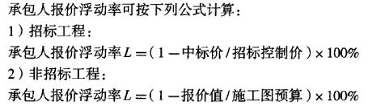

甲公司投资某工程，经过招标投标确定了承包人为乙公司，中标价为人民币115000万元，招标控制价为人民币120000万元。该工程报价浮动率为（）。

A.0.958
B.0.750
C.0.250
D.0.042  (正确)
解析：
计算：1-115000/120000=0.042 【知识点】措施项目费的调整 【考点】措施项目费的调整 【考查方向】计算 【难度】易 【题库维护老师】yxf

某工程采用工程量清单招标，招标人公布的招标控制价为1亿元。中标人的投标报价为8900万元，经调整计算错误后的中标价为9100万元，所有合格投标人的报价平均为9200万元，则该中标人的报价浮动率为( &nbsp; &nbsp;)。

A.8.0%
B.8.5%
C.9.0%  (正确)
D.11.0%
解析：
价格使用中标价，浮动率与均价无关，只与中标价格有关 招标工程承包人报价浮动率L=（1—中标价/招标控制价）×100% 列式计算：L=（1-9100万/1亿）×100%=9.0%

【知识点】措施项目费的调整

【考点】措施项目费的调整

【考察方向】公式计算

【难度】易

【题库维护老师：ZKQ】 

根据《建设工程工程量清单计价规范》（GB50500—2013），工程变更引起施工方案改变并使措施项目发生发化时，承包人提出调整措施项目费用的，应事先将（）提交发包人确认。

A.拟实施的施工方案  (正确)
B.索赔意向通知
C.拟申请增加的费用明细
D.工程变更的内容
解析：
工程变更引起施工方案改变并使措施项目发生变化时，承包人提出调整措施项目费的，应事先将拟实施的方案提交发包人确认，并应详细说明与原方案措施项目相比的变化情况。

【知识点】措施项目费的调整

【考点】措施项目费的调整

【考察方向】原文挖空

【难度】易

【题库维护老师：ZKQ】

某工程招标控制价为8413949元，中标人的投标报价为7972282元，承包人报价浮动率为（ &nbsp; &nbsp;）

A.5.95%
B.5.25%  (正确)
C.5.65%
D.5.85%
解析：
价格使用中标价，浮动率与均价无关，只与中标价格有关 招标工程承包人报价浮动率L=（1—中标价/招标控制价）×100% 列式计算：L=( 1 - 7972282/8413949)×100%=(1-0.9475 )×100%=5.25%

【知识点】措施项目费的调整

【考点】措施项目费的调整

【考察方向】公式计算

【难度】易

【题库维护老师：ZKQ】

某采用工程量清单招标的工程，公布的招标控制价为6000万元，中标人的投标报价为5200万元，经调整后的中标价为5100万元，所有合格投标人的平均报价为5450万元，则中标人报价浮动率为( &nbsp;)。

A.9.17%
B.13.33%
C.15%  (正确)
D.85%
解析：
招标工程的承包人报价浮动率可按下列公式计算：

承包人报价浮动率L=（1-中标价／招标控制价）×100%=(1-5100／6000)×100%=15%。故C正确。

【知识点】措施项目费的调整

【考点】措施项目费的调整

【考察方向】公式计算

【难度】易

【题库维护老师：ZKQ】

根据《建设工程工程量清单计价规范》，因工程变更引起措施项目发生变化导致措施项目费调整，在措施项目拟实施方案得到发承包双方确认后，措施项目费调整的正确说法有（）。

A.对采用总价计算的措施项目费，按实际发生变化的措施项目并考虑承包人报价浮动因素进行调整  (正确)
B.采用单价计算的措施项目费，应按实际发生变化的措施项目和己标价工程量清单项目确定单价  (正确)
C.安全文明施工费应按实际发生变化的措施项目调整，不得浮动  (正确)
D.除非措施项目变动超过一定幅度，一般采用总价计算的措施项目费不能进行调整
E.安全文明施工费应按实际发生的措施项目计算，并考虑承包人报价浮动因素进行调整
解析：
本题考查的是措施项目费的调整。 工程变更引起施工方案改变并使措施项目发生变化时，承包人提出调整措施项目费的，应事先将拟实施的方案提交发包人确认，并应详细说明与原方案措施项目相比的变化情况。拟实施的方案经发承包双方确认后执行，并应按照下列规定调整措施项目费: (1)安全文明施工费应按照实际发生变化的措施项目调整，不得浮动。 (2)采用单价计算的措施项目费，应按照实际发生变化的措施项目按照前述已标价工程量清单项目的规定确定单价。 (3)按总价(或系数)计算的措施项目费，按照实际发生变化的措施项目调整，但应考虑承包人报价浮动因素，即调整金额按照实际调整金额乘以承包人报价浮动率计算。 

【知识点】措施项目费的调整

【考点】措施项目费的调整

【考察方向】概念释义

【难度】中等

【题库维护老师：ZKQ】

根据《建设工程工程量清单计价规范》（GB.50500-2013）工程变更引起施工方案改变并使措施项目发生变化时，关于措施项目费调整的说法，正确的有( &nbsp; &nbsp;)。

A.安全文明施工费按实际发生的措施项目，考虑承包人报价浮动因素进行调整
B.安全文明施工费按实际发生变化的措施项目调整，不得浮动  (正确)
C.对单价计算的措施项目，按实际发生变化的措施项目和已标价工程量清单项目确定单价  (正确)
D.对总价计算的措施项目费一般不能进行调整
E.对总价计算的措施项目费，按实际发生变化的措施项目并考虑承包人报价浮动因素进行调整  (正确)
解析：

措施项目费的调整：工程变更引起施工方案改变并使措施项目发生变化时，承包人提出调整措施项目费的，应事先将拟实施的方案提交发包人确认，并应详细说明与原方案措施项目相比的变化情况。拟实施的方案经发承包双方各确认后执行，并应按照下列规定调整措施项目费：

（1）安全文明施工费应按照实际发生变化的措施项目调整，不得浮动。（2）采用单价计算的措施项目费，应按照实际发生变化的措施项目按照前述已标价工程量清单项目的规定确定单价。

（3）按总价（或系数）计算的措施项目费，按照实际发生变化的措施项目调整，但应考虑承包人报价浮动因素。

【知识点】措施项目费的调整

【考点】措施项目费的调整

【考察方向】概念释义

【难度】中等

【题库维护老师：ZKQ】

某招标工程最高投标限价10000万元，中标人的中标金额为9500万元。在施工中由于设计变更，增加了一项原招标工程量清单不包括也没有类似列项的工作，该工作按照造价管理机构发布的材料价、定额计算可得综合单价为62元/米，则在本工程中，该工作的综合单价应确认为（ &nbsp;）元/米。

A.62
B.58.9  (正确)
C.54.2
D.55.73
解析：
 L=(1-95/100)×100%=5%，综合单价=62-62×5%=58.9元/米 【知识点】措施项目费的调整 【考点】措施项目费的调整 【考查方向】公式计算 【难度】易 【题库维护】yxf

