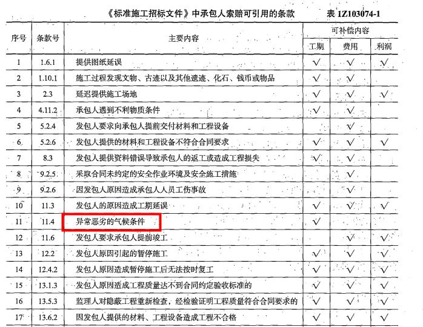
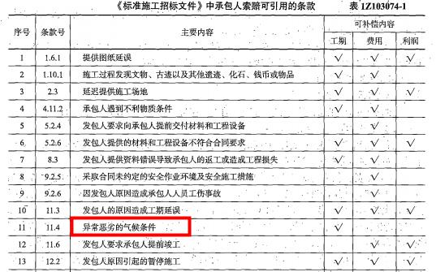
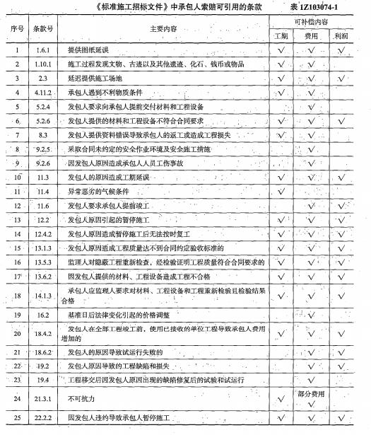

在施工中由于建设单位的责任造成工程窝工，施工企业租赁的施工机械的窝工费用应按照（ &nbsp;）标准进行索赔。

A.折旧费
B.利润
C.租赁费  (正确)
D.利息
解析：
因窝工引起的设备费索赔，当施工机械属于施工企业自有时，按机械折旧费计算索赔费用；当施工机械是施工企业 从外部租赁时，索赔费用的标准按照设备租赁费计算。 【知识点】施工索赔 【考点】索赔的计算方法 【考查方向】概念释义 【难度】易 【题库维护老师】yxf

承包人提出工程索赔，监理收到索赔报告后（）天内完成审查并报送发包人。

A.7
B.14  (正确)
C.28
D.42
解析：
监理人应在收到索赔报告后1 4天内完成审查并报送发包人。 【知识点】施工索赔 【考点】施工索赔 【考查方向】原文挖空 【难度】易 【题库维护老师】yxf

承包人提出工程索赔，应在发出索赔意向通知书后（）天内，正式提交索赔报告，并附必要的记录和证明材料。

A.7
B.14
C.28  (正确)
D.42
解析：
承包人应在发出索赔意向通知书后28天内，向监理人正式递交索赔报告。 【知识点】施工索赔 【考点】施工索赔 【考查方向】原文挖空 【难度】易 【题库维护老师】yxf

索赔费用的组成中，当工作内容增加引起设备费索赔时，设备费的标准按照（ &nbsp; &nbsp;）计算。

A.机械折旧费
B.机械台班费  (正确)
C.设备租赁费
D.机械人工费
解析：
分部分项工程量清单费用中的设备费：可采用机械台班费、机械折旧费、设备租赁费等几种形式。 当工作内容增加引起设备费索赔时，设备费的标准按照机械台班费计算。 因窝工引起的设备费索赔，当施工机械属于施工企业自有时，按照机械折旧费计算索赔费用； 当施工机械是施工企业建设工程估价从外部租赁时，索赔费用的标准按照设备租赁费计算。

【知识点】施工索赔

【考点】索赔的计算方法

【考察方向】原文挖空

【难度】易

【题库维护老师：ZKQ】

某建设工程施工过程中，由于发包人提供的材料没有及时到货，导致承包人自有的一台机械窝工四个台班。每台班折旧费500元。工作时每台班燃油动力费100元。另外，承包人租赁的一台机械窝工3个台班。台班租赁费为300元。工作时每台班燃油动力费80元。不考虑其他因素，则承包人可以索赔的费用为（ &nbsp;）元。

A.3540
B.3300
C.3140
D.2900  (正确)
解析：
本题考查的是索赔。可以索赔的费用为：4×500+3×300=2900元。

因窝工引起的设备费索赔，当施工机械属于施工企业自有时，按照机械折旧费计算索赔费用； 当施工机械是施工企业建设工程估价从外部租赁时，索赔费用的标准按照设备租赁费计算。 已经索赔了窝工费用，不再索赔燃油动力费。

【知识点】施工索赔

【考点】索赔的计算方法

【考察方向】概念释义

【难度】易

【题库维护老师：ZKQ】

某施工项目施工合同约定竣工日期为2018年6月30日，在施工中因天气持续下雨导致甲供材料未能及时到货，使工程延误至2018年7月30日竣工，但由于2018年7月1日起当地计价政策调整，导致承包人额外支付了300万元工人工资。关于这300万元的责任承担的说法正确的是（）。

A.增加的300万元因政策变化造成，属于承包人的责任，应由承包人承担
B.发包人原因导致的工期延误，因此政策变化增加的300万元应由发包人承担  (正确)
C.因不可抗力原因造成工期延误，增加的300万元应由承包人承担
D.工期延误是承包人原因，增加的300万元是政策变化造成的，应由双方共同承担
解析：
发包人原因导致的工期延误（此题指甲供材料未能及时到货），因此政策变化增加的300万元应由发包人承担。

【知识点】施工索赔

【考点】索赔的计算方法

【考察方向】概念释义

【难度】易

【题库维护老师：ZKQ】

某工程在施工过程中，由于发包人设计变更导致停工，承包人的工人窝工10个工日，每个工日单价为250元；承包人租赁的一台挖土机窝工3个台班，挖土机台班租赁费为800元；承包人自有的一台自卸汽车窝工3个台班，该自卸汽车台班折旧费为400元，台班单价为700元，则承包人可以向发包人索赔的费用为（）元。

A.6100  (正确)
B.4900
C.5500
D.7000
解析：
列式计算：10x250+3x800+3x400=6100元 

人工费包括增加工作内容的人工费、停工损失费和工作效率降低的损失费等累计，其中增加工作内容的人工费应按照计日工费计算，而停工损失费和工作效率降低的损失费按窝工费计算，窝工费的标准双方应在合同中约定。

因窝工引起的设备费索赔，当施工机械属于施工企业自有时，按照机械折旧费计算索赔费用； 当施工机械是施工企业建设工程估价从外部租赁时，索赔费用的标准按照设备租赁费计算。 

【知识点】施工索赔

【考点】索赔的计算方法

【考察方向】概念释义

【难度】中等

【题库维护老师：ZKQ】

索赔费用的组成中，可索赔的材料费不包括（ ）

A.材料价格大幅度上涨
B.承包人原因造成的工期延误而引起的材料价格上涨  (正确)
C.材料超期存储费用
D.索赔事件引起的材料用量增加
解析：
本题考查索赔费用的构成。  索赔费用的组成与建筑安装工程造价的组成相似，包括以下几个方面。  （1）分部分项工程量清单费用（2）措施项目费用（3）其他项目费（4）规费与税金 分部分项工程量清单费用中可以索赔以下费用：1）人工费 2）设备费 <strong>3）材料费，包括索赔事件引起的材料用量增加、材料价格大幅度上涨、非承包人原因造成的工期延误而引起的材料价格上涨和材料超期存储费用</strong>。4）管理费 5）利润 6）迟延付款利息。

【知识点】施工索赔

【考点】索赔的计算方法

【考察方向】原文挖空

【难度】中等

【题库维护老师：ZKQ】

因修改设计导致现场停工而引起施工索赔时，承包商自有施工机械的索赔费用宜按机械（　　）计算。

A.租赁费
B.台班费
C.折旧费  (正确)
D.大修理费
解析：
本题考查的是索赔与现场签证的方法。因窝工引起的设备费索赔，<strong>当施工机械属于施工企业自有时，按照机械折旧费</strong>计算索赔费用;当施工机械是施工企业从外部租赁时，索赔费用的标准按照设备租赁费计算。故本题的正确答案为C 选项

【知识点】施工索赔

【考点】索赔的计算方法

【考察方向】概念释义

【难度】易

【题库维护老师：ZKQ】

在施工机械使用费中的窝工费计算，如是租赁设备，一般按（ ）计算。

A.实际租赁费  (正确)
B.实际使用费
C.台班折旧费
D.按分包合同规定的内容
解析：
当工作内容增加引起设备费索赔时，设备费的标准按照机械台班费计算。 因窝工引起的设备费索赔，当施工机械属于施工企业自有时，按照机械折旧费计算索赔费用；当施工机械是施工企业从外部租赁时，索赔费用的标准按照设备租赁费计算。

【知识点】施工索赔

【考点】索赔的计算方法

【考察方向】原文挖空

【难度】易

【题库维护老师：ZKQ】

因窝工引起的设备费索赔，当施工机械属于施工企业从外部租赁时，按照机械( &nbsp; )计算索赔费用。

A.租赁费  (正确)
B.折旧费
C.保养费
D.台班单价
解析：
当工作内容增加引起的设备费索赔时，设备费的标准按照机械台班费计算。因窝工引起的设备费索赔，当施工机械属于施工企业自有时，按照机械折旧费计算索赔费用；当施工机械是施工企业从外部租赁时，索赔费用的标准按照设备租赁费计算。

【知识点】施工索赔

【考点】索赔的计算方法

【考察方向】原文挖空

【难度】易

【题库维护老师：ZKQ】

发包人应在确认索赔事件发生后( &nbsp; )天内向承包人发出索赔通知，否则，承包人免除该索赔的全部责任。

A.56
B.42
C.28  (正确)
D.14
解析：
当合同中对发包人索赔处理未作具体约定时，按以下规定办理： (1)发包人应在确认索赔的事件发生后28d内向承包人发出索赔通知，否则，承包人免除该索赔的全部责任； (2)承包人在收到发包人索赔报告后的28d内，应作出回应，表示同意或不同意并附具体意见，如在收到索赔报告后的28d内，未向发包人作出答复，视为该项索赔报告已经认可。

【知识点】施工索赔

【考点】发包人索赔

【考察方向】原文挖空

【难度】易

【题库维护老师：ZKQ】

某建设工程施工过程中，由于发包人供应的材料没有及时到货，导致承包人的工人窝工5个工作日，每个工日单价200元,承包人租赁的一台挖土机窝工5个台班，台班租赁费500元，承包人自卸汽车窝工2个台班，该自卸汽车折旧费每台300元，工作时燃油动力费每台班80元。则承包人可以索赔的费用是（）元。

A.2500
B.3500
C.4260
D.4100  (正确)
解析：
发包人供应的材料没有及时到货，属于发包人责任，承包人可以索赔。人工费中停工损失费按窝工费计算，因窝工引起的设备费索赔，当施工机械属于施工企业自有时，按照机械折旧费计算索赔费用；当施工机械是施工企业从外部租赁时，索赔费用的标准按照设备租赁费计算，本题中，工作时燃料的费用不能索赔，承包人可以索赔的费用为：5×200+5×500+2×300=4100（元）。

【知识点】施工索赔

【考点】索赔的计算方法

【考察方向】概念释义

【难度】易

【题库维护老师：ZKQ】 

某施工项目6月份因异常恶劣的气候条件停工3天，停工费用8万元;之后因停工待图损失3万元，因施工质量不合格，返工费用4万元。根据《标准施工招标文件》施工承包商可索赔的费用为( &nbsp; )万元。

A.15
B.11
C.7
D.3  (正确)
解析：
本题考查的是施工索赔。对于承包商而言由于施工质量不合格的返工费是其自身原因造成的不可得到索赔；恶劣天气，仅可以得到工期索赔；所以只能得到停工待图的索赔金额即3万元。（这道题注意区分异常恶劣的气候条件和不可抗力，两者不等同）

【知识点】施工索赔

【考点】索赔的计算方法

【考察方向】概念释义

【难度】中等

【题库维护老师：ZKQ】

根据《建设工程工程量清单计价规范》GB50500-2013，在施工过程中，如果发生不可抗力事件，并且该事件延续了三个月，则承包商提交最终索赔报告的时间应该是在不可抗力结束( &nbsp;)天内。

A.7
B.14
C.21
D.28  (正确)
解析：
在索赔事件影响结束后 28 天内，承包人应向监理人递交最终索赔报告，说明最终要求索赔的追加付款金额和(或)延长的工期，并附必要的记录和证明材料。

【知识点】施工索赔

【考点】承包人索赔

【考察方向】原文挖空

【难度】易

【题库维护老师：ZKQ】

某工程在施工过程中，由于业主方临时设计变更导致停工，承包商的工人窝工10个工日，每个工日单价为300元，承包商租赁的一台挖土机窝工2个台班，挖土机台班单价为1000元，承包商自有的一台自卸汽车窝工2个台班，该自卸汽车折旧费用每天300元，该机械工作每天动力费为200元，则承包商可以向业主索赔的费用是( &nbsp;)元。

A.5000
B.5500
C.5600  (正确)
D.6000
解析：
人工费：停工损失费和工作效率降低的损失费按窝工费计算，窝工费的标准双方应在合同中约定。

因窝工引起的设备费索赔，当施工机械属于施工企业自有时，按照机械折旧费计算索赔费用；当施工机械是施工企业从外部租赁时，索赔费用的标准按照设备租赁费计算。

列式计算：10×300+2×1000+2×300=5600元。故C正确。

【知识点】施工索赔

【考点】索赔的计算方法

【考察方向】概念释义

【难度】中等

【题库维护老师：ZKQ】

索赔费用的组成中的人工费，包括增加工作内容的人工费、停工损失费和工作效率降低的损失费等累计，其中增加工作内容的人工费计算应按照（ &nbsp; ）。

A.计日工费  (正确)
B.平均日工费
C.窝工费
D.平均窝工费
解析：
人工费。包括增加工作内容的人工费、停工损失费和工作效率降低的损失费等累计，其中增加工作内容的人工费应按照计日工费计算，而停工损失费和工作效率降低的损失费按窝工费计算，窝工费的标准双方应在合同中约定。

【知识点】施工索赔

【考点】索赔的计算方法

【考察方向】原文挖空

【难度】易

【题库维护老师：ZKQ】

根据《标准招标文件》，下列情形中，承包人既可以索赔费用，又可以索赔工期和利润的情形有（）。

A.发包人延迟提供施工场地  (正确)
B.因发包人原因造成承包人人员工伤事故
C.发包人要求采取合同未约定的安全作业环境及安全施工措施
D.工程移交后因发包人原因出现的缺陷修复后的试验和试运行
E.因发包人违约导致承包人暂停施工  (正确)
解析：
BCD选项仅可以索赔费用。 【知识点】施工索赔 【考点】施工索赔 【考查方向】概念释义 【难度】易 【题库维护老师】yxf

根据《建设工程施工合同（示范文本）》，关于承包人索赔的说法，正确的有（ &nbsp;）。

A.承包人应在发出索赔意向通知书28天后，向监理人正式递交索赔报告
B.承包人应在知道或应当知道索赔事件发生后28天内，向监理人递交索赔意向通知书  (正确)
C.监理人应在收到索赔该报告后28天内完成审查并报送发包人
D.承包人接受索赔处理结果的，索赔款项应在竣工结算时进行支付
E.具有持续影响的索赔事件，承包人应按合理时间间隔持续递交延续索赔通知  (正确)
解析：
承包人索赔程序：

①承包人应在知道或应当知道索赔事件发生后28天内，向监理人提交索赔意向通知书，说明发生索赔事件的事由；承包人未在前述28天内发出索赔意向通知书的，丧失要求追加付款和（或）延长工期的权利。 ②承包人应在发出索赔意向通知书后28天内，向监理人正式提交索赔报告；索赔报告应详细说明索赔理由以及要求追加的付款金额和（或）延长的工期，并附必要的记录和证明材料。 ③索赔事件具有持续影响的，承包人应按合理时间间隔继续提交延续索赔通知，说明持续影响的实际情况和记录，列出累计的追加付款金额和（或）工期延长天数。 ④在索赔事件影响结束后的28天内，承包人应向发包人提交最终索赔报告；说明最终要求索赔的付款金额和（或）延长的工期，并附必要的记录和证明材料。

对承包人索赔的处理如下:

①监理人应在收到索赔报告后 14 天内完成审查并报送发包人。监理人对索赔报告存在异议的，有权要求承包人提交全部原始记录副本。 ②发包人应在监理人收到索赔报告或有关索赔的进一步证明材料后的 28 天内，由监理人向承包人出具经发包人签认的索赔处理结果。发包人逾期答复的，则视为认可承包人的索赔要求。 ③承包人接受索赔处理结果的，索赔款项在当期进度款中进行支付;承包人不接受索赔处理结果的，按照&quot;争议解决&quot;条款约定处理。

【知识点】施工索赔

【考点】承包人索赔

【考察方向】概念释义

【难度】中等

【题库维护老师：ZKQ】

因发包人原因导致工程延期时，下列索赔事件能够成立的有（ &nbsp; &nbsp;）。

A.材料超期储存费用索赔  (正确)
B.材料保管不善造成的损坏费用索赔
C.现场管理费索赔  (正确)
D.保险费索赔  (正确)
E.保函手续费索赔  (正确)
解析：
由于发包人原因导致工程延期期间的材料价格上涨和超期储存费用，可以索赔材料费，A正确； 如果由于承包商管理不善，造成材料损坏失效，则不能列入索赔款项内，B错误； 现场管理费的索赔包括承包人完成合同之外的额外工作以及由于发包人原因导致工期延期期间的现场管理费，包括管理人员工资、办公费、通信费.交通费等，C正确； 因发包人原因导致工程延期时，承包人必须办理工程保险、施工人员意外伤害保险等各项保险的延期手续，对于由此而增加的费用，承包人可以提出索赔，D正确； 因发包人原因导致工程延期时，承包人必须办理相关履约保函的延期手续，对于由此而增加的手续费，承包人可以提出索赔，E正确。

【知识点】施工索赔

【考点】索赔的计算方法

【考察方向】原文挖空

【难度】中等

【题库维护老师：ZKQ】

索赔费用的组成包括( &nbsp; )。

A.窝工费  (正确)
B.设备摊销费
C.材料费  (正确)
D.规费
E.迟延付款利息  (正确)
解析：
索赔费用的组成包括：①人工费（按计日工费或窝工费）；②设备费（有机械台班费、机械折旧费、设备租赁费）；③材料费；④管理费；⑤利润；⑥迟延付款利息。

【知识点】施工索赔

【考点】索赔的计算方法

【考察方向】原文挖空

【难度】中等

【题库维护老师：ZKQ】

任何索赔事件成立必须满足的三要素是( &nbsp; )。

A.正当的索赔理由  (正确)
B.索赔申请表
C.有效的索赔证据  (正确)
D.造价工程师对索赔金额的确认
E.在合同约定的时间时限内提出  (正确)
解析：
索赔事件成立必须满足的三要素：正当的索赔理由、有效的索赔证据、在合同约定的时间时限内提出。

【知识点】施工索赔

【考点】索赔的成立条件

【考察方向】原文挖空

【难度】易

【题库维护老师：ZKQ】

在施工合同履行过程中，任何索赔事件的成立必须满足（ ）要素。

A.发包方有过错
B.承包方有过错
C.正当的索赔理由  (正确)
D.有效的索赔证据  (正确)
E.在合同约定的时间内提出  (正确)
解析：
任何索赔事件成立必须满足的三要素：正当的索赔理由；有效的索赔证据；在合同约定的时间内提出。索赔证据应满足以下基本要求：真实性；全面性；关联性；及时性并具有法律证明效力。

【知识点】施工索赔

【考点】索赔的成立条件

【考察方向】原文挖空

【难度】易

【题库维护老师：ZKQ】

任何索赔事件成立必须满足的要素有（ ）。

A.有效的索赔方式
B.合理的索赔过程
C.正当的索赔理由  (正确)
D.在合同约定的时间时限内提出  (正确)
E.有效的索赔证据  (正确)
解析：
索赔事件成立必须满足的三要素:正当的索赔理由、有效的索赔证据；在合同约定的时间内提出。

【知识点】施工索赔

【考点】索赔的成立条件

【考察方向】原文挖空

【难度】易

【题库维护老师：ZKQ】

人工费的索赔一般包括( &nbsp; )。

A.不可抗力导致的人员窝工费
B.停工损失费  (正确)
C.增加工作内容的人工费  (正确)
D.工作效率降低的损失费  (正确)
E.工期延误的损失费
解析：
人工费的索赔包括增加工作内容的人工费、停工损失费和工作效率降低的损失费等累计，其中增加工作内容的人工费应按照计日工费计算，而停工损失费和工作效率降低的损失费按窝工费计算，窝工费的标准双方应在合同中约定。

【知识点】施工索赔

【考点】索赔的计算方法

【考察方向】原文挖空

【难度】易

【题库维护老师：ZKQ】

下列材料中，属于一般索赔费用报审表的内容有( &nbsp;)。

A.索赔事件的经过  (正确)
B.索赔的理由  (正确)
C.索赔金额的计算  (正确)
D.索赔事项的证明材料  (正确)
E.索赔程序的说明
解析：
填报费用索赔报审表，向项目监理机构提出费用索赔。表中应详细说明索赔事件的经过、索赔理由、索赔金额的计算，并附上证明材料。收到承包人报送的费用索赔报审表后，总监理工程应组织专业监理工程师按标准规范及合同文件有关章节要求进行审核与评估，并与发包人、承包人协商一致后进行签认，报发包人审批，不同意部分应说明理由。

见【示例 1Z103074-2】 费用索赔报审表

【知识点】施工索赔

【考点】索赔的计算方法

【考察方向】原文挖空

【难度】中等

【题库维护老师：ZKQ】

根据《建设工程施工合同（示范文本）》GF-2017-0201，除专用合同条款另有约定外，关于监理人和发包人对承包人索赔的处理，正确的有( &nbsp;)。

A.监理人应在收到索赔报告后14天内完成审查并报送发包人  (正确)
B.监理人对承包人提交的索赔报告存在异议的，有权要求承包人提交全部原始记录副本  (正确)
C.发包人在监理人收到索赔报告的28天内没有给出回应的，视为认可承包人的索赔要求  (正确)
D.发包人应在监理人收到索赔报告的28天内，直接向承包人出具索赔处理结果
E.承包人接受索赔处理结果的，索赔款项应在索赔事件结束后28天内完成支付
解析：
对承包人索赔的处理如下： (1)监理人应在收到索赔报告后14天内完成审查并报送发包人。监理人对索赔报告存在异议的，有权要求承包人提交全部原始记录副本。A、B选项正确； (2)发包人应在监理人收到索赔报告或有关索赔的进一步证明材料后的28天内，由监理人向承包人出具经发包人签认的索赔处理结果。发包人逾期答复的，则视为认可承包人的索赔要求。C选项正确，D选项错误。

(3)承包人接受索赔处理结果的，索赔款项当期进度款中进行支付；承包人不接受索赔处理结果的，按照“争议解决”条款约定处理。

【知识点】施工索赔

【考点】承包人索赔

【考察方向】原文挖空

【难度】中等

【题库维护老师：ZKQ】

采用修正的总费用法进行索赔费用的计算时，通常在总费用法的基础上进行一些修正，修正的因素主要有( &nbsp;)。

A.将计算索赔的时段局限于受到外界影响的时间，而不是整个施工期  (正确)
B.只计算影响时段内某项工作所受的损失，而不是影响时段内所有工作所受的损失  (正确)
C.对发生的多起索赔事件重新计算索赔费用，减去原合同价的部分
D.对索赔时间引起的超过原计划的费用
E.对投标报价费用重新核算，用受影响时段内该项工作的实际单价乘以完成的工程量  (正确)
解析：
修正总费用法 即在总费用计算的原则上，去掉一些不合理的因素，使其更合理。修正的内容包栝： ①将计算索赔款的时段局限于受到外界影响的时间，而不是整个施工期； ②只计算受到影响时段内的某项工作所受影响的损失，而不是计算该时段内所有施工工作所受的损失； ③对投标报价费用重新进行核算，按受影响时段内该项工作的实际单价进行核算，乘以完成的该项工作的工程量，得出调整后的报价费用。

【知识点】施工索赔

【考点】索赔的计算方法

【考察方向】原文挖空

【难度】易

【题库维护老师：ZKQ】

根据《建设工程施工合同（示范文本）》GF-2017-0201，关于提出索赔期限的说法，正确的有( &nbsp;)。

A.若承包人按约定接受竣工付款证书后，应被视为无权再提出任何索赔要求
B.若承包人按约定接受竣工付款证书后，被视为无权再提出在工程接受证书颁发前的索赔  (正确)
C.若承包人按约定的提交最终结清申请单，只限于提出工程接受证书后发生的索赔  (正确)
D.承包人提出索赔的期限应自接受最终结清证书为止  (正确)
E.承包人提出索赔的期限是竣工结算后28天内
解析：
关于提出索赔的期限，《建设工程施工合同（示范文本）》中有如下规定：

①承包人按[竣工结算审核]约定接收竣工付款证书后，应被视为已无权再提出在工程接收证书颁发前所发生的任何索赔，故选项B正确。

②承包人按[最终结清]提交的最终结清申请单中，只限于提出工程接收证书颁发后发生的索赔。提出索赔的期限自接受最终结清证书时终止，故C、D选项正确。

【知识点】施工索赔

【考点】提出索赔的期限

【考察方向】概念释义

【难度】中等

【题库维护老师：ZKQ】

施工中的任何索赔事件成立必须同时满足的条件有( &nbsp;)。

A.发包人存在过错行为
B.正当的索赔理由  (正确)
C.监理人存在过失责任
D.有效的索赔证据  (正确)
E.在合同约定的时间提出  (正确)
解析：
当合同一方向另一方提出索赔时，应有正当的索赔理由和有效证据，并应符合合同的相关约定。由此可看出任何索赔事件成立必须满足的三要素：<strong>正当的索赔理由；有效的索赔证据；在合同约定的时间内提出</strong>。

【知识点】施工索赔

【考点】索赔的成立条件

【考察方向】原文挖空

【难度】易

【题库维护老师：ZKQ】

作为索赔的证据，必须满足的基本要求有( &nbsp;)。

A.真实性  (正确)
B.及时且具有法律效力  (正确)
C.全面性  (正确)
D.可计算
E.关联性  (正确)
解析：
索赔证据应满足以下基本要求：真实性；全面性；关联性；及时性并具有法律证明效力。

【知识点】施工索赔

【考点】索赔的成立条件

【考察方向】原文挖空

【难度】易

【题库维护老师：ZKQ】

在异常恶劣的气候条件下，承包人可以就（）的损失提出索赔。

A.工期+费用
B.费用+利润
C.工期  (正确)
D.费用
解析：
 

【知识点】施工索赔

【考点】施工索赔

【考查方向】概念释义

【难度】易

【题库维护老师】yxf

根据《标准施工招标文件》，下列导致承包人成本增加的情形中，可以同时补偿承包人费用和利润的是（ &nbsp;）。

A.发包人原因导致的工程缺陷和损失  (正确)
B.发包人要求承包人提前交付材料和工程设备
C.异常恶劣的气候条件
D.施工过程中发现文物
解析：
发包人原因导致的工程缺陷和损失的，可同时索赔费用和利润。（见表 1Z103074-1） 【知识点】施工索赔 【考点】索赔的计算方法 【考察方向】原文挖空 【难度】易 【题库维护老师：ZKQ】 

某施工项目7月份因异常恶劣气候条件停工天，停工费用12万元；之后因停工待图损失4万元，因施工质量不合格，返工费用5万元。则施工承包商可索赔的费用为（）万元。

A.5
B.4  (正确)
C.12
D.16
解析：

因异常恶劣的气候条件停工，只能索赔工期（见表 1Z103074-1）因停工待图损失4万元属于甲方原因造成的，可以索赔；施工质量不合格，返工费用5万元属于施工方自身原因，不能索赔。所以可以索赔的费用为4万元。

【知识点】施工索赔

【考点】索赔的计算方法

【考察方向】原文挖空

【难度】易

【题库维护老师：ZKQ】

根据《标准施工招标文件》，下列事件中，承包人只能向发包人索赔工期的是（ ）。

A.承包人遇到不利的物质条件
B.发包人向承包人提前交付材料和工程设备
C.异常恶劣的气候条件  (正确)
D.发包人提供的材料和工程设备不符合合同要求
解析：
见表 1Z103074-1

【知识点】施工索赔

【考点】索赔的计算方法

【考察方向】原文挖空

【难度】中等

【题库维护老师：ZKQ】

下列工期延误的索赔中，承包人还可以得到费用补偿的是（ &nbsp; &nbsp;）。

A.遇到特大暴雨
B.特殊反常天气
C.法律法规变化
D.设计图纸错误  (正确)
解析：
在工期索赔中，（A.B）为异常恶劣的气候条件的延误，仅给予工期索赔，各自的财产损失各自承担；法律法规变化（C），招标工程以投标截止日前28天为准，基准日期后导致承包人在合同履行过程中所需要的费用发生“市场价格波动引起的调整” 条款约定以外的增加时，由发包人承担由此增加的费用；减少时，应从合同价格中予以扣减。（D）发包人原因造成的延误，应当同时给予承包人工期、费用和利润补偿。 

见表 1Z103074-1

【知识点】施工索赔

【考点】索赔的计算方法

【考察方向】原文挖空

【难度】中等

【题库维护老师：ZKQ】

根据《标准施工招标文件》，因发包人要求承包人提前竣工时，承包人提出的( &nbsp; )索赔应得到合理补偿。

A.工期
B.费用  (正确)
C.利润
D.工期+费用
解析：
《标准施工招标文件》规定，发包人要求承包人提前竣工，或承包人提出提前竣工的建议能够给发包人带来效益的，应由监理人与承包人共同协商采取加快工程进度的措施和修订合同进度计划。发包人应承担承包人由此增加的费用，并向承包人支付专用合同条款约定的相应奖金。

【知识点】施工索赔

【考点】索赔的计算方法

【考察方向】原文挖空

【难度】易

【题库维护老师：ZKQ】

根据《标准施工招标文件》，承包人采取合理措施克服施工过程中遇到的不利物质条件继续施工的，其可能获取的补偿包括( &nbsp; )

A.工期和费用  (正确)
B.费用和利润
C.工期和利润
D.利润、费用和工期
解析：
承包人遇到不利物质条件可补偿内容为工期、费用

【知识点】施工索赔

【考点】索赔的计算方法

【考察方向】原文挖空

【难度】易

【题库维护老师：ZKQ】

根据《标准施工招标文件》，下列事件发生时，承包人只能索赔费用的是( &nbsp;)。

A.因发包人提供资料错误导致承包人的返工
B.因法律变化引起的价格调整  (正确)
C.发包人原因造成工程质量达不到合同验收标准
D.发包人的原因导致试运行失败
解析：
《标准施工招标文件》中合同条款规定了可以合理补偿承包人索赔的条款，其中在发包人要求向承包人提前交付材料和工程设备、发包人要求承包人提前竣工、法律变化引起的价格调整这三种情况下，只能索赔费用，故B选项正确。

【知识点】施工索赔

【考点】索赔的计算方法

【考察方向】原文挖空

【难度】中等

【题库维护老师：ZKQ】

根据《标准施工招标文件》，下列事件发生时，承包人可同时索赔工期和费用的是( &nbsp;)。

A.发包人要求承包人提前交付工程设备
B.因不可抗力导致承包人的施工机械受到损害，并导致工期延误
C.施工过程中发现古迹  (正确)
D.发包人原因导致的工程缺陷和损失
解析：
施工过程发现文物、古迹以及其他遗迹、化石、钱币或物品，承包人可同时索赔工期和费用。

【知识点】施工索赔

【考点】索赔的计算方法

【考察方向】原文挖空

【难度】易

【题库维护老师：ZKQ】

根据《标准施工招标文件》，在施工过程中遭遇不可抗力，承包人可以要求合理补偿( &nbsp;)。

A.成本
B.费用
C.利润
D.工期  (正确)
解析：
在施工过程中遭遇不可抗力承包人可以要求合理补偿工期。

【知识点】施工索赔

【考点】索赔的计算方法

【考察方向】原文挖空

【难度】易

【题库维护老师：ZKQ】

根据《标准施工招标文件》，下列事件中，承包人向发包人可索赔工期、费用及利润的有（ &nbsp; &nbsp;）。

A.发包人要求向承包人提前交付材料和工程设备
B.发包人提供的材料和工程设备不符合合同要求  (正确)
C.发包人提供资料错误导致承包人的返工或造成工程损失
D.发包人原因导致工程缺陷和损失
E.发包人在全部工程竣工前，使用已接收的单位工程导致承包人费用增加的  (正确)
解析：
发生B、C、E事件时，承包人向发包人可索赔工期、费用及利润。发包人要求向承包人提前交付材料和工程设备，只可以索赔费用。发包人原因导致工程缺陷和损失，不能索赔工期，可索赔费用和利润。（见表 1Z103074-1）

【知识点】施工索赔

【考点】索赔的计算方法

【考察方向】原文挖空

【难度】中等

【题库维护老师：ZKQ】

依据《标准施工招标文件》，承包人可同时索赔工期和费用的情形有（）。

A.承包人遇到不利物质条件  (正确)
B.施工过程中发现文物  (正确)
C.法律变化引起价格调整
D.发包人要求向承包人提前交付工程设备
E.承包人遇到异常恶劣的气候条件
解析：

见上表 1Z103074-1

【知识点】施工索赔

【考点】索赔的计算方法

【考察方向】原文挖空

【难度】中等

【题库维护老师：ZKQ】

按照《标准施工招标文件》中合同条款规定，下列情况可以合理补偿承包人一定利润的情况是( &nbsp; )。

A.异常恶劣的气候条件
B.发包人要求承包人提前竣工  (正确)
C.承包人遇到不利物质条件
D.发包人的原因造成工期延误  (正确)
E.发包人原因导致试运行失败的  (正确)
解析：
A项只能补偿工期，C项只能补偿工期和费用。

见表 1Z103074-1

【知识点】施工索赔

【考点】施工索赔

【考察方向】原文挖空

【难度】中等

【题库维护老师：ZKQ】

根据《标准施工招标文件》，下列事件中，承包人向发包人既可索赔工期又可索赔费用的有（ ）。

A.发包人原因导致工程缺陷和损失
B.承包人遇到不利物质条件  (正确)
C.发包人要求向承包人提前交付工程设备
D.施工过程发现文物  (正确)
E.承包人遇到异常恶劣的气候条件
解析：
根据《标准施工招标文件》，承包人即可以索赔工期又可索赔费用的有：施工过程发现文物、古迹以及其他遗迹、化石、钱币或物品；承包人遇到不利物质条件；发包人提供的材料和工程设备不符合合同要求；发包人提供资料错误导致承包人的返工或造成工程损失；发包人的原因造成工期延误；发包人原因引起的暂停施工；发包人原因造成暂停施工后无法按时复工等。<strong>发包人原因导致的工程缺陷和损失，可以索赔费用和利润，不可以索赔工期。</strong>发包人要求向承包人<strong>提前交付工程设备，只可以索赔费用</strong>。<strong>承包人遇到异常恶劣的气候条件，只可以索赔工期。</strong>

具体见表 1Z103074-1

【知识点】施工索赔

【考点】索赔的计算方法

【考察方向】概念释义

【难度】中等

【题库维护老师：ZKQ】

根据《标准施工招标文件》，下列导致承包人工期延长和费用增加的事件中，承包人可同时索赔工期、费用和利润的有（ ）。

A.发包人提供资料错误  (正确)
B.发包人原因引起的暂停施工  (正确)
C.施工过程发现文物
D.承包人遇到不利物质条件
E.发包人要求承包人提前交付材料和工程设备
解析：
【真题已过时】按照22版教材A选项不应选。

具体见表 1Z103074-1

【知识点】施工索赔

【考点】索赔的计算方法

【考察方向】概念释义

【难度】中等

【题库维护老师：ZKQ】

根据《标准施工招标文件》，承包人可索赔工期、费用、利润三项的有（ &nbsp;）。

A.发现文物古迹
B.发包人提供的材料不符合合同要求  (正确)
C.发包人原因引起的暂停施工  (正确)
D.发包人原因导致的工程缺陷和损失
E.不可抗力
解析：
如图：

【知识点】施工索赔 

【考点】索赔的计算方法

【考察方向】原文挖空

【难度】中等

【题库维护老师：ZKQ】

