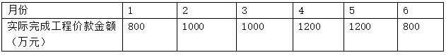
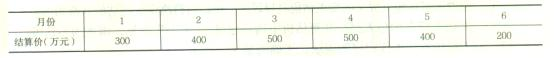

某建造合同总价为4000万元，合同工期3年，若第1年完工进度为30%，第2年完工进度为60%，第3年工程全部完工交付使用。则第3年应确认的合同收入为( &nbsp; )万元。

A.4000
B.2400
C.1600  (正确)
D.1200
解析：
第1年确认的合同收入＝4000×30%＝1200万元；第2年确认的合同收入＝4000×60%－1200＝1200万元；第3年确认的合同收入＝4000－(1200＋1200)＝1600万元。

【知识点】工程进度款支付

【考点】工程进度款支付

【考察方向】概念释义

【难度】易

【题库维护老师：ZKQ】

某工程承包人向发包人递交了200万元的进度款支付申请。按照《建设工程价款结算的暂行办法》的规定，下列关于工程进度款支付的说法中，正确的是( &nbsp; )。

A.发包人应在收到该申请的15天内，向承包人支付不少于180万元的进度款
B.发包人应在批准该申请的14天内，向承包人支付不少于120万元的进度款  (正确)
C.发包人应在收到该申请的14天内，向承包人支付不少于120万元的进度款
D.发包人应在批准该申请的15天内，向承包人支付不少于180万元的进度款
解析：
发包人应在收到承包人进度款支付申请后的14天内，根据计量结果和合同约定对申请内容予以核实，确认后向承包人出具进度款支付证书。发包人应在签发进度款支付证书后的14天内，按照支付证书列明的金额向承包人支付进度款。进度款的支付比例按照合同约定，按期中结算价款总额计，不低于60%，不高于90%。

【知识点】工程进度款支付

【考点】进度款审核和支付

【考察方向】概念释义

【难度】中等

【题库维护老师：ZKQ】

根据《建设工程施工合同（示范文本）》GF-2017-0201，除专用合同条款另有约定外，关于进度款审核和支付的说法，正确的有( &nbsp;)。

A.监理人应在收到承包人进度付款申请单后14天内完成审查并报送发包人
B.发包人和监理人对进度付款申请中的个别款项有争议的，应暂停这一次进度款的支付
C.承包人签发进度款支付证书，即表明发包人已接受了承包人完成的相应部分的工作
D.进度款一旦签发，如果承包人发现有错误，有权提出修正申请  (正确)
E.发包人应在进度款支付证书签发后14天内完成支付  (正确)
解析：
1.除专用合同条款另有约定外，监理人应在收到承包人进度付款申请单以及相关资料后7天内完成审查并报送发包人，发包人应在收到后7天内完成审批并签发进度款支付证书。发包人逾期未完成审批且未提出异议的，视为已签发进度款支付证书。（A有误） 发包人和监理人对承包人的进度付款申请单有异议的，有权要求承包人修正和提供补充资料，承包人应提交修正后的进度付款申请单。监理人应在收到监理人报送的进度付款申请单及相关资料后7天内完成审查并报送发包人，发包人应在收到监理人报送的进度付款申请单及相关资料后7天内，向承包人签发无异议部分的临时进度款支付证书。存在争议的部分，按照“争议解决”条款的约定处理。（B有误） 2.除专用合同条款另有约定外，发包人应在进度款支付证书或临时进度款支付证书签发后14天内完成支付，发包人逾期支付进度款的，应按照中国人民银行发布的同期同类贷款基准利率支付违约金。（E正确） 3.发包人签发进度款支付证书或临时进度款支付证书，不表明发包人已同意、批准或接受承包人完成的相应部分的工作。（C有误）

在对已签发的进度款支付证书进行阶段汇总和符合中发现错误、遗漏或重复的，发包人和承包人均有权提出修正申请。经发包人和承包人同意的修正，应在下期进度付款中支付或扣除。（D正确）

【知识点】工程进度款支付

【考点】工程进度款支付

【考察方向】概念释义

【难度】中等

【题库维护老师：ZKQ】

某工程合同价6000万元,合同约定：工期6个月：预付款120万元，每月进度款按实际完成工程价款的80%支付；每月再单独支付安全文明施工费50万元；质量保证金按进度款的3%逐月扣留；预付款在最后两个月等额扣回。承包人每月实际完成工程价款金额如下表，则第2个月发包人实际应支付的工程款金额为（）万元。 

A.850.0
B.826.0  (正确)
C.824.5
D.776.0
解析：
本题考查工程进度款支付。预付款最迟应在开工日期前七天内支付，所以第二个月不考虑。则发包人应实际支付金额为（1000×80%）-（1000×80%×3%）+50=826（万元）

【知识点】工程进度款支付

【考点】工程进度款支付

【考察方向】公式计算

【难度】中等

【题库维护老师：ZKQ】

某工程项目预付款200万元。合同约定：每月进度款按结算价的80%支付；每月再单独支付安全文明施工费20万元；质量保证金按进度款的3%逐月扣留，预付款最后两个月等额扣回。工期6个月。结算价款如下表，则第5个月应支付的款项为( &nbsp;)万元。

A.210.4
B.230.4  (正确)
C.330.4
D.400.0
解析：
400×80%×(1—3%)+20-200×50%=230.4万元故B正确。

【知识点】工程进度款支付

【考点】工程进度款支付

【考察方向】公式计算

【难度】易

【题库维护老师：ZKQ】

