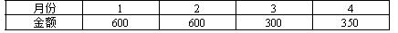

根据《建设工程施工合同（示范文本）》，除专用合同条款另有约定外，承包人应提交最终结清申请单及证明材料的最迟时间为（ ）。

A.竣工验收合格后7天
B.缺陷责任期终止证书颁发后7天  (正确)
C.签发竣工付款证书后14天
D.工程竣工验收合格后28天
解析：
除专用合同条款另有约定外，承包人应在<strong>缺陷责任期终止证书颁发后 7 天内</strong>，按专用合同条款约定的份数向发包人<strong>提交最终结清申请单</strong>，并提供相关证明材料。

【知识点】最终结清

【考点】最终结清申请单

【考察方向】原文挖空

【难度】易

【题库维护老师：ZKQ】

竣工结算时，发包人按总造价的（ &nbsp; &nbsp;）预留质量保证金。

A.3%  (正确)
B.5%
C.3%～5%
D.10%
解析：
    竣工结算时，发包人按总造价的3%预留质量保证金。

    【知识点】最终结清

    【考点】最终结清证书和支付

    【考察方向】原文挖空

    【难度】易

    【题库维护老师：ZKQ】

根据《建设工程施工合同（示范文本)》GF-2017-0201，除专用合同条款另有约定的外，承包人应提交最终结清申请单的时间最迟为( &nbsp;)。

A.竣工验收合格后7日内
B.缺陷责任期终止证书颁发后7日内  (正确)
C.签发竣工付款证书后14天内
D.工程竣工验收合格后28天内
解析：
除专用合同条款另有约定外，承包人应在缺陷责任期终止证书颁发后7天内，按专用合同条款约定的份数向发包人提交最终结清申请单，并提交相关 证明材料。 除专用合同条款另有约定外，最终结清申请单应列明质量保证金、应扣除的质量保证金、缺陷责任期内发生增减费用。

【知识点】最终结清

【考点】最终结清申请单

【考察方向】原文挖空

【难度】易

【题库维护老师：ZKQ】

根据《建设工程施工合同（示范文本）》GF-2017-0201，除专用合同条款另有约定的外，最终结清证书应列明的内容有( &nbsp;)。

A.工程保修责任
B.缺陷责任期内发生的增减费用  (正确)
C.竣工结算合同价格
D.质量保证金  (正确)
E.应扣除的质量保证金  (正确)
解析：
除专用合同条款另有约定外，最终结清申请单应列明质量保证金、应扣除的质量保证金、缺陷责任期内发生增减费用。

【知识点】最终结清

【考点】最终结清申请单

【考察方向】原文挖空

【难度】易

【题库维护老师：ZKQ】

某工程合同价款为5000万元，合同工期11个月。开工前支付承包人合同价款的10%作为预付款，每月进度款按当月实际完成工程价款的85%支付，并且每月再单独支付安全文明施工费60万元，质量保证金按进度款的3%逐月扣留，预付款在最后3个月等额扣回。承包人前5个月的工程价款金额如表所示。那么在第2个月月末，发包人累积实际支付了工程款金额为（ &nbsp;）万元。 

A.1054.70
B.1609.40  (正确)
C.1089.40
D.1700.00
解析：
发包人实际支付的工程款金额=预付款+第1个月进度款+第1个月安全文明施工费-第1个月扣留的质保金+第2个月进度款+第2个月安全文明施工费-第2个月扣留的质保金=5000×10%+600×85%+60-600×85%×3%+600×85%+60-600×85%×3%=1609.40（万元）。

