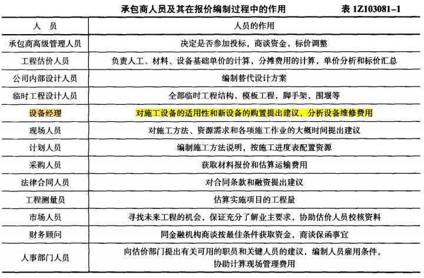

在国际工程投标报价中，投标获得成功的基本保证是( &nbsp; &nbsp;)。

A.高水平投标报价班子  (正确)
B.现场勘察
C.了解生产要素市场行情
D.估算实施项目工程量
解析：
国际工程投标报价，不论承包方式和工程范围如何，都必然涉及承包市场竞争态势、生产要素市场行情、工程技术规范和标准、施工组织和技术、工料消耗标准或定额、合同形式和条款以及金融、税务、保险以及当地的政治、经济状况等方面的问题。

因此，需要有专门的机构和人员对报价的全部活动加以组织和管理，<strong>组织一个业务水平高、经验丰富、精力充沛的投标报价班子</strong>是<strong>投标获得成功的基本保证</strong>。

【知识点】组织投标报价班子

【考点】组织投标报价班子

【考察方向】概念释义

【难度】易

【题库维护老师：ZKQ】

国际工程投标报价编制过程中，( &nbsp; )需要对施工设备的适用性和新设备的购置提出建议，分析设备维修费用。

A.承包商高级管理人员
B.工程估价人员
C.设备经理  (正确)
D.工程测量员
解析：
国际工程投标报价编制过程中，承包商高级管理人员的作用：决定是否参加投标，商谈资金，标价调整。工程估价人员的作用：负责人工、材料、设备基础单价的计算，分摊费用的计算，单价分析和标价汇总。设备经理的作用：对施工设备的适用性和新设备的购置提出建议，分析设备维修费用。工程测量员的作用：估算实施项目的工程量。

【知识点】组织投标报价班子

【考点】组织投标报价班子

【考察方向】原文挖空

【难度】易

【题库维护老师：ZKQ】

