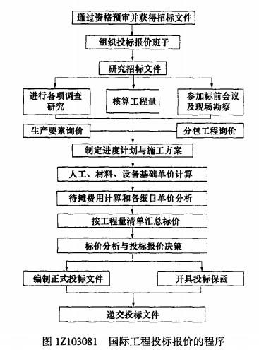

国际工程投标报价中，对工程项目业主的调查包括（）。

A.本工程的资金来源情况  (正确)
B.本工程的各项手续是否齐全  (正确)
C.本工程的业主的工程建设经验  (正确)
D.本工程的业主的信用水平  (正确)
E.本工程的业主的经济状况和实力
解析：
国际工程投标报价中，对工程项目业主的调查主要包括本工程的<strong>资金来源情况、各项手续是否齐全、业主的工程建设经验、业主的信用水平及工程师的情况</strong>等。（E有误）

【知识点】进行各项调查研究

【考点】工程项目业主的调查

【考察方向】原文挖空

【难度】易

【题库维护老师：ZKQ】

在国际工程投标报价中，开展各项调查研究是标价计算之前的一项重要准备工作，是成功投标报价的基础。下列选项中，属于标价计算前应调查的内容有( &nbsp; )

A.所在国当地的劳务规定、税费标准和进出口限额  (正确)
B.竞争对手  (正确)
C.所在国当地的出口结构
D.所在国招标条件
E.所在国现场的施工条件  (正确)
解析：
在国际工程投标报价中，开展各项调查研究是标价计算之前的一项重要准备工作，是成功投标报价的基础，主要内容包括以下方面：

(1)市场、政治、经济环境调查。

(2)施工现场自然条件调查。

(3)现场施工条件调查。

(4)劳务规定、税费标准和进出口限额调查。

(5)工程项目业主的调查。

(6)竞争对手的调查。故选项A、B、E正确。

【知识点】进行各项调查研究

【考点】进行各项调查研究

【考察方向】原文挖空

【难度】中等

【题库维护老师：ZKQ】

某施工企业第一次投标一个非洲的项目，为了了解项目的风险，公司派出人员到当地进行各项调查研究，则与国内工程相比较，国际工程进行调查研究首先应注重的是( &nbsp;)。

A.现场施工条件
B.竞争对手的调查
C.工程所在国政局的稳定性  (正确)
D.施工现场自然条件
解析：
与国内工程相比较，国际工程进行调查研究首先应注重的是工程所在国的政治形势，包括政局的稳定性、该国与周边国家的关系、该国与我国的关系、政策的开放性与连续性。故C选项正确。

【知识点】进行各项调查研究

【考点】进行各项调查研究

【考察方向】概念释义

【难度】易

【题库维护老师：ZKQ】

按照国际工程投标报价的程序，投标人在标前会议之前应该进行的工作是（ &nbsp; &nbsp;） 。

A.分包工程询价
B.人工、材料、机械基础单价计算
C.生产要素询价
D.进行各项调查研究  (正确)
解析：
<strong></strong>

<strong>开展各项调查研究</strong>是标价计算之前的一项重要准备工作，是成功投标报价的基础。

【知识点】进行各项调查研究

【考点】进行各项调查研究

【考察方向】原文挖空

【难度】易

【题库维护老师：ZKQ】

