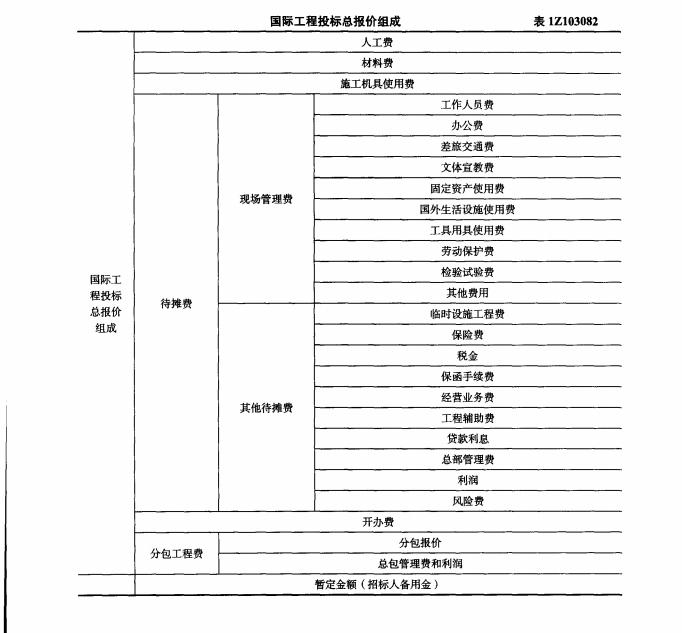

下列选项中，属于国际工程投标报价待摊费之中的现场管理费的是（）。

A.工作人员费  (正确)
B.保险费
C.施工用水电费
D.现场清理费
解析：
B选项为其他待摊费，C、D选项为开办费。 【知识点】国际工程投标报价的组成 【考点】国际工程投标报价的组成 【考查方向】概念释义 【难度】易 【题库维护老师】yxf

关于国标工程投标报价的说法，错误的是（ &nbsp;&nbsp;）。

A.施工企业现场管理费应作为待摊费用分摊在各项综合单价中
B.现场试验设施费作为开办费应依赖招标文件决定是否单列
C.暂列金额由业主工程师决定是否全部或部分使用
D.人工费工日基价应按在工程所在国招募工人的平均日工资单价计算  (正确)
解析：
本题考查的国际工程投标报价的组成，参见教材P229-302。难度大。ABC都是对的，D的错误在于人工费还要考虑国内工人的加权平均。

【知识点】国际工程投标报价的组成

【考点】国际工程投标报价的组成

【考察方向】概念释义

【难度】中等

【题库维护老师：ZKQ】

国际工程投标报价中，待摊费用项目不在工程量清单上出现，而是作为报价项目的价格组成因素隐含在( &nbsp; )。

A.每项综合单价  (正确)
B.临时设施工程费
C.工程总价
D.分包工程费
解析：
国际工程投标报价要准确划分报价项目和待摊费用项目，报价项目就是工程量清单上所列的项目。

待摊费用项目不在工程量清单上出现，而是作为报价项目的价格组成因素<strong>隐含在每项综合单价之中</strong>。

【知识点】国际工程投标报价的组成

【考点】国际工程投标报价的组成

【考察方向】原文挖空

【难度】易

【题库维护老师：ZKQ】

国际工程投标报价时，对于预计施工现场发生的办公费，正确的做法是( &nbsp; &nbsp;)。

A.作为待摊费用单列并计入投标总报价
B.作为开办费单列并计入投标总报价
C.作为待摊费用摊入到工程量表的各计价分项价格中  (正确)
D.按照其费用性质分别计入相应分项工程的人工费、材料费或机具费
解析：
预计施工现场发生的<strong>办公费属于现场管理费</strong>，现场管理费是在工程量清单中没有单独列项的费用项目，需将其<strong>作为待摊费用分摊到工程量清单的各个报价分项中去</strong>。 

【知识点】国际工程投标报价的组成

【考点】国际工程投标报价的组成

【考察方向】原文挖空

【难度】易

【题库维护老师：ZKQ】

在国际工程投标报价中，工程量清单中不需单独列项的费用项目是( &nbsp; )

A.人工费
B.材料费
C.施工机具使用费
D.现场管理费  (正确)
解析：
国际工程投标报价的组成应根据投标项目的内容和招标文件的要求进行划分。其中，<strong>现场管理费</strong>、临时工程设施费、保险费、税金等是在工程量清单中<strong>没有单独列项的费用项目</strong>，需将其作为待摊费用分摊到工程量清单的各个报价分项中去。

【知识点】国际工程投标报价的组成

【考点】国际工程投标报价的组成

【考察方向】概念释义

【难度】易

【题库维护老师：ZKQ】

目前国内外对国际工程投标报价的组成的划分方法取决于( &nbsp; )是否单列。

A.现场管理费
B.总部管理费
C.开办费  (正确)
D.利润
解析：
目前国内外对国际工程投标报价的组成有着不同的划分，但主要有两种：

<strong>开办费单列的投标报价</strong>；<strong>开办费未单列的投标报价</strong>，则开办费应列入待摊费用之中。

【知识点】国际工程投标报价的组成

【考点】国际工程投标报价的组成

【考察方向】概念释义

【难度】易

【题库维护老师：ZKQ】

在国际工程投标报价中，一般没有单独列项，而是需要作为待摊费用分摊到工程量清单中的费用有( &nbsp;)。

A.现场管理费  (正确)
B.临时工程设施费  (正确)
C.分项工程费
D.保函手续费  (正确)
E.检验试验费  (正确)
解析：
国际工程投标报价的组成应根据投标项目的内容和招标文件的要求进行划分。其中<strong>现场管理费、临时工程设施费</strong>、<strong>保险费</strong>、<strong>税金</strong>等是在工程量清单中没有单独列项的费用项目，需将其作为待摊费用分摊到工程量清单的各个报价分项中去。

【知识点】国际工程投标报价的组成

【考点】国际工程投标报价的组成

【考察方向】原文挖空

【难度】易

【题库维护老师：ZKQ】

国际工程投标报价时，下列施工现场办公费的处理方式，正确的是（ &nbsp;）。

A.按照其费用性质分别计入相应分项工程的人工费、材料费或机具费
B.作为待摊费分摊到工程量清单的各个报价分项中  (正确)
C.作为待摊费用单列并计入投标总报价
D.作为开办费单列并计入投标总报价
解析：
本题考查的是人工、材料和施工机械基础单价计算。<strong>办公费属于待摊费的现场管理费列项内容。</strong> <strong>现场管理费</strong>、临时工程设施费、保险费、税金等是在工程量清单中没有单独列项的费用项目，需将其<strong>作为待摊费用分摊到工程量清单的各个报价分项中去</strong>。

【知识点】国际工程投标报价的组成

【考点】国际工程投标报价的组成

【考察方向】概念释义

【难度】易

【题库维护老师：ZKQ】

在国际工程投标报价组成中，建设期利息应计入（ ）。

A.经营业务费
B.开办费
C.暂定金额
D.其他待摊费用  (正确)
解析：
如图

【知识点】国际工程投标报价的组成

【考点】国际工程投标报价的组成

【考察方向】原文挖空

【难度】易

【题库维护老师：ZKQ】

