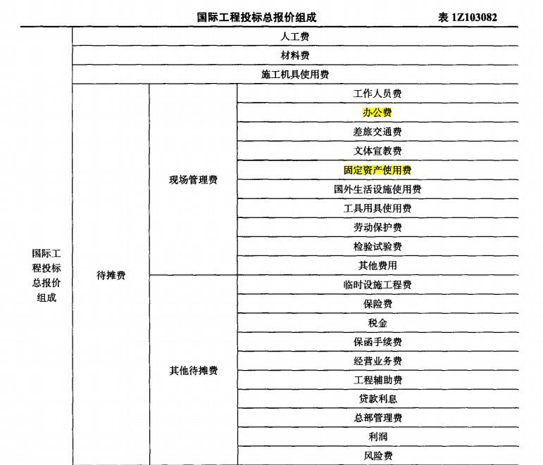
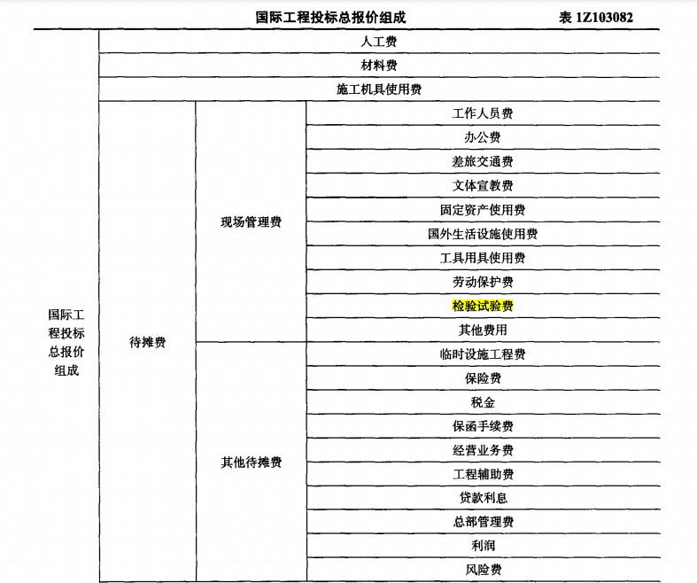
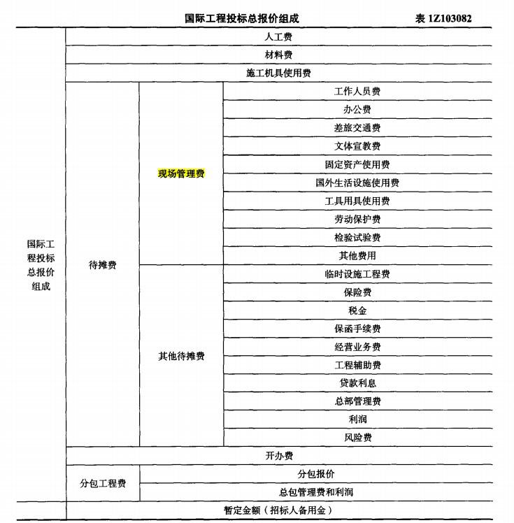

下列属于现场管理费的是( &nbsp;)。

A.临时设施工程费
B.劳动保护费  (正确)
C.检验试验费  (正确)
D.工具用具使用费  (正确)
E.工作人员费  (正确)
解析：
国际工程投标总报价组成中，<strong>现场管理费</strong>是由于组织施工与管理工作而发生的费用，包括：<strong>工作人员费</strong>、办公费、差旅交通费、文体宣教费、固定资产使用费、国外生活设施使用费、<strong>工具用具使用费</strong>、<strong>劳动保护费、检验试验费</strong>及其他费用，不包括临时设施工程费。

<strong>临时设施工程费属于其他待摊费</strong>

【知识点】待摊费

【考点】现场管理费

【考察方向】原文挖空

【难度】中等

【题库维护老师：ZKQ】

国际工程投标总报价组成中，其他待摊费用包括( &nbsp; )。

A.工程辅助费  (正确)
B.保险费  (正确)
C.国外生活设施使用费
D.经营业务费  (正确)
E.检验试验费
解析：
其他待摊费用包括临时设施工程费、<strong>保险费</strong>、税金、保函手续费、<strong>经营业务费</strong>、<strong>工程辅助费</strong>、贷款利息、总部管理费、利润和风险费。

选项C、E属于现场管理费。

【知识点】待摊费

【考点】其他待摊费用

【考察方向】原文挖空

【难度】易

【题库维护老师：ZKQ】

国际工程投标报价的组成中，应计入现场管理费的有（ ）。

A.贷款利息
B.现场办公费  (正确)
C.保险费
D.保函手续费
E.固定资产使用费  (正确)
解析：
根据国际工程投标总报价组成表或有关介绍，现场管理费包括<strong>现场办公费、固定资产使用费</strong>等。ACD属于其他待摊费。

【知识点】待摊费

【考点】现场管理费

【考察方向】原文挖空

【难度】易

【题库维护老师：ZKQ】

下列国际工程投标报价组成中，属于现场管理费的是（）。

A.工程辅助费
B.检验试验费  (正确)
C.临时设施施工费
D.工程保险费
解析：
 

现场管理费包括工作人员费、办公费、差旅交通费、文体宣教费、固定资产使用费、国外生活设施使用费、工具用具使用费、劳动保护费、检验试验费、其他费用等10项。

A选项工程辅助费属于其他待摊费用；C选项临时设施施工费属于开办费；D选项工程保险费属于其他待摊费用。   &nbsp; &nbsp;【知识点】待摊费  &nbsp; &nbsp;【考点】现场管理费  &nbsp; &nbsp;【考察方向】原文挖空  &nbsp; &nbsp;【难度】易  &nbsp; &nbsp;【题库维护老师：ZKQ】

国际工程投标总报价组成中，应计入现场管理费的有（ &nbsp;&nbsp;）。

A.差旅交通费  (正确)
B.临时设施工程费
C.工程辅助费
D.劳动保护费  (正确)
E.检验试验费  (正确)
解析：
本题考查的是待摊费的内容。现场管理费是指由于组织施工与管理工作而发生的各种费用，涵盖费用项目较多，主要包括下列几方面：工作人员费、办公费、<strong>差旅交通费</strong>、文体宣教费、固定资产使用费、国外生活设施使用费、工具用具使用费、<strong>劳动保护费</strong>、<strong>检验试验费</strong>、其他费用。

<strong>临时设施工程费、工程辅助费属于其他待摊费。</strong>

【知识点】待摊费

【考点】现场管理费

【考察方向】原文挖空

【难度】易

【题库维护老师：ZKQ】

